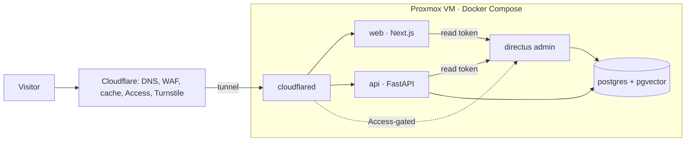

# Architecture

Three deployables behind one Cloudflare Tunnel, all on a single Docker Compose host.

| Component | Responsibility | Talks to |
|---|---|---|
| web | Presentation. Server components read Directus; browser calls the API for interactions. ISR + tag revalidation. | directus (internal), api (public hostname) |
| api | Interactions and intelligence: contact, views/reactions, resume download, GitHub cache, RAG chat. Owns the `portfolio` DB. | postgres, directus (internal), external APIs |
| directus | Content system of record. Schema, roles, and flows are committed and applied on deploy. | postgres |

Boundaries that matter:
- Directus is never publicly reachable except its admin UI behind Cloudflare Access. Assets are proxied through `web`.
- `web` never fetches the CMS at build time; CI has no route to it.
- Only `api` and `directus` hold Postgres credentials, each for its own database.

Decisions are recorded in [`adr/`](adr/README.md). Phase-by-phase delivery is in the [design spec](superpowers/specs/2026-09-16-portfolio-design.md).

## Notes

- FastAPI's `/docs` and `/openapi.json` are intentionally public (the API contract is part of the showcase).
- `next build` fetches Inter and Fraunces from Google Fonts at build time, so image builds need network access.
