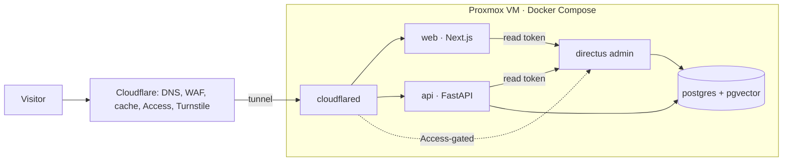
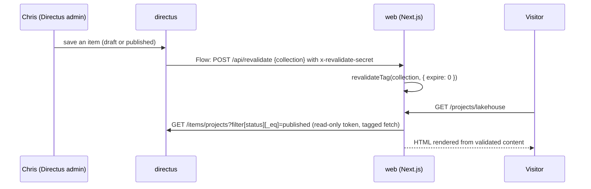
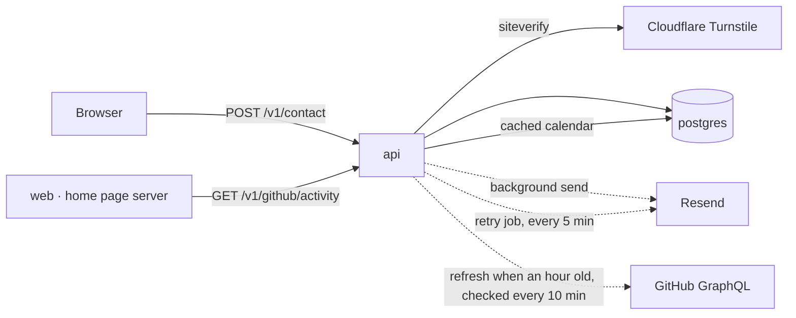

# Architecture

Three deployables behind one Cloudflare Tunnel, all on a single Docker Compose host.

```mermaid
flowchart LR
  U[Visitor] --> CF[Cloudflare: DNS, WAF, cache, Access, Turnstile]
  CF -- tunnel --> T[cloudflared]
  subgraph VM [Proxmox VM · Docker Compose]
    T --> W[web · Next.js]
    T --> A[api · FastAPI]
    T -. Access-gated .-> D[directus admin]
    W -- read token --> D
    A -- read token --> D
    A --> P[(postgres + pgvector)]
    D --> P
  end
```

| Component | Responsibility | Talks to |
|---|---|---|
| web | Presentation. Server components read Directus per request through a tag-cached fetch; browser calls the API for interactions. | directus (internal), api (public hostname) |
| api | Interactions and intelligence: contact, views/reactions, resume download, GitHub cache, RAG chat. Owns the `portfolio` DB. | postgres, directus (internal), external APIs |
| directus | Content system of record. Schema, roles, and flows are committed and applied on deploy. | postgres |

Boundaries that matter:
- Directus is never publicly reachable except its admin UI behind Cloudflare Access. Assets are proxied through `web`.
- `web` never fetches the CMS at build time; CI has no route to it.
- Only `api` and `directus` hold Postgres credentials, each for its own database.
- Production (`infra/compose/compose.yaml`) publishes no host ports; cloudflared reaches services by name. The VM firewall denies all inbound traffic except SSH from the LAN, on IPv4 and IPv6.
- Deploys run on an ephemeral runner inside the stack and are pinned to commit SHAs ([ADR 0006](adr/0006-runner-in-compose.md)); operations are in the [runbook](runbook.md).

Decisions are recorded in [`adr/`](adr/README.md). Phase-by-phase delivery is in the [design spec](superpowers/specs/2026-09-16-portfolio-design.md).

## Content flow

```mermaid
sequenceDiagram
  participant C as Chris (Directus admin)
  participant D as directus
  participant W as web (Next.js)
  participant V as Visitor
  C->>D: save an item (draft or published)
  D->>W: Flow: POST /api/revalidate {collection} with x-revalidate-secret
  W->>W: revalidateTag(collection, { expire: 0 })
  V->>W: GET /projects/lakehouse
  W->>D: GET /items/projects?filter[status][_eq]=published (read-only token, tagged fetch)
  W-->>V: HTML rendered from validated content
```

- **Per-request rendering, cached data.** Every page that reads Directus calls `connection()`, so `next build` never contacts the CMS (CI has no route to it) and nothing is prerendered empty. Each Directus `fetch` uses `cache: "force-cache"` with `next: { tags: [<collection>, ...], revalidate: 86400 }`, so Directus is hit only after an invalidation or once a day. ISR with `generateStaticParams() => []` was rejected because static pages (`/`, `/experience`, ...) would prerender at build with no CMS and serve empty content until revalidated.
- **Invalidation by collection.** The Flow sends only the collection name (no item IDs or slugs), so the revalidate route invalidates the collection tag; list and detail queries both carry it. The route checks `x-revalidate-secret` in constant time and accepts only known collection names.
- **Validation at the boundary.** Responses are parsed with zod; a malformed list item is skipped and logged, a malformed detail item renders the 404 page.
- **Assets.** `/cms-assets/<id>` streams files from Directus with the read-only token (`Cache-Control: public, max-age=31536000, immutable`) and only for IDs referenced by published content or the resume; `cms.christopherguzman.me` stays behind Cloudflare Access.
- **Schema as code.** `infra/directus/bootstrap.mjs` runs inside the Directus container on every deploy: it creates missing collections and fields (never alters or deletes), the read-only `web-reader` policy and token, the revalidation Flow, and seed items for collections that are still empty.

## Interactions (Phase 4)

```mermaid
flowchart LR
  B[Browser] -- POST /v1/contact --> A[api]
  A -- siteverify --> T[Cloudflare Turnstile]
  A --> P[(postgres)]
  A -. background send .-> R[Resend]
  A -. retry job, every 5 min .-> R
  W[web · home page server] -- GET /v1/github/activity --> A
  A -- cached calendar --> P
  A -. refresh when an hour old, checked every 10 min .-> G[GitHub GraphQL]
```

- **Contact:** the browser posts to `api.christopherguzman.me/v1/contact`. The API applies the rate limit, verifies Turnstile, saves the message in Postgres, then sends the email through Resend in the background. A retry job resends failed or stuck messages.
- **GitHub activity:** the home page server reads `http://api:8000/v1/github/activity`, which serves the calendar cached in Postgres. A job refreshes it from GitHub's GraphQL API when it is an hour old (checked every 10 minutes).
- Rate limits and both jobs run inside the API process ([ADR 0007](adr/0007-in-process-rate-limits-and-jobs.md)).

| Failure | Result |
|---|---|
| API down | Contact form shows the email fallback; heatmap hidden; rest of both pages unaffected |
| Resend down / key revoked | Message saved, retried every 5 min up to 5 attempts |
| Turnstile down | `503`; form shows the email fallback |
| GitHub down / token revoked | Last cached heatmap keeps showing |
| Accounts not set up yet | Form shows "coming soon"; heatmap hidden |

## Notes

- FastAPI's `/docs` and `/openapi.json` are intentionally public (the API contract is part of the showcase).
- `next build` fetches Geist and JetBrains Mono from Google Fonts at build time, so image builds need network access.
