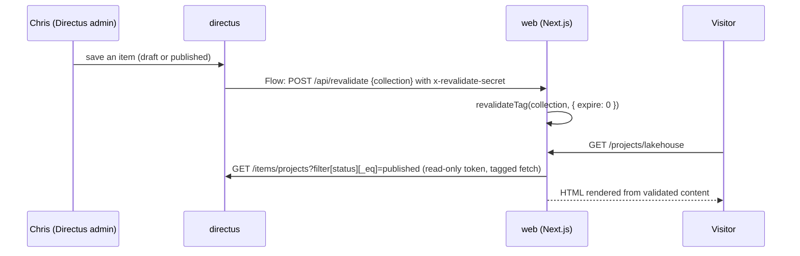

# Phase 3: CMS Content and Pages Implementation Plan

> **For agentic workers:** REQUIRED SUB-SKILL: Use superpowers:subagent-driven-development (recommended) or superpowers:executing-plans to implement this plan task-by-task. Steps use checkbox (`- [ ]`) syntax for tracking.

**Goal:** Render every page of https://christopherguzman.me from Directus content seeded from Chris's resume, in the approved "Engineer" design, with on-publish revalidation.

**Architecture:** A Node bootstrap script (run inside the Directus container on every deploy) creates collections, fields, a read-only `web-reader` policy and token, a revalidation Flow, and insert-only seed content. Next.js reads Directus server-side through a small typed client (zod-validated, tag-cached `fetch`); pages render per request (`connection()`) so `next build` never touches the CMS, while the data cache keeps Directus traffic near zero. Shared UI components are built once in the foundation, then six route tracks build in parallel against them.

**Tech Stack:** Next.js 16.3 (App Router, React 19.3, Tailwind 4, next-themes, lucide-react), zod 4, unified/remark/rehype + rehype-pretty-code/Shiki, vitest + Testing Library, Directus 12.4.1 REST API, Node 24 `node --test`, Docker Compose, bash.

**Spec:** [`docs/superpowers/specs/2026-10-01-phase-3-content-pages-design.md`](../specs/2026-10-01-phase-3-content-pages-design.md)

## Global Constraints

- **Branch:** all work lands on `feat/phase-3`; one PR to `main` at the end. Commits end with `Co-Authored-By: Claude Opus 5.5 <noreply@anthropic.com>`.
- **Never** read or write `.env` / `.env.*` files, never print secrets, never run `sops` or `make secrets-*`. Local test variables go in the session scratchpad as `*.vars`. If any permission is denied, stop and report BLOCKED.
- **No emojis** anywhere in UI, content, or seed data. Icons: `lucide-react`; GitHub/LinkedIn logos from `@/components/icons/brand`.
- **No caption/subtitle under any page `h1`.** Page header = mono prompt + `h1` only (`PageHeader`).
- **Dates:** posts `Oct 14, 2026` (day always shown); roles `Aug 2026 – Present` (en dash `–`, "Present"). No reading time anywhere.
- **Experience entry order:** company (bold) / role (regular) + "current" pill / `dates · location` (dates first).
- **Projects page:** no filters; section order **Personal projects** then **Competitions**; empty sections not rendered.
- **Blog:** no filters, no tag pages; homepage Blog section and nothing else hides when there are zero published posts (`/blog` shows the empty state).
- **Theme:** dark default for first-time visitors (`defaultTheme="dark"`, `enableSystem={false}`).
- **No CMS or API at build time:** any server code that fetches Directus or the API calls `await connection()` first (from `next/server`). `pnpm build` must pass with `DIRECTUS_URL` unset.
- **Resume PDF is never committed** (contains a phone number; repo is public).
- **Pinned versions:** Next `16.3.6`, Directus image `directus/directus:12.4.1`. New npm deps are added with `pnpm add` (exact versions recorded in the lockfile); do not upgrade unrelated deps.
- **Tests:** web `pnpm --dir apps/web test` (single file: `pnpm --dir apps/web test <path-substring>`, no `--`; every component test file calls `afterEach(cleanup)`), `typecheck`, `lint`, `format`; bootstrap `node --test infra/directus/lib.test.mjs` (a directory argument fails on Node 24 and would execute `bootstrap.mjs`). Every task leaves all of them green.

## Amendments to the spec (decided while planning)

1. **Schema as code via the API, not a snapshot file.** `infra/directus/schema.mjs` declares collections and fields; `bootstrap.mjs` creates whatever is missing through the REST API and never alters or deletes existing collections/fields. Reason: a hand-written `snapshot.yaml` is brittle across Directus versions, and additive-only is safer on a live CMS.
2. **No `projects.gallery` field.** Images go inline in `body` markdown (served through `/cms-assets`). Reason: a files M2M needs a junction collection; not worth it for four projects.
3. **Per-request rendering with cached data**, instead of ISR with `generateStaticParams() => []`. Pages call `connection()`; Directus `fetch`es use `cache: "force-cache"` + `next: { tags, revalidate: 86400 }`. Reason: static pages (`/`, `/experience`, ...) would otherwise prerender at build time with no CMS and serve empty content until revalidated.
4. `revalidateTag` takes two arguments in Next 16. Use `revalidateTag(tag, { expire: 0 })`: the next request after a publish blocks and renders fresh content, so Chris sees his edit on the first reload (with `"max"` the first request would still serve the stale page). Traffic is low and renders are fast, so the blocking request is cheap.
5. **Flow body is `{"collection":"{{$trigger.collection}}"}`** (header `x-revalidate-secret`). Directus leaves `$trigger.keys` undefined on create, which would produce invalid JSON. The route revalidates per collection only; every query (including `getProject`/`getPost`) carries the collection tag.
7. **Published-only is enforced by the web app, not Directus.** Unlicensed Directus 12 (Core) rejects permission filters (`403 RESOURCE_RESTRICTED (custom_permission_rules_enabled)`), so the `web-reader` policy can read drafts. The token is server-side only; every query, including `getProject`, `getPost`, and `isReferencedFile`, filters `status = published`, and tests assert it. Core limits (25 collections, 5 Flows, 3 seats) are well above this plan's 8 / 1 / 2.
6. **Bootstrap must reconcile secrets on every run**: update the `web-reader` user's token and the Flow operation's secret header when they differ from the env, so "edit secrets, then deploy" rotates them.

## Resolved drafting notes

Each task section below opens with "Contract notes" from the agent that drafted it. They are resolved as follows; where a note and this list disagree, this list wins.

- Test command form, cleanup, Flow body without `keys`, published filter on every query, `node --test infra/directus/lib.test.mjs`, seeded empty `resume` row, `cast-boolean` booleans, collection-tag-only revalidation: **adopted** (see Global Constraints and Amendments).
- `revalidateTag` profile: **`{ expire: 0 }`** everywhere (Amendment 4), not `"max"`.
- Heading levels: card/entry/post titles stay `h3`; `/experience` and `/blog` add an `sr-only` `h2` (already in Tasks 6 and 8). No `headingLevel` prop.
- Light accent: **`#0d7a57`** (AA contrast), already applied in Task 2.
- Mobile menu: an inline **disclosure** (`aria-expanded`, Escape closes and returns focus, closes on navigation), no focus trap; that is the correct pattern for a non-modal panel.
- Extra file `src/components/layout/nav-link.tsx` (Task 2) and `serializeJsonLd` in `seo.ts` (Task 10): **adopted**.
- Fonts: `--font-geist` / `--font-jetbrains-mono` mapped to `font-sans` / `font-mono`: **adopted**.
- Buttons in pages use inline Tailwind classes with contract tokens (the shadcn `Button` stays for the theme toggle only).
- `make secrets-check` on the secrets branch prints `11 keys present, 9 required` until this PR updates `prod.env.example`; expected.

## Execution shape

| Stage | Tasks | Mode |
|---|---|---|
| Foundation | 1 (F1 CMS bootstrap), 2 (F2a design system + layout), 3 (F2b data layer + markdown + assets), 4 (F2c shared components) | Sequential on `feat/phase-3` |
| Tracks | 5 (A home), 6 (B experience + education), 7 (C projects), 8 (D blog + RSS), 9 (E resume + contact + 404), 10 (F revalidate + SEO) | Parallel, each in its own worktree branched from `feat/phase-3` after Task 4, branch `feat/phase-3-track-<letter>` |
| Integration | 11 (merge, smoke extension, docs), 12 (secrets gate + PR + deploy + manual checks) | Sequential |

**Track rules:** a track edits only the files listed in its task. If it needs a change to a shared file (anything from Tasks 1-4), it stops and reports the needed change instead of making it.

## File map

```
infra/directus/
  schema.mjs                 # Task 1: declarative collections + fields
  bootstrap.mjs              # Task 1: entrypoint (login, ensure schema/policy/user/flow/seed)
  lib.mjs                    # Task 1: pure planners (planSchema, planSeed) + DirectusClient
  lib.test.mjs               # Task 1: node --test
  seed/profile.json, experience.json, education.json, involvement.json, projects.json   # Task 1
infra/compose/compose.yaml, compose.dev.yaml, prod.env.example   # Task 1 (env + mount)
scripts/deploy.sh, Makefile                                       # Task 1 (cms bootstrap step)
apps/web/
  src/app/globals.css, layout.tsx, not-found.tsx                  # Task 2 (not-found content: Task 9)
  src/components/theme-provider.tsx                               # Task 2
  src/components/layout/site-header.tsx, mobile-nav.tsx, site-footer.tsx, theme-toggle.tsx  # Task 2
  src/components/icons/brand.tsx                                  # Task 2
  src/lib/site.ts                                                 # Task 2
  src/lib/env.ts                                                  # Task 3
  src/lib/directus/{client,schemas,queries,tags}.ts               # Task 3
  src/lib/format.ts                                               # Task 3
  src/lib/markdown.ts                                             # Task 3
  src/app/cms-assets/[id]/route.ts                                # Task 3
  src/components/content/{page-header,section-heading,award-badge,tech-tags,current-pill,
      project-card,experience-entry,post-list-item,empty-state,live-status,prose}.tsx      # Task 4
  src/app/page.tsx                                                # Task 5
  src/app/experience/page.tsx, src/app/education/page.tsx         # Task 6
  src/app/projects/page.tsx, src/app/projects/[slug]/page.tsx     # Task 7
  src/app/blog/page.tsx, src/app/blog/[slug]/page.tsx, src/app/blog/rss.xml/route.ts   # Task 8
  src/app/resume/page.tsx, src/app/contact/page.tsx, src/components/content/copy-email.tsx, src/app/not-found.tsx  # Task 9
  src/app/api/revalidate/route.ts, src/app/sitemap.ts, src/app/robots.ts,
      src/app/opengraph-image.tsx, src/lib/og.tsx, src/lib/seo.ts                  # Task 10
scripts/smoke.sh, docs/runbook.md, docs/architecture.md, docs/setup.md             # Task 11
```

## Shared contract (every task must use these exact names)

### Environment (`src/lib/env.ts`, Task 3)

```ts
export type ServerEnv = {
  directusUrl: string | undefined;   // DIRECTUS_URL, e.g. http://directus:8055
  directusToken: string | undefined; // DIRECTUS_TOKEN
  apiInternalUrl: string | undefined;// API_INTERNAL_URL, e.g. http://api:8000
  revalidateSecret: string | undefined; // REVALIDATE_SECRET
  siteUrl: string;                   // SITE_URL, default "https://christopherguzman.me"; trailing "/" stripped
};
export function serverEnv(): ServerEnv; // reads process.env on every call (no module-level caching)
```

### Content types (`src/lib/directus/schemas.ts`, Task 3)

zod 4 schemas and inferred types. Dates arrive from Directus as `"YYYY-MM-DD"` strings.

```ts
export const ProfileSchema = z.object({
  name: z.string(), intro: z.string(), email: z.string(), location: z.string(),
  github_url: z.string().url(), linkedin_url: z.string().url(), seo_description: z.string(),
});
export const ExperienceSchema = z.object({
  id: z.number(), company: z.string(), role: z.string(), location: z.string(),
  start_date: z.string(), end_date: z.string().nullable(),
  highlights: z.array(z.string()).nullable().transform(v => v ?? []),
  tech: z.array(z.string()).nullable().transform(v => v ?? []),
  show_on_home: z.boolean(),
});
export const DegreeSchema = z.object({ kind: z.enum(["degree", "minor"]), name: z.string() });
export const EducationSchema = z.object({
  id: z.number(), school: z.string(), location: z.string(), end_date: z.string(),
  degrees: z.array(DegreeSchema).nullable().transform(v => v ?? []),
  coursework: z.array(z.string()).nullable().transform(v => v ?? []),
});
export const InvolvementSchema = z.object({
  id: z.number(), organization: z.string(), role: z.string(), year: z.string(), summary: z.string().nullable(),
});
export const CertificationSchema = z.object({
  id: z.number(), name: z.string(), issuer: z.string(), date: z.string().nullable(), url: z.string().nullable(),
});
export const ProjectSchema = z.object({
  id: z.number(), slug: z.string(), title: z.string(), summary: z.string(), body: z.string().nullable(),
  type: z.enum(["personal", "competition"]), award: z.string().nullable(),
  tech: z.array(z.string()).nullable().transform(v => v ?? []),
  repo_url: z.string().nullable(), live_url: z.string().nullable(),
  cover: z.string().nullable(), date: z.string().nullable(), featured: z.boolean(),
});
export const PostSchema = z.object({
  id: z.number(), slug: z.string(), title: z.string(), published_at: z.string(),
  excerpt: z.string(), body: z.string(), tags: z.array(z.string()).nullable().transform(v => v ?? []),
  cover: z.string().nullable(),
});
export const ResumeSchema = z.object({
  file: z.string().nullable(), version_label: z.string().nullable(), updated_at: z.string().nullable(),
});
export type Profile = z.infer<typeof ProfileSchema>;   // and Experience, Degree, Education,
// Involvement, Certification, Project, Post, Resume likewise
```

### Cache tags (`src/lib/directus/tags.ts`, Task 3)

```ts
export const CONTENT_COLLECTIONS = ["profile","experience","education","involvement",
  "certifications","projects","posts","resume"] as const;
export type ContentCollection = (typeof CONTENT_COLLECTIONS)[number];
export function collectionTag(c: ContentCollection): string;          // => c
export function itemTag(c: "projects" | "posts", slug: string): string; // => `${c}:${slug}`
export function isContentCollection(x: string): x is ContentCollection;
```

### Client and queries (`src/lib/directus/client.ts`, `queries.ts`, Task 3)

```ts
// client.ts
export class DirectusUnavailableError extends Error {}
// Calls connection(); throws DirectusUnavailableError when DIRECTUS_URL is unset or the request fails;
// GETs `${directusUrl}/items/${path}` with Authorization: Bearer token,
// cache: "force-cache", next: { tags, revalidate: 86400 }; returns parsed JSON `.data`.
export async function directusGet(path: string, tags: string[]): Promise<unknown>;

// queries.ts — EVERY query (lists, getProject, getPost, isReferencedFile) filters status=published server-side, validates each item
// with safeParse, drops (and console.error-logs) invalid items, and returns [] / null when
// Directus is unavailable (pages render their empty states instead of crashing).
export async function getProfile(): Promise<Profile | null>;
export async function getExperience(): Promise<Experience[]>;       // sorted by sortExperience
export async function getEducation(): Promise<Education[]>;         // sort asc
export async function getInvolvement(): Promise<Involvement[]>;     // sort asc
export async function getCertifications(): Promise<Certification[]>;// sort asc
export async function getProjects(): Promise<Project[]>;            // sort asc, then date desc
export async function getProject(slug: string): Promise<Project | null>;
export async function getPosts(): Promise<Post[]>;                  // published_at desc
export async function getPost(slug: string): Promise<Post | null>;
export async function getResume(): Promise<Resume | null>;
// Tagging rule: every query tags with collectionTag(<collection>); getProject/getPost ALSO add
// itemTag(<collection>, slug). The Directus Flow sends numeric IDs (not slugs), so the revalidate
// route revalidates the collection tag, which must therefore cover detail pages too.
export async function isReferencedFile(id: string): Promise<boolean>; // id is resume.file,
// a project/post cover, or appears as /assets/<id> in a published project/post body
```

### Formatting (`src/lib/format.ts`, Task 3)

```ts
export function formatPostDate(iso: string): string;                  // "2026-10-14" -> "Oct 14, 2026"
export function formatMonthYear(iso: string): string;                 // "2026-08-01" -> "Aug 2026"
export function formatRange(start: string, end: string | null): string; // "Aug 2026 – Present" / "Jun 2026 – Jul 2026"
export function isCurrent(e: { end_date: string | null }): boolean;   // end_date === null
export function sortExperience(list: Experience[]): Experience[];     // current first, then start_date desc
export function graduationLabel(endIso: string, today?: Date): string;// "Expected May 2027" or "May 2027" once past
export function sectionNumbers<T extends string>(visible: T[]): Record<T, string>; // ["a","c"] -> {a:"01", c:"02"}
```
All date parsing is UTC (`new Date(iso + "T00:00:00Z")`, format with `timeZone: "UTC"`) so output never shifts by a day.

### Markdown (`src/lib/markdown.ts`, Task 3)

```ts
export type Heading = { id: string; text: string; depth: 2 | 3 };
export async function renderMarkdown(md: string): Promise<{ html: string; headings: Heading[] }>;
// remark-parse → remark-gfm → remark-rehype → rehype-slug → rehype-sanitize (schema allowing
// id on headings, className on code/pre/span, data-* used by rehype-pretty-code) →
// rehype-pretty-code (themes: { dark: "github-dark-dimmed", light: "github-light" }) → rehype-stringify.
// Before parsing, rewrites "/assets/<uuid>" (optionally prefixed by any origin) to "/cms-assets/<uuid>".
export function rewriteAssetUrls(md: string): string;
```

### Site config (`src/lib/site.ts`, Task 2)

```ts
export const siteConfig = {
  name: "Christopher Guzman",
  description: "Portfolio of Christopher Guzman: full-stack, backend, and ML engineering, with a security background.",
  nav: [ {href:"/experience",label:"experience"}, {href:"/education",label:"education"},
         {href:"/projects",label:"projects"}, {href:"/blog",label:"blog"},
         {href:"/resume",label:"resume"}, {href:"/contact",label:"contact"} ],
  links: { github: "https://github.com/chrisguzman77",
           linkedin: "https://www.linkedin.com/in/christopher-emmanuel-guzman/" },
} as const;
```
(`headline` is removed; the hero intro comes from `profile.intro`.)

### Shared components (Task 2 and Task 4)

```tsx
// @/components/icons/brand (Task 2)
export function GitHubIcon(props: React.SVGProps<SVGSVGElement>): JSX.Element;
export function LinkedInIcon(props: React.SVGProps<SVGSVGElement>): JSX.Element;

// @/components/content/* (Task 4) — all server components unless noted
export function PageHeader(p: { prompt: string; title: string }): JSX.Element;      // mono prompt + h1, nothing else
export function SectionHeading(p: { number: string; title: string; href?: string; linkLabel?: string; count?: string; id?: string }): JSX.Element; // h2
export function AwardBadge(p: { award: string }): JSX.Element;                      // Lucide Trophy outline + text
export function TechTags(p: { tags: string[] }): JSX.Element;                       // mono accent "a · b · c"
export function CurrentPill(): JSX.Element;                                          // "current"
export function ProjectCard(p: { project: Project }): JSX.Element;                  // whole card links /projects/<slug>; title is h3
export function ExperienceEntry(p: { entry: Experience; compact?: boolean }): JSX.Element; // compact = homepage (no bullets/tags); company is h3
export function PostListItem(p: { post: Post }): JSX.Element;                       // date, title, excerpt, tags, "Read post" button; title is h3
export function EmptyState(p: { children: React.ReactNode }): JSX.Element;          // dashed mono box
export async function LiveStatus(): Promise<JSX.Element>;                           // fetches API health
export function Prose(p: { html: string }): JSX.Element;                            // styled markdown container
```

Layout rules for Task 4 components (tracks rely on them): `PageHeader` and `SectionHeading` have no outer margin/padding; `SectionHeading` renders `linkLabel` followed by " →" itself and renders `count` in its own element with exactly that text; `ExperienceEntry`, `PostListItem`, `LiveStatus` draw no outer borders (pages add dashed dividers). Pages that list items directly under the `h1` (`/experience`, `/blog`) add `<h2 className="sr-only">` ("All roles" / "All posts") above the list so heading levels never skip.

### Design tokens (Task 2, `globals.css`)

Semantic Tailwind colors used everywhere (never raw hex in components): `bg-background`, `bg-card`, `border-border`, `border-input`, `text-foreground`, `text-muted-foreground`, `text-accent-brand`, `bg-accent-brand`, `text-accent-brand-foreground`, `text-live`, `border-live`, `text-warn`. Fonts: `font-sans` (Geist), `font-mono` (JetBrains Mono). Values:

| Token | Dark (default, `.dark`) | Light (`:root`) |
|---|---|---|
| `--background` | `#0d1117` | `#fbfbfa` |
| `--card` | `#161b22` | `#ffffff` |
| `--border` | `#21262d` | `#e6e8eb` |
| `--input` | `#30363d` | `#d0d4da` |
| `--foreground` | `#e6edf3` | `#16191d` |
| `--muted-foreground` | `#9da7b3` | `#4b5563` |
| `--accent-brand` | `#7ee2b8` | `#0d7a57` (≈5.1:1 on the light background; `#0f8a62` from the mockups fails AA for small text) |
| `--accent-brand-foreground` | `#0d1117` | `#ffffff` |
| `--live` | `#3fb950` | `#15803d` |
| `--warn` | `#d29922` | `#b45309` |

---

## Contract notes (Task 1)

These were found by running the bootstrap against a throwaway `directus/directus:12.3.1` container (SQLite and Postgres 17), the same access model as 12.4.1. Each one changes something outside Task 1, so the plan owner needs to decide on it.

1. **Directus 12 without a license rejects item filters on permissions.** `POST /permissions` with `permissions: {status: {_eq: "published"}}` returns `403 RESOURCE_RESTRICTED: custom_permission_rules_enabled is a restricted resource`. The Core license (`@directus/license` `CORE_LICENSE`) sets `custom_permission_rules_enabled: false`. It also limits `fields` to `["*"]`, and sets `collections: 25`, `flows: 5`, `seats: 3` (this plan uses 8, 1, and 2). Because of that, the `web-reader` policy reads **all** items in the 8 content collections, drafts included. Published-only is enforced by the web app. This affects:
   - **Spec, "Content model"**: the line "the web reader can read **published items only**" is no longer true server-side. The token stays server-only.
   - **Task 3 (`queries.ts`)**: every query that reads a non-singleton collection, **including `getProject(slug)` and `getPost(slug)`**, must send `filter[status][_eq]=published`. The contract says this only for "every list query". It should say every query, and Task 3 should test that the detail queries send the filter. `isReferencedFile` must also filter by published.
2. **The Flow body is `{"collection":"<name>"}` only, with no `keys`.** For `items.create`, Directus exposes `$trigger.key` (singular), not `$trigger.keys`. A body template with `{{$trigger.keys}}` rendered as the string `"{\"collection\":\"posts\",\"keys\":undefined}"`, which is invalid JSON (seen on a fake `web` receiver). Task 10's `/api/revalidate` should parse `{ collection: string }` and ignore anything else. It already revalidates the collection tag, which also covers detail pages. Header `X-Revalidate-Secret` and `Content-Type: application/json` are sent as expected.
3. **`node --test infra/directus/` does not work on Node 24.** A directory argument is treated as one file and fails (`✖ infra/directus 'test failed'`). Running every `.mjs` file under the directory would also execute `bootstrap.mjs`. The command is **`node --test infra/directus/lib.test.mjs`**, both in CI and in the Global Constraints "Tests" line.
4. **An empty singleton reads as `{"id": null}`, not as defaults.** `GET /items/<singleton>` with no row returns only `{"id":null}`, so `ResumeSchema.safeParse` would fail. Task 1 therefore **creates the `resume` singleton** with `file`, `version_label`, and `updated_at` all `null` (insert-only, seed key "singleton"). `GET /items/resume` then returns `{"id":1,"file":null,"version_label":null,"updated_at":null}`. Task 3's `getResume` should still return `null` on a parse failure.
5. Boolean fields need `special: ["cast-boolean"]`. Without it, SQLite returns `1`/`0` for `featured`. Postgres already returns real booleans, but the field is declared the way the Directus app would declare it.

---

### Task 1: Directus bootstrap (F1)

Schema as code, read-only web token, revalidation Flow, and insert-only seed content. Everything is created through the Directus REST API by a Node script that runs inside the existing `directus` container. There is no new image and no new dependency, because Node 22 and global `fetch` already ship in `directus/directus:12.x`.

**Files:**
- Create: `infra/directus/lib.mjs`, `infra/directus/schema.mjs`, `infra/directus/bootstrap.mjs`
- Create: `infra/directus/seed/profile.json`, `resume.json`, `experience.json`, `education.json`, `involvement.json`, `projects.json`
- Test: `infra/directus/lib.test.mjs`
- Modify: `infra/compose/compose.yaml`, `infra/compose/compose.dev.yaml`, `infra/compose/prod.env.example`, `scripts/deploy.sh`, `Makefile`, `.github/workflows/ci.yml`

**Interfaces:**
- Consumes: the collection names and field names from the Shared contract's content types (`ProfileSchema` … `ResumeSchema`), and `CONTENT_COLLECTIONS` (order and names identical to `tags.ts`).
- Produces:
  - Directus collections `profile` (singleton), `experience`, `education`, `involvement`, `certifications`, `projects`, `posts`, `resume` (singleton), with integer `id` primary keys. Every non-singleton has `status` (`draft`|`published`, default `draft`). `sort` exists on all but `posts`. `projects.slug` and `posts.slug` are unique. Dates come back as `"YYYY-MM-DD"`, JSON lists come back as arrays, and booleans come back as booleans.
  - A static token (`DIRECTUS_WEB_TOKEN`) for user `web-reader@christopherguzman.me`: read on the 8 content collections (all items, see Contract note 1) and on `directus_files`; 403 on writes and on system collections such as `/flows`.
  - Flow `revalidate site`: on `items.create|update|delete` in the 8 collections it calls `POST http://web:3000/api/revalidate` with header `X-Revalidate-Secret: $REVALIDATE_SECRET` and JSON body `{"collection":"<collection>"}`. **Task 10 consumes this.**
  - Env on the `web` service: `DIRECTUS_URL`, `DIRECTUS_TOKEN`, `REVALIDATE_SECRET`, `API_INTERNAL_URL`, `SITE_URL`. **Task 3's `serverEnv()` consumes this.**
  - `make cms-bootstrap` (dev), and the "CMS bootstrap" step in `scripts/deploy.sh` (prod). **Task 11's smoke extension relies on seeded content being present after deploy.**
  - Pure exports `planSchema`, `planSeed`, `seedKeys`, `DirectusClient` (`lib.mjs`) and `CONTENT_COLLECTIONS`, `SINGLETONS`, `collections` (`schema.mjs`).

- [ ] **Step 1: Write the failing test**

Create `infra/directus/lib.test.mjs`:

```js
import assert from "node:assert/strict";
import { readFile } from "node:fs/promises";
import { test } from "node:test";

import { DirectusClient, planSchema, planSeed, seedKeys } from "./lib.mjs";
import { CONTENT_COLLECTIONS, SINGLETONS, collections } from "./schema.mjs";

const EMPTY = { collections: [], fields: [], relations: [] };

const desired = [
  {
    collection: "projects",
    meta: { icon: "code" },
    fields: [
      { field: "slug", type: "string", meta: { interface: "input" }, schema: {} },
      { field: "cover", type: "uuid", meta: { interface: "file-image", special: ["file"] }, schema: {} },
    ],
  },
];

/** Applies planned ops to an in-memory "existing" snapshot, like Directus would. */
function apply(existing, ops) {
  return {
    collections: [
      ...existing.collections,
      ...ops.filter((o) => o.type === "collection").map((o) => o.collection),
    ],
    fields: [
      ...existing.fields,
      ...ops.filter((o) => o.type === "field").map(({ collection, field }) => ({ collection, field })),
    ],
    relations: [
      ...existing.relations,
      ...ops.filter((o) => o.type === "relation").map(({ collection, field }) => ({ collection, field })),
    ],
  };
}

test("planSchema creates collection, fields, then file relations on an empty instance", () => {
  const ops = planSchema(EMPTY, desired);
  assert.deepEqual(
    ops.map((o) => `${o.type}:${o.collection}${o.field ? `.${o.field}` : ""}`),
    ["collection:projects", "field:projects.slug", "field:projects.cover", "relation:projects.cover"],
  );
  assert.deepEqual(ops[0].body, { collection: "projects", meta: { icon: "code" }, schema: {} });
  assert.deepEqual(ops[3].body, {
    collection: "projects",
    field: "cover",
    related_collection: "directus_files",
    schema: { on_delete: "SET NULL" },
  });
});

test("planSchema plans only what is missing", () => {
  const existing = {
    collections: ["projects"],
    fields: [{ collection: "projects", field: "slug", type: "text" }],
    relations: [],
  };
  const ops = planSchema(existing, desired);
  assert.deepEqual(
    ops.map((o) => `${o.type}:${o.collection}.${o.field}`),
    ["field:projects.cover", "relation:projects.cover"],
  );
});

test("planSchema never plans an update, even when an existing field differs", () => {
  const existing = {
    collections: ["projects"],
    fields: [
      { collection: "projects", field: "slug", type: "text", meta: { interface: "other" } },
      { collection: "projects", field: "cover", type: "uuid" },
    ],
    relations: [{ collection: "projects", field: "cover" }],
  };
  assert.deepEqual(planSchema(existing, desired), []);
});

test("planSchema on its own result plans nothing (real schema)", () => {
  const first = planSchema(EMPTY, collections);
  assert.ok(first.length > 0);
  assert.deepEqual(planSchema(apply(EMPTY, first), collections), []);
});

test("schema declares every content collection, status on non-singletons, unique slugs", () => {
  assert.deepEqual(
    collections.map((c) => c.collection),
    CONTENT_COLLECTIONS,
  );
  for (const c of collections) {
    const names = c.fields.map((f) => f.field);
    assert.equal(names.includes("status"), !SINGLETONS.includes(c.collection), c.collection);
    assert.equal(Boolean(c.meta.singleton), SINGLETONS.includes(c.collection), c.collection);
  }
  for (const name of ["projects", "posts"]) {
    const slug = collections.find((c) => c.collection === name).fields.find((f) => f.field === "slug");
    assert.equal(slug.schema.is_unique, true, name);
  }
  const projectFields = collections.find((c) => c.collection === "projects").fields;
  assert.equal(projectFields.some((f) => f.field === "gallery"), false);
});

test("planSeed inserts only items whose key is missing", () => {
  const existing = [{ id: 1, slug: "a", title: "Edited by Chris" }];
  const seed = [
    { slug: "a", title: "Seed A" },
    { slug: "b", title: "Seed B" },
  ];
  assert.deepEqual(planSeed(existing, seed, seedKeys.projects), [{ slug: "b", title: "Seed B" }]);
});

test("planSeed is idempotent: a second run plans zero inserts", () => {
  const seed = [{ slug: "a" }, { slug: "b" }];
  const first = planSeed([], seed, seedKeys.projects);
  assert.equal(first.length, 2);
  const afterFirst = first.map((item, i) => ({ id: i + 1, ...item }));
  assert.deepEqual(planSeed(afterFirst, seed, seedKeys.projects), []);
});

test("planSeed never returns an existing item (no updates), even if fields differ", () => {
  const existing = [{ id: 7, company: "Acme", role: "Intern", location: "Changed" }];
  const seed = [{ company: "Acme", role: "Intern", location: "Original" }];
  assert.deepEqual(planSeed(existing, seed, seedKeys.experience), []);
});

test("planSeed de-duplicates seed items with the same key", () => {
  assert.deepEqual(planSeed([], [{ slug: "a" }, { slug: "a" }], seedKeys.projects), [{ slug: "a" }]);
});

test("seedKeys: singletons, experience company+role, education, involvement, projects", () => {
  assert.equal(seedKeys.profile({ name: "x" }), seedKeys.profile({ name: "y" }));
  assert.equal(seedKeys.resume({}), seedKeys.resume({ file: "z" }));
  assert.notEqual(
    seedKeys.experience({ company: "ACM@AU", role: "Lead Developer" }),
    seedKeys.experience({ company: "ACM@AU", role: "Member" }),
  );
  assert.notEqual(
    seedKeys.experience({ company: "a b", role: "c" }),
    seedKeys.experience({ company: "a", role: "b c" }),
  );
  assert.equal(seedKeys.education({ school: "AU" }), "AU");
  assert.equal(seedKeys.involvement({ organization: "ACM@AU" }), "ACM@AU");
  assert.equal(seedKeys.projects({ slug: "this-portfolio" }), "this-portfolio");
  assert.equal(planSeed([{ id: 1 }], [{ name: "x" }], seedKeys.profile).length, 0);
  assert.equal(planSeed([], [{ name: "x" }], seedKeys.profile).length, 1);
});

test("seed files: valid JSON, no phone number, unique keys", async () => {
  const phone = /\(?\d{3}\)?[-.\s]\d{3}[-.\s]\d{4}/;
  for (const name of ["profile", "resume", "experience", "education", "involvement", "projects"]) {
    const raw = await readFile(new URL(`./seed/${name}.json`, import.meta.url), "utf8");
    assert.doesNotMatch(raw, phone, name);
    const data = JSON.parse(raw);
    if (Array.isArray(data)) {
      const keys = data.map(seedKeys[name]);
      assert.equal(new Set(keys).size, keys.length, name);
      for (const item of data) assert.equal(item.status, "published", name);
    }
  }
});

function fakeFetch(responses) {
  const calls = [];
  const impl = async (url, init) => {
    calls.push({ url, ...init });
    const { status, body } = responses.shift();
    return new Response(body === undefined ? null : JSON.stringify(body), { status });
  };
  return { calls, impl };
}

test("DirectusClient logs in and sends the bearer token", async () => {
  const { calls, impl } = fakeFetch([
    { status: 200, body: { data: { access_token: "abc" } } },
    { status: 200, body: { data: [{ collection: "profile" }] } },
  ]);
  const api = new DirectusClient("http://directus:8055/", impl);
  await api.login("me@example.com", "pw");
  assert.deepEqual(await api.get("/collections"), [{ collection: "profile" }]);
  assert.equal(calls[0].url, "http://directus:8055/auth/login");
  assert.equal(calls[0].method, "POST");
  assert.deepEqual(JSON.parse(calls[0].body), { email: "me@example.com", password: "pw" });
  assert.equal(calls[1].headers.authorization, "Bearer abc");
});

test("DirectusClient throws with status and body on non-2xx", async () => {
  const { impl } = fakeFetch([{ status: 403, body: { errors: [{ message: "Forbidden" }] } }]);
  const api = new DirectusClient("http://directus:8055", impl);
  await assert.rejects(api.post("/permissions", {}), /POST \/permissions -> 403: .*Forbidden/);
});

test("DirectusClient returns null for 204", async () => {
  const { impl } = fakeFetch([{ status: 204 }]);
  const api = new DirectusClient("http://directus:8055", impl);
  assert.equal(await api.patch("/users/1", { token: "t" }), null);
});
```

- [ ] **Step 2: Run it to verify it fails**

Run: `node --test infra/directus/lib.test.mjs`
Expected: FAIL with `Cannot find module '.../infra/directus/lib.mjs'` (`ERR_MODULE_NOT_FOUND`), and `ℹ fail 1`.

- [ ] **Step 3: Implement the pure planners and the client**

Create `infra/directus/lib.mjs`:

```js
// Pure planners for the Directus bootstrap, plus a tiny REST client.
// The planners only ever plan creations: nothing here updates or deletes an
// existing collection, field, relation, or content item.

/** Relation body for a file field (uuid pointing at directus_files). */
function fileRelation(collection, field) {
  return {
    collection,
    field,
    related_collection: "directus_files",
    schema: { on_delete: "SET NULL" },
  };
}

function isFileField(f) {
  return Array.isArray(f.meta?.special) && f.meta.special.includes("file");
}

/**
 * existing: { collections: string[], fields: {collection, field}[], relations: {collection, field}[] }
 * desired:  [{ collection, meta, fields: [{ field, type, meta, schema }] }]
 * Returns ops in a safe order: collections, then fields, then relations.
 */
export function planSchema(existing, desired) {
  const haveCollection = new Set(existing.collections);
  const haveField = new Set(existing.fields.map((f) => `${f.collection}.${f.field}`));
  const haveRelation = new Set(existing.relations.map((r) => `${r.collection}.${r.field}`));
  const collections = [];
  const fields = [];
  const relations = [];
  for (const c of desired) {
    if (!haveCollection.has(c.collection)) {
      collections.push({
        type: "collection",
        collection: c.collection,
        body: { collection: c.collection, meta: c.meta, schema: {} },
      });
    }
    for (const f of c.fields) {
      const key = `${c.collection}.${f.field}`;
      if (!haveField.has(key)) {
        fields.push({ type: "field", collection: c.collection, field: f.field, body: f });
      }
      if (isFileField(f) && !haveRelation.has(key)) {
        relations.push({
          type: "relation",
          collection: c.collection,
          field: f.field,
          body: fileRelation(c.collection, f.field),
        });
      }
    }
  }
  return [...collections, ...fields, ...relations];
}

/** Seed items whose key is not already present (insert-only, de-duplicated). */
export function planSeed(existingItems, seedItems, keyFn) {
  const seen = new Set(existingItems.map(keyFn));
  const inserts = [];
  for (const item of seedItems) {
    const key = keyFn(item);
    if (!seen.has(key)) {
      seen.add(key);
      inserts.push(item);
    }
  }
  return inserts;
}

/** Stable identity of a seed item per collection. Singletons: one row or none. */
export const seedKeys = {
  profile: () => "singleton",
  resume: () => "singleton",
  experience: (i) => JSON.stringify([i.company, i.role]),
  education: (i) => i.school,
  involvement: (i) => i.organization,
  projects: (i) => i.slug,
};

export class DirectusClient {
  constructor(baseUrl, fetchImpl = globalThis.fetch) {
    this.baseUrl = baseUrl.replace(/\/+$/, "");
    this.fetch = fetchImpl;
    this.token = undefined;
  }

  async login(email, password) {
    const data = await this.request("POST", "/auth/login", { email, password });
    this.token = data.access_token;
  }

  get(path) {
    return this.request("GET", path);
  }

  post(path, body) {
    return this.request("POST", path, body);
  }

  patch(path, body) {
    return this.request("PATCH", path, body);
  }

  /** Returns the response's `data` (null for 204). Throws on any non-2xx. */
  async request(method, path, body) {
    const headers = { accept: "application/json" };
    if (body !== undefined) headers["content-type"] = "application/json";
    if (this.token) headers.authorization = `Bearer ${this.token}`;
    const res = await this.fetch(`${this.baseUrl}${path}`, {
      method,
      headers,
      body: body === undefined ? undefined : JSON.stringify(body),
    });
    const text = await res.text();
    if (!res.ok) {
      throw new Error(`${method} ${path} -> ${res.status}: ${text.slice(0, 500)}`);
    }
    return text ? JSON.parse(text).data : null;
  }
}
```

- [ ] **Step 4: Declare the schema**

Create `infra/directus/schema.mjs`. It contains no `gallery` field (Amendment 2). Every field shape below was accepted by Directus 12 `POST /fields/<collection>`.

```js
// Declarative Directus schema for the portfolio content. bootstrap.mjs creates
// whatever is missing and never alters existing collections or fields, so a
// change to an existing field here must also be made by hand in the CMS.

/** Every collection the web app reads; also the Flow's trigger list. */
export const CONTENT_COLLECTIONS = [
  "profile",
  "experience",
  "education",
  "involvement",
  "certifications",
  "projects",
  "posts",
  "resume",
];

export const SINGLETONS = ["profile", "resume"];

const half = { width: "half" };

const status = {
  field: "status",
  type: "string",
  meta: {
    interface: "select-dropdown",
    display: "labels",
    options: {
      choices: [
        { text: "Draft", value: "draft" },
        { text: "Published", value: "published" },
      ],
    },
    width: "half",
  },
  schema: { default_value: "draft", is_nullable: false },
};

const sort = {
  field: "sort",
  type: "integer",
  meta: { interface: "input", hidden: true },
  schema: {},
};

function string(field, { required = false, unique = false, width = "full" } = {}) {
  return {
    field,
    type: "string",
    meta: { interface: "input", required, width },
    schema: { is_nullable: !required, is_unique: unique },
  };
}

function text(field, { required = false, markdown = false } = {}) {
  return {
    field,
    type: "text",
    meta: { interface: markdown ? "input-rich-text-md" : "input-multiline", required },
    schema: { is_nullable: !required },
  };
}

function date(field, { required = false } = {}) {
  return {
    field,
    type: "date",
    meta: { interface: "datetime", required, width: "half" },
    schema: { is_nullable: !required },
  };
}

function boolean(field) {
  return {
    field,
    type: "boolean",
    meta: { interface: "boolean", special: ["cast-boolean"], width: "half" },
    schema: { default_value: false, is_nullable: false },
  };
}

function tags(field) {
  return {
    field,
    type: "json",
    meta: { interface: "tags", special: ["cast-json"] },
    schema: {},
  };
}

function file(field, iface) {
  return {
    field,
    type: "uuid",
    meta: { interface: iface, special: ["file"] },
    schema: {},
  };
}

const degrees = {
  field: "degrees",
  type: "json",
  meta: {
    interface: "list",
    special: ["cast-json"],
    options: {
      template: "{{kind}}: {{name}}",
      fields: [
        {
          field: "kind",
          name: "kind",
          type: "string",
          meta: {
            field: "kind",
            type: "string",
            interface: "select-dropdown",
            width: "half",
            options: {
              choices: [
                { text: "Degree", value: "degree" },
                { text: "Minor", value: "minor" },
              ],
            },
          },
        },
        {
          field: "name",
          name: "name",
          type: "string",
          meta: { field: "name", type: "string", interface: "input", width: "half" },
        },
      ],
    },
  },
  schema: {},
};

const projectType = {
  field: "type",
  type: "string",
  meta: {
    interface: "select-dropdown",
    options: {
      choices: [
        { text: "Personal", value: "personal" },
        { text: "Competition", value: "competition" },
      ],
    },
    width: "half",
  },
  schema: { default_value: "personal", is_nullable: false },
};

export const collections = [
  {
    collection: "profile",
    meta: { singleton: true, icon: "person" },
    fields: [
      string("name", { required: true }),
      text("intro", { required: true }),
      string("email", { required: true, ...half }),
      string("location", { required: true, ...half }),
      string("github_url", { required: true, ...half }),
      string("linkedin_url", { required: true, ...half }),
      text("seo_description", { required: true }),
    ],
  },
  {
    collection: "experience",
    meta: { icon: "work", sort_field: "sort" },
    fields: [
      status,
      sort,
      string("company", { required: true, ...half }),
      string("role", { required: true, ...half }),
      string("location", { required: true, ...half }),
      date("start_date", { required: true }),
      date("end_date"),
      tags("highlights"),
      tags("tech"),
      boolean("show_on_home"),
    ],
  },
  {
    collection: "education",
    meta: { icon: "school", sort_field: "sort" },
    fields: [
      status,
      sort,
      string("school", { required: true }),
      string("location", { required: true, ...half }),
      date("end_date", { required: true }),
      degrees,
      tags("coursework"),
    ],
  },
  {
    collection: "involvement",
    meta: { icon: "groups", sort_field: "sort" },
    fields: [
      status,
      sort,
      string("organization", { required: true, ...half }),
      string("role", { required: true, ...half }),
      string("year", { required: true, ...half }),
      text("summary"),
    ],
  },
  {
    collection: "certifications",
    meta: { icon: "verified", sort_field: "sort" },
    fields: [
      status,
      sort,
      string("name", { required: true, ...half }),
      string("issuer", { required: true, ...half }),
      date("date"),
      string("url", half),
    ],
  },
  {
    collection: "projects",
    meta: { icon: "code", sort_field: "sort" },
    fields: [
      status,
      sort,
      string("slug", { required: true, unique: true, ...half }),
      string("title", { required: true, ...half }),
      text("summary", { required: true }),
      text("body", { markdown: true }),
      projectType,
      string("award", half),
      tags("tech"),
      string("repo_url", half),
      string("live_url", half),
      file("cover", "file-image"),
      date("date"),
      boolean("featured"),
    ],
  },
  {
    collection: "posts",
    meta: { icon: "article" },
    fields: [
      status,
      string("slug", { required: true, unique: true, ...half }),
      string("title", { required: true, ...half }),
      date("published_at", { required: true }),
      text("excerpt", { required: true }),
      text("body", { required: true, markdown: true }),
      tags("tags"),
      file("cover", "file-image"),
    ],
  },
  {
    collection: "resume",
    meta: { singleton: true, icon: "description" },
    fields: [file("file", "file"), string("version_label", half), date("updated_at")],
  },
];
```

- [ ] **Step 5: Write the seed content**

The content comes from Chris's resume. It has no emojis and no phone number, and every item is `published`. Create each file exactly as written.

`infra/directus/seed/profile.json`:

```json
{
  "name": "Christopher Guzman",
  "intro": "I'm a CS and Cyber Operations student at Augusta University, graduating May 2027. Right now I'm a software engineering intern at AU's College of Allied Health Professions, building a 3D radiation-therapy clinic simulator in Three.js. I've also shipped full-stack and ML work as an intern and contractor, and I lead development for our ACM chapter's platform.",
  "email": "chguzman@augusta.edu",
  "location": "Augusta, GA",
  "github_url": "https://github.com/chrisguzman77",
  "linkedin_url": "https://www.linkedin.com/in/christopher-emmanuel-guzman/",
  "seo_description": "Christopher Guzman is a software engineer and Augusta University CS + Cyber Operations student building full-stack, backend, and ML systems with a security mindset."
}
```

`infra/directus/seed/resume.json` (creates the singleton row so reads return the full shape; Chris uploads the PDF later):

```json
{
  "file": null,
  "version_label": null,
  "updated_at": null
}
```

`infra/directus/seed/experience.json`:

```json
[
  {
    "status": "published",
    "sort": 1,
    "company": "Augusta University, College of Allied Health Professions",
    "role": "Software Engineer Intern",
    "location": "Augusta, GA",
    "start_date": "2026-08-01",
    "end_date": null,
    "highlights": [
      "Shipped a 3D walkable radiation-therapy clinic simulator (Three.js/TypeScript): 19 rooms, NPC behavior, a guided patient-journey state machine, and an SDK contract connecting 29 arcade learning apps to a SvelteKit/FastAPI/PostgreSQL platform.",
      "Eliminated frame-rate stalls by profiling the render loop: removed ~55 per-room point lights from the forward renderer, capped device pixel ratio, distance-gated NPC updates, and added an adaptive quality floor.",
      "Refactored two single-file simulators (10,600+ and 1,700+ lines of embedded JavaScript) into ~30 Vite-built TypeScript modules, with a transpile-and-token-diff harness proving each migration behavior-identical."
    ],
    "tech": ["three.js", "typescript", "vite", "sveltekit", "fastapi", "postgresql"],
    "show_on_home": true
  },
  {
    "status": "published",
    "sort": 2,
    "company": "Jubilee Farms",
    "role": "Full Stack Engineer, Contract",
    "location": "Remote",
    "start_date": "2026-03-01",
    "end_date": null,
    "highlights": [
      "Maintain a production ASP.NET/jQuery shipping and order-tracking system used daily by a live aquaculture operation, integrated with the Caspio REST API.",
      "Diagnosed a silent save failure caused by invalid JSON escaping across 18 payload fields; rewrote the serialization so records containing quotes or apostrophes persist instead of being dropped.",
      "Cut order-grid rendering from 112ms to 23ms (79%) by replacing O(n×m) jQuery lookups with pre-indexed Maps and DocumentFragment batch DOM writes."
    ],
    "tech": ["asp.net", "jquery", "javascript", "rest apis"],
    "show_on_home": true
  },
  {
    "status": "published",
    "sort": 3,
    "company": "ACM@AU",
    "role": "Lead Developer",
    "location": "Augusta, GA",
    "start_date": "2026-01-01",
    "end_date": null,
    "highlights": [
      "Shipped the chapter's production website (SvelteKit/TypeScript frontend, FastAPI/PostgreSQL backend) on a self-managed Oracle Cloud ARM VM behind a Cloudflare Tunnel, Dockerized with Alembic migrations and nightly backups.",
      "Designed authentication end to end: JWT access and rotating refresh tokens with token-family theft detection, Argon2 hashing, TOTP 2FA, email verification, and step-up sudo mode for admins.",
      "Built a block-based CMS with owner/editor permissions enforced server-side per request for officer page and event editing."
    ],
    "tech": ["sveltekit", "typescript", "fastapi", "postgresql", "docker"],
    "show_on_home": true
  },
  {
    "status": "published",
    "sort": 4,
    "company": "SteelGate LLC",
    "role": "AI/ML Engineer / Data Scientist Intern",
    "location": "Hybrid",
    "start_date": "2026-06-01",
    "end_date": "2026-07-31",
    "highlights": [
      "Engineered a TLS-secured pipeline across Apache, Filebeat, Logstash, Elasticsearch, and Kibana on Kubernetes, securing every in-cluster hop with TLS and mTLS.",
      "Trained an autoencoder for anomaly detection, engineering 10 features from 600k logs with sin/cos time encoding.",
      "Fixed a threshold calibration failure producing 267 false positives on clean data by moving median/MAD thresholding into log-space with a volume gate, cutting false positives to zero."
    ],
    "tech": ["kubernetes", "elk", "python", "pytorch"],
    "show_on_home": true
  },
  {
    "status": "published",
    "sort": 5,
    "company": "SIEGE CyberOps",
    "role": "GRC Analyst Intern",
    "location": "Augusta, GA",
    "start_date": "2025-06-01",
    "end_date": "2026-06-30",
    "highlights": [
      "Conducted 100+ third-party security risk assessments evaluating MFA, SSO, encryption, and handling of regulated data (PII, PHI, GLBA, FERPA), assigning risk scores by exposure and control maturity.",
      "Led weekly GRC meetings and presented risk metrics dashboards to cybersecurity leadership."
    ],
    "tech": ["risk assessment", "compliance"],
    "show_on_home": true
  }
]
```

`infra/directus/seed/education.json`:

```json
[
  {
    "status": "published",
    "sort": 1,
    "school": "School of Computer and Cyber Sciences, Augusta University",
    "location": "Augusta, GA",
    "end_date": "2027-05-01",
    "degrees": [
      { "kind": "degree", "name": "B.S. in Computer Science" },
      { "kind": "degree", "name": "B.S. in Cyber Operations" },
      { "kind": "minor", "name": "Mathematics" }
    ],
    "coursework": []
  }
]
```

`infra/directus/seed/involvement.json`:

```json
[
  {
    "status": "published",
    "sort": 1,
    "organization": "ACM@AU",
    "role": "Lead Developer",
    "year": "2026",
    "summary": "Built and run the chapter's production platform."
  },
  {
    "status": "published",
    "sort": 2,
    "organization": "The Delta Chi Fraternity",
    "role": "Officer of Philanthropy",
    "year": "2024",
    "summary": null
  }
]
```

`infra/directus/seed/projects.json`:

```json
[
  {
    "status": "published",
    "sort": 1,
    "slug": "offres-offpay",
    "title": "OFFRes / OFFPay",
    "summary": "Offline payment device on a Raspberry Pi 5 with HMAC-signed QR transactions and a local LLM for disaster information.",
    "body": "## What it is\n\nOFFRes / OFFPay won Capital One's Best Financial Hack at Vanderbilt's VandyHacks. It is an offline payment device built on a Raspberry Pi 5, meant for places where a disaster has taken the network down.\n\n## How payments work\n\nVendors and buyers pay with QR codes. Every transaction is signed with HMAC-SHA256, so a vendor can verify a payment on the device without reaching a server.\n\n## The assistant\n\nThe same device runs a local LLM (TinyLlama 1.1B) with BM25-based retrieval (RAG) over a disaster knowledge base, so people can get disaster information with no internet connection.",
    "type": "competition",
    "award": "Capital One Best Financial Hack",
    "tech": ["python", "fastapi", "react", "sqlite", "sqlalchemy", "typescript", "vite", "leaflet.js"],
    "repo_url": null,
    "live_url": null,
    "cover": null,
    "date": "2026-03-01",
    "featured": true
  },
  {
    "status": "published",
    "sort": 1,
    "slug": "cyber-threat-lakehouse",
    "title": "Cyber Threat Lakehouse",
    "summary": "Spark lakehouse pipeline over 2M+ network flow records with Bronze/Silver/Gold layers and 40+ engineered ML features.",
    "body": "## What it is\n\nA lakehouse pipeline that processes 2M+ network flow records from the UNSW-NB15 dataset.\n\n## The pipeline\n\nApache Spark ETL moves the data through Bronze, Silver, and Gold layers on Delta Lake: raw ingest, cleaned and typed records, then analysis-ready tables.\n\n## Detection\n\nFrom the Gold layer I engineered 40+ ML features and trained classification models to detect malicious network activity.",
    "type": "personal",
    "award": null,
    "tech": ["python", "apache spark", "delta lake", "databricks", "sql"],
    "repo_url": null,
    "live_url": null,
    "cover": null,
    "date": "2026-02-01",
    "featured": true
  },
  {
    "status": "published",
    "sort": 2,
    "slug": "acm-au-platform",
    "title": "ACM@AU platform",
    "summary": "The ACM chapter's production site with end-to-end auth (rotating refresh tokens, TOTP 2FA) and a block-based CMS, self-hosted.",
    "body": "## What it is\n\nThe production website for Augusta University's ACM chapter: a SvelteKit/TypeScript frontend and a FastAPI/PostgreSQL backend, running on a self-managed Oracle Cloud ARM VM behind a Cloudflare Tunnel. It is Dockerized, with Alembic migrations and nightly backups.\n\n## Authentication\n\nI designed auth end to end: JWT access tokens and rotating refresh tokens with token-family theft detection, Argon2 password hashing, TOTP 2FA, email verification, and a step-up sudo mode for admins.\n\n## CMS\n\nOfficers edit their pages and events in a block-based CMS. Owner and editor permissions are enforced server-side on every request.",
    "type": "personal",
    "award": null,
    "tech": ["sveltekit", "typescript", "fastapi", "postgresql", "docker"],
    "repo_url": null,
    "live_url": null,
    "cover": null,
    "date": "2026-01-01",
    "featured": true
  },
  {
    "status": "published",
    "sort": 3,
    "slug": "this-portfolio",
    "title": "This portfolio",
    "summary": "Next.js, FastAPI, and Directus, self-hosted on Proxmox behind a Cloudflare Tunnel with a CI/CD pipeline that scans and deploys every merge.",
    "body": "## The stack\n\nA Next.js frontend, a FastAPI service, and Directus as the CMS, all backed by PostgreSQL. Content is edited in Directus and the site refreshes within seconds of publishing.\n\n## Hosting\n\nEverything runs with Docker Compose on a VM on my Proxmox home server. A Cloudflare Tunnel is the only way in, so the VM opens no inbound ports.\n\n## Deploys\n\nEvery merge to main builds the images in GitHub Actions and scans them with Trivy; a failed scan stops the release. An ephemeral self-hosted runner on the VM then pulls the new images and deploys them. Production secrets are encrypted in the repo with SOPS.",
    "type": "personal",
    "award": null,
    "tech": ["next.js", "fastapi", "directus", "postgresql", "docker", "github actions"],
    "repo_url": "https://github.com/chrisguzman77/chris-guzman-portfolio",
    "live_url": "https://christopherguzman.me",
    "cover": null,
    "date": "2026-09-01",
    "featured": false
  }
]
```

`posts` and `certifications` get no seed file.

- [ ] **Step 6: Run tests to verify they pass**

Run: `node --test infra/directus/lib.test.mjs`
Expected: PASS, `ℹ tests 14`, `ℹ pass 14`, `ℹ fail 0`.

- [ ] **Step 7: Write the bootstrap entrypoint**

Create `infra/directus/bootstrap.mjs`. Every step is idempotent and logs one line. The script exits 1 on any failure. Error messages carry the HTTP status and the response body only, never a token or the secret.

```js
// Idempotent Directus bootstrap. Runs inside the directus container:
//   node /directus/bootstrap/bootstrap.mjs
// Creates missing schema, the read-only web-reader policy/role/user (token from
// DIRECTUS_WEB_TOKEN), the revalidation Flow, and insert-only seed content.
// Never deletes anything and never overwrites content Chris edited in the CMS.
import { readFile } from "node:fs/promises";

import { DirectusClient, planSchema, planSeed, seedKeys } from "./lib.mjs";
import { CONTENT_COLLECTIONS, SINGLETONS, collections } from "./schema.mjs";

const BASE_URL = "http://127.0.0.1:8055";
const READER_NAME = "web-reader";
const READER_EMAIL = "web-reader@christopherguzman.me";
const FLOW_NAME = "revalidate site";
const REVALIDATE_URL = "http://web:3000/api/revalidate";
const SEED_ORDER = ["profile", "resume", "experience", "education", "involvement", "projects"];

function env(name) {
  const value = process.env[name];
  if (!value) throw new Error(`${name} is not set`);
  return value;
}

async function waitForPing(attempts = 60) {
  for (let i = 1; i <= attempts; i++) {
    try {
      const res = await fetch(`${BASE_URL}/server/ping`);
      if (res.ok) return;
    } catch {
      // not listening yet
    }
    await new Promise((r) => setTimeout(r, 2000));
  }
  throw new Error(`Directus did not answer ${BASE_URL}/server/ping`);
}

const q = (params) => `?${new URLSearchParams(params)}`;

async function ensureSchema(api) {
  const [cols, fields, relations] = await Promise.all([
    api.get("/collections"),
    api.get("/fields"),
    api.get("/relations"),
  ]);
  const ops = planSchema(
    { collections: cols.map((c) => c.collection), fields, relations },
    collections,
  );
  for (const op of ops) {
    if (op.type === "collection") await api.post("/collections", op.body);
    else if (op.type === "field") await api.post(`/fields/${op.collection}`, op.body);
    else await api.post("/relations", op.body);
  }
  console.log(`schema: ${ops.length} created`);
}

async function findOne(api, path, filter) {
  const rows = await api.get(`${path}${q({ filter: JSON.stringify(filter), limit: "1" })}`);
  return rows[0];
}

async function ensurePolicy(api) {
  let policy = await findOne(api, "/policies", { name: { _eq: READER_NAME } });
  let created = 0;
  if (!policy) {
    policy = await api.post("/policies", {
      name: READER_NAME,
      icon: "visibility",
      description: "Read-only access for the Next.js site: content collections and files.",
      admin_access: false,
      app_access: false,
    });
    created++;
  }
  const existing = await api.get(
    `/permissions${q({ filter: JSON.stringify({ policy: { _eq: policy.id } }), limit: "-1" })}`,
  );
  const have = new Set(existing.filter((p) => p.action === "read").map((p) => p.collection));
  for (const collection of [...CONTENT_COLLECTIONS, "directus_files"]) {
    if (have.has(collection)) continue;
    // No item filter: Directus 12 without a license rejects custom permission
    // rules (RESOURCE_RESTRICTED). The web app filters status=published itself.
    await api.post("/permissions", {
      policy: policy.id,
      collection,
      action: "read",
      fields: ["*"],
      permissions: {},
    });
    created++;
  }
  console.log(`policy: ${created} created`);
  return policy.id;
}

async function ensureRole(api, policyId) {
  let role = await findOne(api, "/roles", { name: { _eq: READER_NAME } });
  let created = 0;
  if (!role) {
    role = await api.post("/roles", { name: READER_NAME, icon: "visibility" });
    created++;
  }
  const link = await findOne(api, "/access", {
    role: { _eq: role.id },
    policy: { _eq: policyId },
  });
  if (!link) {
    await api.post("/access", { role: role.id, policy: policyId });
    created++;
  }
  console.log(`role: ${created} created`);
  return role.id;
}

async function ensureUser(api, roleId, token) {
  const user = await findOne(api, "/users", { email: { _eq: READER_EMAIL } });
  if (!user) {
    await api.post("/users", {
      email: READER_EMAIL,
      first_name: "Web",
      last_name: "Reader",
      role: roleId,
      status: "active",
      token,
    });
    console.log("user: created");
    return;
  }
  // Directus masks stored tokens on read, so set it every run; this is what
  // makes rotating DIRECTUS_WEB_TOKEN take effect on the next deploy.
  await api.patch(`/users/${user.id}`, { token });
  console.log("user: exists, token synced");
}

async function ensureFlow(api, secret) {
  const options = {
    method: "POST",
    url: REVALIDATE_URL,
    headers: [
      { header: "X-Revalidate-Secret", value: secret },
      { header: "Content-Type", value: "application/json" },
    ],
    // Only the collection: create events expose $trigger.key, update/delete
    // expose $trigger.keys, and an undefined key renders invalid JSON.
    body: '{"collection":"{{$trigger.collection}}"}',
  };
  let flow = await findOne(api, "/flows", { name: { _eq: FLOW_NAME } });
  if (!flow) {
    flow = await api.post("/flows", {
      name: FLOW_NAME,
      icon: "bolt",
      status: "active",
      trigger: "event",
      accountability: "activity",
      options: {
        type: "action",
        scope: ["items.create", "items.update", "items.delete"],
        collections: CONTENT_COLLECTIONS,
      },
    });
    const op = await api.post("/operations", {
      flow: flow.id,
      name: "Revalidate",
      key: "revalidate",
      type: "request",
      position_x: 19,
      position_y: 1,
      options,
    });
    await api.patch(`/flows/${flow.id}`, { operation: op.id });
    console.log("flow: created");
    return;
  }
  const op = await findOne(api, "/operations", {
    flow: { _eq: flow.id },
    key: { _eq: "revalidate" },
  });
  if (!op) throw new Error(`flow "${FLOW_NAME}" exists but has no "revalidate" operation`);
  if (JSON.stringify(op.options) !== JSON.stringify(options)) {
    await api.patch(`/operations/${op.id}`, { options });
    console.log("flow: exists, request options synced");
    return;
  }
  console.log("flow: exists");
}

async function loadSeed(name) {
  const url = new URL(`./seed/${name}.json`, import.meta.url);
  return JSON.parse(await readFile(url, "utf8"));
}

async function ensureSeed(api) {
  let inserted = 0;
  for (const name of SEED_ORDER) {
    const seed = await loadSeed(name);
    const keyFn = seedKeys[name];
    if (SINGLETONS.includes(name)) {
      const current = await api.get(`/items/${name}`);
      const existing = current?.id == null ? [] : [current];
      if (planSeed(existing, [seed], keyFn).length > 0) {
        await api.patch(`/items/${name}`, seed);
        inserted++;
      }
      continue;
    }
    const existing = await api.get(`/items/${name}${q({ fields: "*", limit: "-1" })}`);
    const inserts = planSeed(existing, seed, keyFn);
    if (inserts.length > 0) await api.post(`/items/${name}`, inserts);
    inserted += inserts.length;
  }
  console.log(`seed: ${inserted} inserted`);
}

async function main() {
  const webToken = env("DIRECTUS_WEB_TOKEN");
  const revalidateSecret = env("REVALIDATE_SECRET");
  await waitForPing();
  const api = new DirectusClient(BASE_URL);
  await api.login(env("ADMIN_EMAIL"), env("ADMIN_PASSWORD"));
  await ensureSchema(api);
  const policyId = await ensurePolicy(api);
  const roleId = await ensureRole(api, policyId);
  await ensureUser(api, roleId, webToken);
  await ensureFlow(api, revalidateSecret);
  await ensureSeed(api);
  console.log("bootstrap: done");
}

main().catch((err) => {
  console.error(`bootstrap: FAILED: ${err.message}`);
  process.exit(1);
});
```

API facts this relies on, all observed on Directus 12:
- `POST /collections {collection, meta, schema: {}}` creates the table with an auto-increment integer `id` primary key.
- `POST /roles` then `POST /access {role, policy}` links a role to a policy (`GET /access?filter=...` finds an existing link).
- `token` on `directus_users` is masked on read, so the script always `PATCH`es it. That patch is what makes a rotated `DIRECTUS_WEB_TOKEN` take effect, and it revokes the old token (the old token returns 401).
- `PATCH /items/<singleton>` upserts the single row.
- A flow's first operation is set with `PATCH /flows/<id> {operation: <op id>}`. The operation's `options` round-trip byte-identical, so the comparison is stable, and a changed `REVALIDATE_SECRET` is re-synced (`flow: exists, request options synced`).

- [ ] **Step 8: Mount the bootstrap and wire env in production compose**

In `infra/compose/compose.yaml`, in the `directus` service, add these two lines at the end of `environment:` (after `TELEMETRY: "false"`):

```yaml
      DIRECTUS_WEB_TOKEN: ${DIRECTUS_WEB_TOKEN:?}
      REVALIDATE_SECRET: ${REVALIDATE_SECRET:?}
```

and replace its `volumes:` block with:

```yaml
    volumes:
      - directus-uploads:/directus/uploads
      - ../directus:/directus/bootstrap:ro
```

Replace the `web` service with:

```yaml
  web:
    <<: *service
    image: ghcr.io/chrisguzman77/chris-guzman-portfolio/web:${IMAGE_TAG:?}
    environment:
      DIRECTUS_URL: http://directus:8055
      DIRECTUS_TOKEN: ${DIRECTUS_WEB_TOKEN:?}
      REVALIDATE_SECRET: ${REVALIDATE_SECRET:?}
      API_INTERNAL_URL: http://api:8000
      SITE_URL: https://christopherguzman.me
    mem_limit: 256m
```

The relative bind mount resolves on the VM host because the runner mounts `/opt/portfolio` at the same path, the same way `../postgres/init` already works.

- [ ] **Step 9: Same for dev compose**

In `infra/compose/compose.dev.yaml`, in the `directus` service, add at the end of `environment:` (after `WEBSOCKETS_ENABLED: "false"`):

```yaml
      DIRECTUS_WEB_TOKEN: ${DIRECTUS_WEB_TOKEN:-dev-web-token}
      REVALIDATE_SECRET: ${REVALIDATE_SECRET:-dev-revalidate-secret}
```

and replace its `volumes:` block with:

```yaml
    volumes:
      - directus-uploads:/directus/uploads
      - ../directus:/directus/bootstrap:ro
```

Replace the `web` service with:

```yaml
  web:
    build: ../../apps/web
    environment:
      DIRECTUS_URL: http://directus:8055
      DIRECTUS_TOKEN: ${DIRECTUS_WEB_TOKEN:-dev-web-token}
      REVALIDATE_SECRET: ${REVALIDATE_SECRET:-dev-revalidate-secret}
      API_INTERNAL_URL: http://api:8000
      SITE_URL: http://localhost:3000
    ports:
      - "127.0.0.1:${WEB_PORT:-3000}:3000"
```

- [ ] **Step 10: Declare the new secrets**

In `infra/compose/prod.env.example`, append two lines at the end of the `# Stored in prod.enc.env` block (after `GITHUB_RUNNER_TOKEN=change-me`):

```
DIRECTUS_WEB_TOKEN=change-me
REVALIDATE_SECRET=change-me
```

Once these lines exist, `make secrets-check` reports both keys as missing until Chris adds them to `prod.enc.env`. That is intended and is handled in Task 12. Do **not** run `make secrets-*` or `sops`.

- [ ] **Step 11: Run the bootstrap on every deploy**

In `scripts/deploy.sh`, replace:

```bash
compose up -d --wait --wait-timeout 180 --remove-orphans ${SERVICES}
echo "==> Smoke testing"
```

with:

```bash
compose up -d --wait --wait-timeout 180 --remove-orphans ${SERVICES}
echo "==> CMS bootstrap"
compose exec -T directus node /directus/bootstrap/bootstrap.mjs
echo "==> Smoke testing"
```

(The `# shellcheck disable=SC2086` line above `compose up` stays where it is.) Because of `set -e`, a failed bootstrap aborts the deploy before the smoke test.

- [ ] **Step 12: Add `make cms-bootstrap`**

In `Makefile`, change the `.PHONY` line to:

```make
.PHONY: help up down logs ps build migrate cms-bootstrap test lint dev-web dev-api prod-config secrets-edit secrets-check
```

and add this target directly after the `migrate` target:

```make
cms-bootstrap: ## Create Directus schema, web token, Flow, and seed content (idempotent)
	$(COMPOSE) exec -T directus node /directus/bootstrap/bootstrap.mjs
```

(The recipe line starts with a tab.) The `help` target picks up the `## ` comment automatically.

- [ ] **Step 13: Run the bootstrap tests in CI**

In `.github/workflows/ci.yml`, in the `infra` job, replace:

```yaml
      - name: Fallback Worker tests
        run: node --test infra/cloudflare/worker-fallback.test.mjs
```

with:

```yaml
      - name: Fallback Worker and CMS bootstrap tests
        run: node --test infra/cloudflare/worker-fallback.test.mjs infra/directus/lib.test.mjs
```

The `infra` paths filter already includes `infra/**` (which covers `infra/directus/**`), `scripts/**`, and `Makefile`, so no filter change is needed.

- [ ] **Step 14: Static checks**

Run each command:

```bash
node --test infra/cloudflare/worker-fallback.test.mjs infra/directus/lib.test.mjs
docker compose -f infra/compose/compose.dev.yaml config -q
docker compose -f infra/compose/compose.yaml --env-file infra/compose/prod.env.example config -q
docker run --rm -v "$PWD:/mnt" -w /mnt koalaman/shellcheck:stable scripts/*.sh
make help | grep cms-bootstrap
```

Expected:
- `node --test`: all tests pass (`ℹ fail 0`).
- Both `config -q` commands: exit 0 with no output.
- `shellcheck` (run through Docker so no local install is needed): exit 0 with no output.
- `make help`: prints `  cms-bootstrap Create Directus schema, web token, Flow, and seed content (idempotent)`.

- [ ] **Step 15: Verify against the local dev stack**

This proves the API payloads against the pinned `12.4.1` image (the code was developed against 12.3.1). Do not read or create any `.env` file. The dev defaults in `compose.dev.yaml` are enough. The verification script runs inside the container and reads the admin credentials from the container's own env, so no credential is printed.

```bash
make up
make cms-bootstrap
```

Expected (first run on a fresh volume):

```
schema: 72 created
policy: 10 created
role: 2 created
user: created
flow: created
seed: 14 inserted
bootstrap: done
```

If the dev volume already has some of these from earlier experiments, the counts are lower. That is fine as long as the run ends with `bootstrap: done`. Run it again:

```bash
make cms-bootstrap
```

Expected (idempotent):

```
schema: 0 created
policy: 0 created
role: 0 created
user: exists, token synced
flow: exists
seed: 0 inserted
bootstrap: done
```

Then save this script as `$SCRATCH/verify-cms.mjs`, where `$SCRATCH` is the session scratchpad directory. It is not a repo file.

```js
// Runs inside the directus container: checks what bootstrap.mjs set up.
const BASE = "http://127.0.0.1:8055";

async function call(path, token, init = {}) {
  const headers = { "content-type": "application/json" };
  if (token) headers.authorization = `Bearer ${token}`;
  const res = await fetch(BASE + path, { ...init, headers });
  const text = await res.text();
  return { status: res.status, data: text ? JSON.parse(text).data : null };
}

const results = [];
function check(name, ok) {
  results.push(ok);
  console.log(`${ok ? "ok  " : "FAIL"} ${name}`);
}

const login = await call("/auth/login", null, {
  method: "POST",
  body: JSON.stringify({ email: process.env.ADMIN_EMAIL, password: process.env.ADMIN_PASSWORD }),
});
const admin = login.data.access_token;
const web = process.env.DIRECTUS_WEB_TOKEN;
const published = "filter[status][_eq]=published&limit=-1";

check("no token is rejected", (await call("/items/profile", null)).status === 403);
check("web token reads profile", (await call("/items/profile", web)).data?.name === "Christopher Guzman");
check("web token reads resume singleton", (await call("/items/resume", web)).data?.file === null);
check("5 published experience", (await call(`/items/experience?${published}`, web)).data?.length === 5);
check("1 published education", (await call(`/items/education?${published}`, web)).data?.length === 1);
check("2 published involvement", (await call(`/items/involvement?${published}`, web)).data?.length === 2);
check("4 published projects", (await call(`/items/projects?${published}`, web)).data?.length === 4);
check("posts readable and empty", (await call("/items/posts", web)).data?.length === 0);
check("web token reads files", (await call("/files", web)).status === 200);
check("web token cannot write", (await call("/items/posts", web, { method: "POST", body: "{}" })).status === 403);
check("web token cannot read flows", (await call("/flows", web)).status === 403);

const draft = await call("/items/projects", admin, {
  method: "POST",
  body: JSON.stringify({ slug: "zz-draft-check", title: "Draft", summary: "x" }),
});
check("new project defaults to draft", draft.data?.status === "draft");
const hidden = await call(`/items/projects?filter[slug][_eq]=zz-draft-check&${published}`, web);
check("draft excluded by status filter", hidden.data?.length === 0);
await call(`/items/projects/${draft.data.id}`, admin, { method: "DELETE" });

const flows = await call(
  `/flows?filter[name][_eq]=${encodeURIComponent("revalidate site")}&fields=status,trigger,options,operation.options`,
  admin,
);
const flow = flows.data?.[0];
check("flow active on item events", flow?.status === "active" && flow.options.scope.length === 3);
check("flow posts to web", flow?.operation?.options?.url === "http://web:3000/api/revalidate");

process.exit(results.every(Boolean) ? 0 : 1);
```

and run it inside the container:

```bash
docker compose -f infra/compose/compose.dev.yaml exec -T directus node --input-type=module - < "$SCRATCH/verify-cms.mjs"
```

Expected: 15 lines starting with `ok`, no `FAIL`, exit 0:

```
ok   no token is rejected
ok   web token reads profile
ok   web token reads resume singleton
ok   5 published experience
ok   1 published education
ok   2 published involvement
ok   4 published projects
ok   posts readable and empty
ok   web token reads files
ok   web token cannot write
ok   web token cannot read flows
ok   new project defaults to draft
ok   draft excluded by status filter
ok   flow active on item events
ok   flow posts to web
```

A spot check from the host with curl (`-g` is needed so curl does not glob the brackets):

```bash
curl -sg "http://127.0.0.1:8055/items/projects?fields=slug,featured&filter[status][_eq]=published&sort=sort,-date" -H "Authorization: Bearer dev-web-token"
```

Expected: `{"data":[{"slug":"offres-offpay","featured":true},{"slug":"cyber-threat-lakehouse","featured":true},{"slug":"acm-au-platform","featured":true},{"slug":"this-portfolio","featured":false}]}`

Prove a failure exits non-zero. A wrong admin password makes the login fail:

```bash
docker compose -f infra/compose/compose.dev.yaml exec -T -e ADMIN_PASSWORD=wrong directus node /directus/bootstrap/bootstrap.mjs; echo "exit $?"
```

Expected: `bootstrap: FAILED: POST /auth/login -> 401: ...` then `exit 1`.

If any check fails on 12.4.1, stop and report the failing payload and response. Do not work around it silently.

Leave the stack running only if you will use it next; otherwise run `make down`, which keeps the volumes.

- [ ] **Step 16: Commit**

```bash
git add infra/directus infra/compose/compose.yaml infra/compose/compose.dev.yaml infra/compose/prod.env.example scripts/deploy.sh Makefile .github/workflows/ci.yml
git commit -m "feat(cms): bootstrap Directus schema, web-reader token, revalidate flow, and seed content

Co-Authored-By: Claude Opus 5.5 <noreply@anthropic.com>"
```


---

## Contract notes (Tasks 2-4)

1. **rehype-pretty-code option name.** The contract says `themes: { dark, light }`. rehype-pretty-code 0.14 takes `theme: { dark: "github-dark-dimmed", light: "github-light" }` (singular key). Verified in a scratch install: output has `data-rehype-pretty-code-figure` and spans styled `--shiki-dark:…;--shiki-light:…`. Task 3 uses `theme`.
2. **Sanitize schema.** Because the contract's order runs `rehype-sanitize` *before* `rehype-pretty-code`, the highlighter's `data-*`/`style` output never passes through the sanitizer. The only schema change needed is `clobberPrefix: ""` so heading ids stay `hello-world` instead of `user-content-hello-world` (the default schema already allows `id` and `language-*` classes on `code`). Raw HTML in markdown (`<script>`, ``) is dropped by `remark-rehype` and the sanitizer runs anyway.
3. **Font CSS variable names.** next/font variables are named `--font-geist` and `--font-jetbrains-mono`; the Tailwind theme maps them to `--font-sans` / `--font-mono` (so `font-sans` / `font-mono` work as the contract says). Naming the next/font variable `--font-sans` too (as Phase 1 did) makes `@theme inline { --font-sans: var(--font-sans) }` self-referential.
4. **Brand icon paths.** simple-icons dropped the LinkedIn logo at LinkedIn's request, so `brand.tsx` uses the 16×16 GitHub and LinkedIn paths from the approved mockup (`direction-b-v3.html`), which Chris already approved visually.
5. **Extra file:** `src/components/layout/nav-link.tsx` (client component: `usePathname` + active underline), shared by the desktop header and `mobile-nav.tsx`. Not in the file map; it keeps `site-header.tsx` a server component.
6. **Mobile menu is a disclosure, not a modal.** The panel opens inline under the header bar and doesn't cover the page, so it has no focus trap (WAI-ARIA disclosure pattern). It has `aria-expanded`/`aria-controls`, Escape closes it and returns focus to the button, and it closes on navigation. The spec says "focus-trapped"; a trap belongs to modal dialogs. Flagging this in case Chris wants a modal sheet instead.
7. **`directusGet` also throws when `DIRECTUS_TOKEN` is unset** (not just `DIRECTUS_URL`). Without a token every request gets a 403 from Directus anyway; failing early gives a clearer log line.
8. **Heading levels.** `ProjectCard`, `PostListItem` and `ExperienceEntry` render their title/company as `h3` (they sit under a `SectionHeading` `h2` on the homepage and `/projects`). On `/experience` and `/blog` they sit directly under the page `h1`. Lighthouse's `heading-order` audit flags a skipped level there. Tracks B and D should add a visually hidden `<h2 className="sr-only">` ("All roles" / "All posts") above the list. That needs no shared-file change.
9. **`TechTags` returns `null` for an empty list** (return type `JSX.Element | null`), so callers don't need to guard.
10. **Light-theme accent contrast.** `#0d7a57` on `#fbfbfa` is ≈4.2:1 and on `#ffffff` ≈4.35:1. Both fail WCAG AA (4.5:1) for the small mono text it's used for (prompts, tech tags, badges). `#0d7a57` gives ≈5.1:1. The plan keeps the contract value. Chris should decide before Task 12's Lighthouse check.
11. **`not-found.tsx`** is listed under Task 2 in the file map, but its content belongs to Task 9 and the default Next 404 already renders inside the new layout. Task 2 doesn't create it.
12. **Page container convention** (no new export): every page wraps its content in `<div className="mx-auto w-full max-w-5xl px-6 py-10">` (homepage hero may use its own vertical padding). The header and footer use the same `mx-auto max-w-5xl px-6`.

---

### Task 2: Design system and layout (F2a)

**Files:**
- Modify: `apps/web/src/app/globals.css`
- Modify: `apps/web/src/app/layout.tsx`
- Modify: `apps/web/src/app/page.tsx` (minimal placeholder; Task 5 rewrites it)
- Modify: `apps/web/src/lib/site.ts`
- Modify: `apps/web/src/components/theme-provider.tsx`
- Modify: `apps/web/src/components/layout/site-header.tsx`
- Modify: `apps/web/src/components/layout/site-footer.tsx`
- Create: `apps/web/src/components/layout/nav-link.tsx`
- Create: `apps/web/src/components/layout/mobile-nav.tsx`
- Create: `apps/web/src/components/icons/brand.tsx`
- Test: `apps/web/src/components/theme-provider.test.tsx` (create)
- Test: `apps/web/src/components/layout/site-header.test.tsx` (modify)
- Test: `apps/web/src/components/layout/mobile-nav.test.tsx` (create)
- Test: `apps/web/src/components/layout/site-footer.test.tsx` (create)

**Interfaces:**
- Consumes: nothing from earlier tasks.
- Produces:
  - `siteConfig` (`name`, `description`, `nav`, `links`) from `@/lib/site`. `headline` is removed.
  - `GitHubIcon`, `LinkedInIcon` from `@/components/icons/brand`.
  - Tailwind colors `background`, `foreground`, `card`, `border`, `input`, `muted`, `muted-foreground`, `accent-brand`, `accent-brand-foreground`, `live`, `warn` (plus `primary`/`secondary`/`destructive`/`ring`, which map onto them for the shadcn `Button`). Fonts `font-sans` (Geist) and `font-mono` (JetBrains Mono). Raw CSS variables `--font-geist`, `--font-jetbrains-mono`, and every token in the contract table, for use in plain CSS.
  - Layout: `SiteHeader` (logo, desktop nav, toggle, `MobileNav`), `SiteFooter`, `ThemeProvider` (dark default). `NavLink` from `@/components/layout/nav-link`.

- [ ] **Step 1: Write the failing theme provider test**

Create `apps/web/src/components/theme-provider.test.tsx`:

```tsx
// @vitest-environment jsdom
import { render, screen } from "@testing-library/react";
import { ThemeProvider as NextThemesProvider } from "next-themes";
import { describe, expect, it, vi } from "vitest";

import { ThemeProvider } from "./theme-provider";

vi.mock("next-themes", () => ({
  ThemeProvider: vi.fn(({ children }: { children: React.ReactNode }) => children),
}));

describe("ThemeProvider", () => {
  it("defaults first-time visitors to dark, ignores the OS theme, and skips transitions", () => {
    render(
      <ThemeProvider>
        <p>child</p>
      </ThemeProvider>,
    );
    expect(screen.getByText("child")).toBeTruthy();
    expect(vi.mocked(NextThemesProvider).mock.calls[0][0]).toMatchObject({
      attribute: "class",
      defaultTheme: "dark",
      enableSystem: false,
      disableTransitionOnChange: true,
    });
  });
});
```

- [ ] **Step 2: Run it to verify it fails**

Run: `pnpm --dir apps/web test src/components/theme-provider.test.tsx`
Expected: FAIL. The assertion reports `defaultTheme: "system"` (expected `"dark"`) and `enableSystem: true`.

- [ ] **Step 3: Implement the theme provider**

Replace `apps/web/src/components/theme-provider.tsx`:

```tsx
"use client";

import { ThemeProvider as NextThemesProvider } from "next-themes";
import type { ComponentProps } from "react";

export function ThemeProvider(props: ComponentProps<typeof NextThemesProvider>) {
  return (
    <NextThemesProvider
      attribute="class"
      defaultTheme="dark"
      enableSystem={false}
      disableTransitionOnChange
      {...props}
    />
  );
}
```

- [ ] **Step 4: Run it to verify it passes**

Run: `pnpm --dir apps/web test src/components/theme-provider.test.tsx`
Expected: PASS (1 test).

- [ ] **Step 5: Replace the design tokens and fonts**

Replace `apps/web/src/app/globals.css` entirely:

```css
@import "tailwindcss";
@import "tw-animate-css";
@import "shadcn/tailwind.css";

@custom-variant dark (&:is(.dark *));

@theme inline {
  --color-background: var(--background);
  --color-foreground: var(--foreground);
  --color-card: var(--card);
  --color-border: var(--border);
  --color-input: var(--input);
  --color-muted: var(--muted);
  --color-muted-foreground: var(--muted-foreground);
  --color-accent-brand: var(--accent-brand);
  --color-accent-brand-foreground: var(--accent-brand-foreground);
  --color-live: var(--live);
  --color-warn: var(--warn);

  /* shadcn Button variants, mapped onto the site palette */
  --color-primary: var(--accent-brand);
  --color-primary-foreground: var(--accent-brand-foreground);
  --color-secondary: var(--muted);
  --color-secondary-foreground: var(--foreground);
  --color-destructive: var(--destructive);
  --color-ring: var(--accent-brand);

  --font-sans: var(--font-geist), ui-sans-serif, system-ui, sans-serif;
  --font-mono: var(--font-jetbrains-mono), ui-monospace, SFMono-Regular, Menlo, monospace;

  --radius-sm: calc(var(--radius) * 0.6);
  --radius-md: calc(var(--radius) * 0.8);
  --radius-lg: var(--radius);
  --radius-xl: calc(var(--radius) * 1.4);
  --radius-2xl: calc(var(--radius) * 1.8);
  --radius-3xl: calc(var(--radius) * 2.2);
  --radius-4xl: calc(var(--radius) * 2.6);
}

/* Light theme */
:root {
  color-scheme: light;
  --radius: 0.625rem;
  --background: #fbfbfa;
  --card: #ffffff;
  --border: #e6e8eb;
  --input: #d0d4da;
  --foreground: #16191d;
  --muted: #eef0f2;
  --muted-foreground: #4b5563;
  --accent-brand: #0d7a57;
  --accent-brand-foreground: #ffffff;
  --live: #15803d;
  --warn: #b45309;
  --destructive: #cf222e;
}

/* Dark theme (default for first-time visitors via next-themes) */
.dark {
  color-scheme: dark;
  --background: #0d1117;
  --card: #161b22;
  --border: #21262d;
  --input: #30363d;
  --foreground: #e6edf3;
  --muted: #21262d;
  --muted-foreground: #9da7b3;
  --accent-brand: #7ee2b8;
  --accent-brand-foreground: #0d1117;
  --live: #3fb950;
  --warn: #d29922;
  --destructive: #f85149;
}

@layer base {
  * {
    @apply border-border outline-ring/50;
  }
  body {
    @apply bg-background text-foreground;
  }
  html {
    @apply font-sans;
  }
}

@media (prefers-reduced-motion: reduce) {
  *,
  *::before,
  *::after {
    animation-duration: 0.01ms !important;
    animation-iteration-count: 1 !important;
    transition-duration: 0.01ms !important;
    scroll-behavior: auto !important;
  }
}
```

Replace `apps/web/src/app/layout.tsx`:

```tsx
import type { Metadata } from "next";
import { Geist, JetBrains_Mono } from "next/font/google";

import { SiteFooter } from "@/components/layout/site-footer";
import { SiteHeader } from "@/components/layout/site-header";
import { ThemeProvider } from "@/components/theme-provider";
import { siteConfig } from "@/lib/site";

import "./globals.css";

const sans = Geist({ subsets: ["latin"], variable: "--font-geist" });
const mono = JetBrains_Mono({ subsets: ["latin"], variable: "--font-jetbrains-mono" });

export const metadata: Metadata = {
  title: { default: siteConfig.name, template: `%s · ${siteConfig.name}` },
  description: siteConfig.description,
};

export default function RootLayout({ children }: { children: React.ReactNode }) {
  return (
    <html lang="en" suppressHydrationWarning className={`${sans.variable} ${mono.variable}`}>
      <body className="flex min-h-screen flex-col bg-background font-sans text-foreground antialiased">
        <ThemeProvider>
          <SiteHeader />
          <main className="flex-1">{children}</main>
          <SiteFooter />
        </ThemeProvider>
      </body>
    </html>
  );
}
```

Replace `apps/web/src/lib/site.ts`:

```ts
export const siteConfig = {
  name: "Christopher Guzman",
  description:
    "Portfolio of Christopher Guzman: full-stack, backend, and ML engineering, with a security background.",
  nav: [
    { href: "/experience", label: "experience" },
    { href: "/education", label: "education" },
    { href: "/projects", label: "projects" },
    { href: "/blog", label: "blog" },
    { href: "/resume", label: "resume" },
    { href: "/contact", label: "contact" },
  ],
  links: {
    github: "https://github.com/chrisguzman77",
    linkedin: "https://www.linkedin.com/in/christopher-emmanuel-guzman/",
  },
} as const;
```

Replace `apps/web/src/app/page.tsx` with a placeholder. It must not use `siteConfig.headline`. Task 5 replaces it.

```tsx
import { siteConfig } from "@/lib/site";

export default function HomePage() {
  return (
    <section className="mx-auto w-full max-w-5xl px-6 py-20">
      <p className="font-mono text-xs text-accent-brand">$ whoami</p>
      <h1 className="mt-2.5 text-5xl font-semibold tracking-tight">{siteConfig.name}</h1>
    </section>
  );
}
```

Create `apps/web/src/components/icons/brand.tsx` (paths from the approved mockup, 16×16 viewBox):

```tsx
import type { SVGProps } from "react";

export function GitHubIcon(props: SVGProps<SVGSVGElement>) {
  return (
    <svg viewBox="0 0 16 16" fill="currentColor" aria-hidden="true" focusable="false" {...props}>
      <path d="M8 0C3.58 0 0 3.58 0 8c0 3.54 2.29 6.53 5.47 7.59.4.07.55-.17.55-.38 0-.19-.01-.82-.01-1.49-2.01.37-2.53-.49-2.69-.94-.09-.23-.48-.94-.82-1.13-.28-.15-.68-.52-.01-.53.63-.01 1.08.58 1.23.82.72 1.21 1.87.87 2.33.66.07-.52.28-.87.51-1.07-1.78-.2-3.64-.89-3.64-3.95 0-.87.31-1.59.82-2.15-.08-.2-.36-1.02.08-2.12 0 0 .67-.21 2.2.82.64-.18 1.32-.27 2-.27.68 0 1.36.09 2 .27 1.53-1.04 2.2-.82 2.2-.82.44 1.1.16 1.92.08 2.12.51.56.82 1.27.82 2.15 0 3.07-1.87 3.75-3.65 3.95.29.25.54.73.54 1.48 0 1.07-.01 1.93-.01 2.2 0 .21.15.46.55.38A8.013 8.013 0 0016 8c0-4.42-3.58-8-8-8z" />
    </svg>
  );
}

export function LinkedInIcon(props: SVGProps<SVGSVGElement>) {
  return (
    <svg viewBox="0 0 16 16" fill="currentColor" aria-hidden="true" focusable="false" {...props}>
      <path d="M0 1.15C0 .52.52 0 1.17 0h13.66C15.48 0 16 .52 16 1.15v13.7c0 .63-.52 1.15-1.17 1.15H1.17C.52 16 0 15.48 0 14.85V1.15zM4.94 13.4V6.17H2.53v7.23h2.41zM3.74 5.18c.84 0 1.36-.56 1.36-1.25-.02-.71-.52-1.25-1.35-1.25-.82 0-1.36.54-1.36 1.25 0 .69.52 1.25 1.33 1.25h.02zm2.53 8.22h2.4V9.36c0-.21.02-.43.08-.58.17-.43.57-.88 1.23-.88.87 0 1.22.66 1.22 1.64v3.86h2.4V9.26c0-2.22-1.18-3.25-2.76-3.25-1.28 0-1.84.7-2.15 1.19v.02h-.02l.02-.02V6.17h-2.4c.03.68 0 7.23 0 7.23z" />
    </svg>
  );
}
```

- [ ] **Step 6: Verify tokens, fonts, and the placeholder compile**

Run: `pnpm --dir apps/web typecheck && pnpm --dir apps/web test`
Expected: typecheck passes with no errors. The tests pass, including the unchanged `site-header.test.tsx` (the header still renders `siteConfig.name` until Step 13). `grep -rn "headline" apps/web/src` prints nothing. The only remaining `font-display` is the header class that Step 13 replaces.

- [ ] **Step 7: Write the failing footer test**

Create `apps/web/src/components/layout/site-footer.test.tsx`:

```tsx
// @vitest-environment jsdom
import { cleanup, render, screen } from "@testing-library/react";
import { afterEach, describe, expect, it } from "vitest";

import { siteConfig } from "@/lib/site";

import { SiteFooter } from "./site-footer";

afterEach(cleanup);

describe("SiteFooter", () => {
  it("shows the copyright line with the current year", () => {
    render(<SiteFooter />);
    expect(screen.getByText(`© ${new Date().getFullYear()} Christopher Guzman`)).toBeTruthy();
  });

  it("links GitHub and LinkedIn in a new tab with icon-only labelled links", () => {
    render(<SiteFooter />);
    const github = screen.getByRole("link", { name: "GitHub" });
    const linkedin = screen.getByRole("link", { name: "LinkedIn" });
    expect(github.getAttribute("href")).toBe(siteConfig.links.github);
    expect(linkedin.getAttribute("href")).toBe(siteConfig.links.linkedin);
    for (const link of [github, linkedin]) {
      expect(link.getAttribute("target")).toBe("_blank");
      expect(link.getAttribute("rel")).toBe("noopener noreferrer");
      expect(link.querySelector("svg")?.getAttribute("aria-hidden")).toBe("true");
    }
  });

  it("links the RSS feed", () => {
    render(<SiteFooter />);
    const rss = screen.getByRole("link", { name: "RSS feed" });
    expect(rss.getAttribute("href")).toBe("/blog/rss.xml");
    expect(rss.querySelector("svg")).toBeTruthy();
  });
});
```

- [ ] **Step 8: Run it to verify it fails**

Run: `pnpm --dir apps/web test src/components/layout/site-footer.test.tsx`
Expected: FAIL, 2 of 3 tests. The social-links test fails with `expected undefined to be 'true'` because the current footer links are text, not icons. The RSS test fails with `Unable to find an accessible element with the role "link" and name "RSS feed"`. The copyright test already passes.

- [ ] **Step 9: Implement the footer**

Replace `apps/web/src/components/layout/site-footer.tsx`:

```tsx
import { Rss } from "lucide-react";

import { GitHubIcon, LinkedInIcon } from "@/components/icons/brand";
import { siteConfig } from "@/lib/site";

const iconLink = "text-muted-foreground transition-colors hover:text-foreground";

export function SiteFooter() {
  return (
    <footer className="border-t border-border">
      <div className="mx-auto flex max-w-5xl flex-wrap items-center justify-between gap-4 px-6 py-6 font-mono text-[11.5px] text-muted-foreground">
        <p>{`© ${new Date().getFullYear()} ${siteConfig.name}`}</p>
        <nav aria-label="Social links" className="flex items-center gap-3">
          <a
            href={siteConfig.links.github}
            target="_blank"
            rel="noopener noreferrer"
            aria-label="GitHub"
            className={iconLink}
          >
            <GitHubIcon className="size-4" />
          </a>
          <a
            href={siteConfig.links.linkedin}
            target="_blank"
            rel="noopener noreferrer"
            aria-label="LinkedIn"
            className={iconLink}
          >
            <LinkedInIcon className="size-4" />
          </a>
          <a href="/blog/rss.xml" aria-label="RSS feed" className={iconLink}>
            <Rss className="size-4" aria-hidden="true" />
          </a>
        </nav>
      </div>
    </footer>
  );
}
```

- [ ] **Step 10: Run it to verify it passes**

Run: `pnpm --dir apps/web test src/components/layout/site-footer.test.tsx`
Expected: PASS (3 tests).

- [ ] **Step 11: Write the failing header test**

Replace `apps/web/src/components/layout/site-header.test.tsx`:

```tsx
// @vitest-environment jsdom
import { cleanup, render, screen } from "@testing-library/react";
import { afterEach, describe, expect, it, vi } from "vitest";

import { siteConfig } from "@/lib/site";

import { SiteHeader } from "./site-header";

vi.mock("next/navigation", () => ({ usePathname: () => "/projects/offres" }));

afterEach(cleanup);

describe("SiteHeader", () => {
  it("links the ~/chris-guzman logo home with an accessible name", () => {
    render(<SiteHeader />);
    const home = screen.getByRole("link", { name: "Christopher Guzman home" });
    expect(home.getAttribute("href")).toBe("/");
    expect(home.textContent).toBe("~/chris-guzman");
  });

  it("renders all six nav links in order", () => {
    render(<SiteHeader />);
    const nav = screen.getByRole("navigation", { name: "Main" });
    const links = Array.from(nav.querySelectorAll("a"));
    expect(links.map((a) => [a.textContent, a.getAttribute("href")])).toEqual(
      siteConfig.nav.map((item) => [item.label, item.href]),
    );
  });

  it("marks the link for the current section as the current page", () => {
    render(<SiteHeader />);
    expect(screen.getByRole("link", { name: "projects" }).getAttribute("aria-current")).toBe(
      "page",
    );
    expect(screen.getByRole("link", { name: "experience" }).getAttribute("aria-current")).toBeNull();
  });

  it("exposes the theme toggle and the mobile menu button", () => {
    render(<SiteHeader />);
    expect(screen.getByRole("button", { name: /toggle theme/i })).toBeTruthy();
    expect(screen.getByRole("button", { name: "Open menu" })).toBeTruthy();
  });
});
```

- [ ] **Step 12: Run it to verify it fails**

Run: `pnpm --dir apps/web test src/components/layout/site-header.test.tsx`
Expected: FAIL. `Unable to find an accessible element with the role "link" and name "Christopher Guzman home"`, plus `Unable to find ... role "navigation" and name "Main"`.

- [ ] **Step 13: Implement `NavLink`, the mobile nav, and the header**

Create `apps/web/src/components/layout/nav-link.tsx`:

```tsx
"use client";

import Link from "next/link";
import { usePathname } from "next/navigation";

import { cn } from "@/lib/utils";

export function NavLink({
  href,
  children,
  className,
  onClick,
}: {
  href: string;
  children: React.ReactNode;
  className?: string;
  onClick?: () => void;
}) {
  const pathname = usePathname();
  const active = pathname === href || pathname.startsWith(`${href}/`);
  return (
    <Link
      href={href}
      onClick={onClick}
      aria-current={active ? "page" : undefined}
      className={cn(
        "text-muted-foreground transition-colors hover:text-foreground",
        active && "text-foreground underline decoration-accent-brand underline-offset-4",
        className,
      )}
    >
      {children}
    </Link>
  );
}
```

Create `apps/web/src/components/layout/mobile-nav.tsx`. The open state stores the pathname the menu was opened on, so any navigation closes it without a state-setting effect (the React 19 hooks lint rule flags `setState` inside `useEffect`):

```tsx
"use client";

import { Menu, X } from "lucide-react";
import { usePathname } from "next/navigation";
import { useEffect, useRef, useState } from "react";

import { Button } from "@/components/ui/button";
import { siteConfig } from "@/lib/site";

import { NavLink } from "./nav-link";

export function MobileNav() {
  const pathname = usePathname();
  const [openedAt, setOpenedAt] = useState<string | null>(null);
  const open = openedAt === pathname;
  const buttonRef = useRef<HTMLButtonElement>(null);

  useEffect(() => {
    if (!open) return;
    function onKeyDown(event: KeyboardEvent) {
      if (event.key === "Escape") {
        setOpenedAt(null);
        buttonRef.current?.focus();
      }
    }
    document.addEventListener("keydown", onKeyDown);
    return () => document.removeEventListener("keydown", onKeyDown);
  }, [open]);

  return (
    <div className="md:hidden">
      <Button
        ref={buttonRef}
        variant="ghost"
        size="icon"
        aria-label={open ? "Close menu" : "Open menu"}
        aria-expanded={open}
        aria-controls="mobile-menu"
        onClick={() => setOpenedAt(open ? null : pathname)}
      >
        {open ? <X className="size-5" /> : <Menu className="size-5" />}
      </Button>
      <nav
        id="mobile-menu"
        aria-label="Mobile"
        hidden={!open}
        className="absolute inset-x-0 top-full z-40 border-b border-border bg-background"
      >
        <ul className="mx-auto flex max-w-5xl flex-col px-6 py-2 font-mono text-sm">
          {siteConfig.nav.map((item) => (
            <li key={item.href}>
              <NavLink href={item.href} className="block py-2.5" onClick={() => setOpenedAt(null)}>
                {item.label}
              </NavLink>
            </li>
          ))}
        </ul>
      </nav>
    </div>
  );
}
```

Replace `apps/web/src/components/layout/site-header.tsx`:

```tsx
import Link from "next/link";

import { siteConfig } from "@/lib/site";

import { MobileNav } from "./mobile-nav";
import { NavLink } from "./nav-link";
import { ThemeToggle } from "./theme-toggle";

export function SiteHeader() {
  return (
    <header className="relative border-b border-border">
      <div className="mx-auto flex h-14 max-w-5xl items-center justify-between gap-8 px-6 font-mono text-xs">
        <Link
          href="/"
          aria-label="Christopher Guzman home"
          className="shrink-0 text-accent-brand hover:opacity-80"
        >
          ~/chris-guzman
        </Link>
        <div className="flex items-center gap-4">
          <nav aria-label="Main" className="hidden items-center gap-4 md:flex">
            {siteConfig.nav.map((item) => (
              <NavLink key={item.href} href={item.href}>
                {item.label}
              </NavLink>
            ))}
          </nav>
          <div className="flex items-center gap-1 md:border-l md:border-input md:pl-3">
            <ThemeToggle />
            <MobileNav />
          </div>
        </div>
      </div>
    </header>
  );
}
```

- [ ] **Step 14: Run it to verify it passes**

Run: `pnpm --dir apps/web test src/components/layout/site-header.test.tsx`
Expected: PASS (4 tests). The mobile panel is `hidden` while closed, so its links don't duplicate the desktop links in role queries.

- [ ] **Step 15: Write the mobile nav test**

Create `apps/web/src/components/layout/mobile-nav.test.tsx`:

```tsx
// @vitest-environment jsdom
import { cleanup, fireEvent, render, screen } from "@testing-library/react";
import { afterEach, describe, expect, it, vi } from "vitest";

import { siteConfig } from "@/lib/site";

import { MobileNav } from "./mobile-nav";

const nav = vi.hoisted(() => ({ pathname: "/" }));
vi.mock("next/navigation", () => ({ usePathname: () => nav.pathname }));

afterEach(() => {
  cleanup();
  nav.pathname = "/";
});

describe("MobileNav", () => {
  it("starts closed with a labelled disclosure button", () => {
    render(<MobileNav />);
    const button = screen.getByRole("button", { name: "Open menu" });
    expect(button.getAttribute("aria-expanded")).toBe("false");
    expect(button.getAttribute("aria-controls")).toBe("mobile-menu");
    expect(screen.queryByRole("link", { name: "blog" })).toBeNull();
  });

  it("opens to show all six links", () => {
    render(<MobileNav />);
    fireEvent.click(screen.getByRole("button", { name: "Open menu" }));
    const button = screen.getByRole("button", { name: "Close menu" });
    expect(button.getAttribute("aria-expanded")).toBe("true");
    const links = screen.getAllByRole("link");
    expect(links.map((a) => a.getAttribute("href"))).toEqual(siteConfig.nav.map((i) => i.href));
  });

  it("closes on Escape and returns focus to the button", () => {
    render(<MobileNav />);
    fireEvent.click(screen.getByRole("button", { name: "Open menu" }));
    fireEvent.keyDown(document, { key: "Escape" });
    const button = screen.getByRole("button", { name: "Open menu" });
    expect(button.getAttribute("aria-expanded")).toBe("false");
    expect(document.activeElement).toBe(button);
  });

  it("closes when the route changes", () => {
    const { rerender } = render(<MobileNav />);
    fireEvent.click(screen.getByRole("button", { name: "Open menu" }));
    nav.pathname = "/blog";
    rerender(<MobileNav />);
    expect(screen.getByRole("button", { name: "Open menu" }).getAttribute("aria-expanded")).toBe(
      "false",
    );
  });

  it("closes when a link is clicked", () => {
    render(<MobileNav />);
    fireEvent.click(screen.getByRole("button", { name: "Open menu" }));
    fireEvent.click(screen.getByRole("link", { name: "contact" }));
    expect(screen.getByRole("button", { name: "Open menu" })).toBeTruthy();
  });
});
```

- [ ] **Step 16: Run it**

Run: `pnpm --dir apps/web test src/components/layout/mobile-nav.test.tsx`
Expected: PASS (5 tests). The component was written in Step 13, so this test confirms behavior rather than driving it. To see it fail, temporarily delete the `document.addEventListener` line; the Escape test then fails with `expected 'true' to be 'false'`. Restore the line.

- [ ] **Step 17: Run all gates and the production build**

Run: `pnpm --dir apps/web test && pnpm --dir apps/web typecheck && pnpm --dir apps/web lint && pnpm --dir apps/web format && pnpm --dir apps/web build`
Expected: all tests pass (healthz, theme-provider 1, site-footer 3, site-header 4, mobile-nav 5). Typecheck, lint and format are clean. `next build` completes, downloading Geist and JetBrains Mono through next/font. If `format` fails, run `pnpm --dir apps/web format:write` and re-run.

- [ ] **Step 18: Manual check in the browser**

Run: `pnpm --dir apps/web dev`, open http://localhost:3000 in a fresh private window.
Expected: dark background `#0d1117` on first load; mint `~/chris-guzman` logo; six mono links with a visible gap after the logo; toggle switches to the light palette and persists across reloads; at a width below 768px the links disappear and the menu button opens and closes them (Escape works). Stop the dev server.

- [ ] **Step 19: Commit**

```bash
git add apps/web/src/app/globals.css apps/web/src/app/layout.tsx apps/web/src/app/page.tsx \
  apps/web/src/lib/site.ts apps/web/src/components/theme-provider.tsx \
  apps/web/src/components/theme-provider.test.tsx apps/web/src/components/icons/brand.tsx \
  apps/web/src/components/layout/
git commit -m "feat(web): engineer design tokens, fonts, dark default, header, mobile nav, footer

Co-Authored-By: Claude Opus 5.5 <noreply@anthropic.com>"
```

---

### Task 3: Data layer, markdown, assets (F2b)

**Files:**
- Modify: `apps/web/package.json`, `apps/web/pnpm-lock.yaml` (via `pnpm add`)
- Create: `apps/web/src/lib/env.ts`
- Create: `apps/web/src/lib/directus/tags.ts`
- Create: `apps/web/src/lib/directus/schemas.ts`
- Create: `apps/web/src/lib/directus/client.ts`
- Create: `apps/web/src/lib/directus/queries.ts`
- Create: `apps/web/src/lib/format.ts`
- Create: `apps/web/src/lib/markdown.ts`
- Create: `apps/web/src/app/cms-assets/[id]/route.ts`
- Test: `apps/web/src/lib/env.test.ts`, `apps/web/src/lib/directus/tags.test.ts`, `apps/web/src/lib/directus/schemas.test.ts`, `apps/web/src/lib/directus/client.test.ts`, `apps/web/src/lib/directus/queries.test.ts`, `apps/web/src/lib/format.test.ts`, `apps/web/src/lib/markdown.test.ts`, `apps/web/src/app/cms-assets/[id]/route.test.ts`

**Interfaces:**
- Consumes: nothing from Task 2.
- Produces (exact contract names): `serverEnv`, `ServerEnv`; `CONTENT_COLLECTIONS`, `ContentCollection`, `collectionTag`, `itemTag`, `isContentCollection`; all schemas `ProfileSchema` … `ResumeSchema` and types `Profile`, `Experience`, `Degree`, `Education`, `Involvement`, `Certification`, `Project`, `Post`, `Resume`; `DirectusUnavailableError`, `directusGet`; `getProfile`, `getExperience`, `getEducation`, `getInvolvement`, `getCertifications`, `getProjects`, `getProject`, `getPosts`, `getPost`, `getResume`, `isReferencedFile`; `formatPostDate`, `formatMonthYear`, `formatRange`, `isCurrent`, `sortExperience`, `graduationLabel`, `sectionNumbers`; `Heading`, `renderMarkdown`, `rewriteAssetUrls`; route `GET /cms-assets/[id]`.

- [ ] **Step 1: Add dependencies**

Run:

```bash
pnpm --dir apps/web add zod unified remark-parse remark-gfm remark-rehype rehype-slug rehype-sanitize rehype-pretty-code shiki rehype-stringify hast-util-to-string
pnpm --dir apps/web add -D @types/hast
```

Expected: `package.json` gains `zod` (4.x), `unified`, `remark-parse`, `remark-gfm`, `remark-rehype`, `rehype-slug`, `rehype-sanitize`, `rehype-pretty-code` (0.14.x), `shiki` (4.x), `rehype-stringify`, `hast-util-to-string` under `dependencies` and `@types/hast` under `devDependencies`. No other dependency changes in the lockfile diff (`git diff --stat apps/web/pnpm-lock.yaml` shows only additions).

- [ ] **Step 2: Write the failing env and tags tests**

Create `apps/web/src/lib/env.test.ts`:

```ts
import { afterEach, describe, expect, it, vi } from "vitest";

import { serverEnv } from "./env";

afterEach(() => vi.unstubAllEnvs());

describe("serverEnv", () => {
  it("reads every variable and strips trailing slashes from URLs", () => {
    vi.stubEnv("DIRECTUS_URL", "http://directus:8055/");
    vi.stubEnv("DIRECTUS_TOKEN", "tok");
    vi.stubEnv("API_INTERNAL_URL", "http://api:8000/");
    vi.stubEnv("REVALIDATE_SECRET", "s3cret");
    vi.stubEnv("SITE_URL", "https://example.test/");
    expect(serverEnv()).toEqual({
      directusUrl: "http://directus:8055",
      directusToken: "tok",
      apiInternalUrl: "http://api:8000",
      revalidateSecret: "s3cret",
      siteUrl: "https://example.test",
    });
  });

  it("treats empty values as unset and defaults SITE_URL", () => {
    for (const name of [
      "DIRECTUS_URL",
      "DIRECTUS_TOKEN",
      "API_INTERNAL_URL",
      "REVALIDATE_SECRET",
      "SITE_URL",
    ]) {
      vi.stubEnv(name, "");
    }
    expect(serverEnv()).toEqual({
      directusUrl: undefined,
      directusToken: undefined,
      apiInternalUrl: undefined,
      revalidateSecret: undefined,
      siteUrl: "https://christopherguzman.me",
    });
  });

  it("reads process.env on every call", () => {
    vi.stubEnv("DIRECTUS_URL", "http://one");
    expect(serverEnv().directusUrl).toBe("http://one");
    vi.stubEnv("DIRECTUS_URL", "http://two");
    expect(serverEnv().directusUrl).toBe("http://two");
  });
});
```

Create `apps/web/src/lib/directus/tags.test.ts`:

```ts
import { describe, expect, it } from "vitest";

import { CONTENT_COLLECTIONS, collectionTag, isContentCollection, itemTag } from "./tags";

describe("cache tags", () => {
  it("lists the eight content collections", () => {
    expect(CONTENT_COLLECTIONS).toEqual([
      "profile",
      "experience",
      "education",
      "involvement",
      "certifications",
      "projects",
      "posts",
      "resume",
    ]);
  });

  it("uses the collection name as its tag", () => {
    expect(collectionTag("projects")).toBe("projects");
  });

  it("builds item tags as collection:slug", () => {
    expect(itemTag("posts", "hello-world")).toBe("posts:hello-world");
  });

  it("recognises only known collections", () => {
    expect(isContentCollection("posts")).toBe(true);
    expect(isContentCollection("directus_users")).toBe(false);
    expect(isContentCollection("")).toBe(false);
  });
});
```

- [ ] **Step 3: Run them to verify they fail**

Run: `pnpm --dir apps/web test src/lib/env.test.ts src/lib/directus/tags.test.ts`
Expected: FAIL with `Failed to resolve import "./env"` and `Failed to resolve import "./tags"`.

- [ ] **Step 4: Implement env and tags**

Create `apps/web/src/lib/env.ts`:

```ts
export type ServerEnv = {
  directusUrl: string | undefined;
  directusToken: string | undefined;
  apiInternalUrl: string | undefined;
  revalidateSecret: string | undefined;
  siteUrl: string;
};

function read(name: string): string | undefined {
  const value = process.env[name];
  return value ? value : undefined;
}

function readUrl(name: string): string | undefined {
  return read(name)?.replace(/\/+$/, "");
}

// Reads process.env on every call so tests and runtime config changes are always seen.
export function serverEnv(): ServerEnv {
  return {
    directusUrl: readUrl("DIRECTUS_URL"),
    directusToken: read("DIRECTUS_TOKEN"),
    apiInternalUrl: readUrl("API_INTERNAL_URL"),
    revalidateSecret: read("REVALIDATE_SECRET"),
    siteUrl: readUrl("SITE_URL") ?? "https://christopherguzman.me",
  };
}
```

Create `apps/web/src/lib/directus/tags.ts`:

```ts
export const CONTENT_COLLECTIONS = [
  "profile",
  "experience",
  "education",
  "involvement",
  "certifications",
  "projects",
  "posts",
  "resume",
] as const;

export type ContentCollection = (typeof CONTENT_COLLECTIONS)[number];

export function collectionTag(collection: ContentCollection): string {
  return collection;
}

export function itemTag(collection: "projects" | "posts", slug: string): string {
  return `${collection}:${slug}`;
}

export function isContentCollection(value: string): value is ContentCollection {
  return (CONTENT_COLLECTIONS as readonly string[]).includes(value);
}
```

- [ ] **Step 5: Run them to verify they pass**

Run: `pnpm --dir apps/web test src/lib/env.test.ts src/lib/directus/tags.test.ts`
Expected: PASS (7 tests).

- [ ] **Step 6: Write the failing schema tests**

Create `apps/web/src/lib/directus/schemas.test.ts`:

```ts
import { describe, expect, it } from "vitest";

import {
  CertificationSchema,
  EducationSchema,
  ExperienceSchema,
  InvolvementSchema,
  PostSchema,
  ProfileSchema,
  ProjectSchema,
  ResumeSchema,
} from "./schemas";

const experience = {
  id: 1,
  company: "Jubilee Farms",
  role: "Full Stack Engineer, Contract",
  location: "Remote",
  start_date: "2026-03-01",
  end_date: null,
  highlights: ["Cut order-grid render time by 79%."],
  tech: ["asp.net", "jquery"],
  show_on_home: true,
};

const project = {
  id: 1,
  slug: "offres",
  title: "OFFRes / OFFPay",
  summary: "Offline payment device.",
  body: "## Overview",
  type: "competition",
  award: "Capital One Best Financial Hack",
  tech: ["python", "fastapi"],
  repo_url: null,
  live_url: null,
  cover: null,
  date: "2025-10-01",
  featured: true,
};

describe("content schemas", () => {
  it("parses a valid profile and rejects a non-URL GitHub link", () => {
    const profile = {
      name: "Christopher Guzman",
      intro: "Hi.",
      email: "chguzman@augusta.edu",
      location: "Augusta, GA",
      github_url: "https://github.com/chrisguzman77",
      linkedin_url: "https://www.linkedin.com/in/christopher-emmanuel-guzman/",
      seo_description: "Portfolio.",
    };
    expect(ProfileSchema.parse(profile)).toEqual(profile);
    expect(ProfileSchema.safeParse({ ...profile, github_url: "not a url" }).success).toBe(false);
  });

  it("parses experience and turns null JSON lists into []", () => {
    expect(ExperienceSchema.parse(experience)).toEqual(experience);
    const parsed = ExperienceSchema.parse({ ...experience, highlights: null, tech: null });
    expect(parsed.highlights).toEqual([]);
    expect(parsed.tech).toEqual([]);
  });

  it("rejects experience missing a company", () => {
    expect(ExperienceSchema.safeParse({ ...experience, company: undefined }).success).toBe(false);
  });

  it("parses education degrees and rejects an unknown degree kind", () => {
    const education = {
      id: 1,
      school: "School of Computer and Cyber Sciences, Augusta University",
      location: "Augusta, GA",
      end_date: "2027-05-01",
      degrees: [
        { kind: "degree", name: "B.S. in Computer Science" },
        { kind: "minor", name: "Mathematics" },
      ],
      coursework: null,
    };
    expect(EducationSchema.parse(education).coursework).toEqual([]);
    expect(
      EducationSchema.safeParse({ ...education, degrees: [{ kind: "major", name: "X" }] }).success,
    ).toBe(false);
  });

  it("parses involvement and certifications with nullable fields", () => {
    expect(
      InvolvementSchema.parse({
        id: 2,
        organization: "The Delta Chi Fraternity",
        role: "Officer of Philanthropy",
        year: "2024",
        summary: null,
      }).summary,
    ).toBeNull();
    expect(
      CertificationSchema.parse({ id: 1, name: "Sec+", issuer: "CompTIA", date: null, url: null })
        .name,
    ).toBe("Sec+");
  });

  it("parses a project and rejects an unknown type", () => {
    expect(ProjectSchema.parse(project)).toEqual(project);
    expect(ProjectSchema.parse({ ...project, tech: null }).tech).toEqual([]);
    expect(ProjectSchema.safeParse({ ...project, type: "work" }).success).toBe(false);
  });

  it("parses a post and requires a body", () => {
    const post = {
      id: 1,
      slug: "self-hosting",
      title: "How I self-host this site",
      published_at: "2026-10-14",
      excerpt: "A tour.",
      body: "Hello",
      tags: null,
      cover: null,
    };
    expect(PostSchema.parse(post).tags).toEqual([]);
    expect(PostSchema.safeParse({ ...post, body: null }).success).toBe(false);
  });

  it("parses an empty resume singleton", () => {
    expect(ResumeSchema.parse({ file: null, version_label: null, updated_at: null })).toEqual({
      file: null,
      version_label: null,
      updated_at: null,
    });
  });
});
```

- [ ] **Step 7: Run it to verify it fails**

Run: `pnpm --dir apps/web test src/lib/directus/schemas.test.ts`
Expected: FAIL with `Failed to resolve import "./schemas"`.

- [ ] **Step 8: Implement the schemas**

Create `apps/web/src/lib/directus/schemas.ts`:

```ts
import { z } from "zod";

// Directus returns null for empty JSON list fields; normalise to [] at the boundary.
const stringList = z
  .array(z.string())
  .nullable()
  .transform((v) => v ?? []);

export const ProfileSchema = z.object({
  name: z.string(),
  intro: z.string(),
  email: z.string(),
  location: z.string(),
  github_url: z.string().url(),
  linkedin_url: z.string().url(),
  seo_description: z.string(),
});

export const ExperienceSchema = z.object({
  id: z.number(),
  company: z.string(),
  role: z.string(),
  location: z.string(),
  start_date: z.string(),
  end_date: z.string().nullable(),
  highlights: stringList,
  tech: stringList,
  show_on_home: z.boolean(),
});

export const DegreeSchema = z.object({ kind: z.enum(["degree", "minor"]), name: z.string() });

export const EducationSchema = z.object({
  id: z.number(),
  school: z.string(),
  location: z.string(),
  end_date: z.string(),
  degrees: z
    .array(DegreeSchema)
    .nullable()
    .transform((v) => v ?? []),
  coursework: stringList,
});

export const InvolvementSchema = z.object({
  id: z.number(),
  organization: z.string(),
  role: z.string(),
  year: z.string(),
  summary: z.string().nullable(),
});

export const CertificationSchema = z.object({
  id: z.number(),
  name: z.string(),
  issuer: z.string(),
  date: z.string().nullable(),
  url: z.string().nullable(),
});

export const ProjectSchema = z.object({
  id: z.number(),
  slug: z.string(),
  title: z.string(),
  summary: z.string(),
  body: z.string().nullable(),
  type: z.enum(["personal", "competition"]),
  award: z.string().nullable(),
  tech: stringList,
  repo_url: z.string().nullable(),
  live_url: z.string().nullable(),
  cover: z.string().nullable(),
  date: z.string().nullable(),
  featured: z.boolean(),
});

export const PostSchema = z.object({
  id: z.number(),
  slug: z.string(),
  title: z.string(),
  published_at: z.string(),
  excerpt: z.string(),
  body: z.string(),
  tags: stringList,
  cover: z.string().nullable(),
});

export const ResumeSchema = z.object({
  file: z.string().nullable(),
  version_label: z.string().nullable(),
  updated_at: z.string().nullable(),
});

export type Profile = z.infer<typeof ProfileSchema>;
export type Experience = z.infer<typeof ExperienceSchema>;
export type Degree = z.infer<typeof DegreeSchema>;
export type Education = z.infer<typeof EducationSchema>;
export type Involvement = z.infer<typeof InvolvementSchema>;
export type Certification = z.infer<typeof CertificationSchema>;
export type Project = z.infer<typeof ProjectSchema>;
export type Post = z.infer<typeof PostSchema>;
export type Resume = z.infer<typeof ResumeSchema>;
```

- [ ] **Step 9: Run it to verify it passes**

Run: `pnpm --dir apps/web test src/lib/directus/schemas.test.ts`
Expected: PASS (8 tests).

- [ ] **Step 10: Write the failing format tests**

Create `apps/web/src/lib/format.test.ts`:

```ts
import { afterEach, describe, expect, it, vi } from "vitest";

import type { Experience } from "@/lib/directus/schemas";

import {
  formatMonthYear,
  formatPostDate,
  formatRange,
  graduationLabel,
  isCurrent,
  sectionNumbers,
  sortExperience,
} from "./format";

afterEach(() => vi.unstubAllEnvs());

function role(company: string, start_date: string, end_date: string | null): Experience {
  return {
    id: 0,
    company,
    role: "Engineer",
    location: "Remote",
    start_date,
    end_date,
    highlights: [],
    tech: [],
    show_on_home: true,
  };
}

describe("formatPostDate", () => {
  it("shows month, day, and year", () => {
    expect(formatPostDate("2026-10-14")).toBe("Oct 14, 2026");
  });

  it("never shifts the day in a timezone west of UTC", () => {
    vi.stubEnv("TZ", "America/Los_Angeles");
    expect(formatPostDate("2026-10-14")).toBe("Oct 14, 2026");
    expect(formatPostDate("2026-01-01")).toBe("Jan 1, 2026");
  });

  it("accepts a full ISO timestamp", () => {
    expect(formatPostDate("2026-10-14T23:30:00Z")).toBe("Oct 14, 2026");
  });
});

describe("formatMonthYear and formatRange", () => {
  it("formats month and year", () => {
    expect(formatMonthYear("2026-08-01")).toBe("Aug 2026");
    expect(formatMonthYear("2026-09-30")).toBe("Sep 2026");
  });

  it("uses an en dash and Present for current roles", () => {
    expect(formatRange("2026-08-01", null)).toBe("Aug 2026 – Present");
  });

  it("formats a past range", () => {
    expect(formatRange("2026-06-01", "2026-07-31")).toBe("Jun 2026 – Jul 2026");
  });
});

describe("isCurrent and sortExperience", () => {
  it("treats a null end date as current", () => {
    expect(isCurrent({ end_date: null })).toBe(true);
    expect(isCurrent({ end_date: "2026-07-31" })).toBe(false);
  });

  it("puts current roles first, then sorts by start date descending", () => {
    const sorted = sortExperience([
      role("SIEGE", "2025-06-01", "2026-06-01"),
      role("ACM", "2026-01-01", null),
      role("SteelGate", "2026-06-01", "2026-07-31"),
      role("CAHP", "2026-08-01", null),
      role("Jubilee", "2026-03-01", null),
    ]);
    expect(sorted.map((e) => e.company)).toEqual(["CAHP", "Jubilee", "ACM", "SteelGate", "SIEGE"]);
  });

  it("does not mutate its input", () => {
    const list = [role("A", "2025-01-01", "2025-02-01"), role("B", "2026-01-01", null)];
    sortExperience(list);
    expect(list.map((e) => e.company)).toEqual(["A", "B"]);
  });
});

describe("graduationLabel", () => {
  it("says Expected before the end date", () => {
    expect(graduationLabel("2027-05-01", new Date("2026-10-01T12:00:00Z"))).toBe(
      "Expected May 2027",
    );
  });

  it("drops Expected once the date has passed", () => {
    expect(graduationLabel("2027-05-01", new Date("2027-06-01T12:00:00Z"))).toBe("May 2027");
  });
});

describe("sectionNumbers", () => {
  it("numbers only the visible sections, two digits", () => {
    expect(sectionNumbers(["involvement", "certifications"])).toEqual({
      involvement: "01",
      certifications: "02",
    });
  });

  it("returns an empty map for no sections", () => {
    expect(sectionNumbers([])).toEqual({});
  });
});
```

- [ ] **Step 11: Run it to verify it fails**

Run: `pnpm --dir apps/web test src/lib/format.test.ts`
Expected: FAIL with `Failed to resolve import "./format"`.

- [ ] **Step 12: Implement format**

Create `apps/web/src/lib/format.ts`:

```ts
import type { Experience } from "@/lib/directus/schemas";

// Directus dates are "YYYY-MM-DD". Parse and format in UTC so output never shifts by a day.
function utcDate(iso: string): Date {
  return new Date(`${iso.slice(0, 10)}T00:00:00Z`);
}

const postDate = new Intl.DateTimeFormat("en-US", {
  month: "short",
  day: "numeric",
  year: "numeric",
  timeZone: "UTC",
});

const monthYear = new Intl.DateTimeFormat("en-US", {
  month: "short",
  year: "numeric",
  timeZone: "UTC",
});

export function formatPostDate(iso: string): string {
  return postDate.format(utcDate(iso));
}

export function formatMonthYear(iso: string): string {
  return monthYear.format(utcDate(iso));
}

export function formatRange(start: string, end: string | null): string {
  return `${formatMonthYear(start)} – ${end ? formatMonthYear(end) : "Present"}`;
}

export function isCurrent(entry: { end_date: string | null }): boolean {
  return entry.end_date === null;
}

export function sortExperience(list: Experience[]): Experience[] {
  return [...list].sort(
    (a, b) =>
      Number(isCurrent(b)) - Number(isCurrent(a)) || b.start_date.localeCompare(a.start_date),
  );
}

export function graduationLabel(endIso: string, today: Date = new Date()): string {
  const label = formatMonthYear(endIso);
  return utcDate(endIso) > today ? `Expected ${label}` : label;
}

export function sectionNumbers<T extends string>(visible: T[]): Record<T, string> {
  return Object.fromEntries(
    visible.map((key, index) => [key, String(index + 1).padStart(2, "0")]),
  ) as Record<T, string>;
}
```

- [ ] **Step 13: Run it to verify it passes**

Run: `pnpm --dir apps/web test src/lib/format.test.ts`
Expected: PASS (13 tests).

- [ ] **Step 14: Write the failing client test**

Create `apps/web/src/lib/directus/client.test.ts`:

```ts
import { connection } from "next/server";
import { afterEach, beforeEach, describe, expect, it, vi } from "vitest";

import { DirectusUnavailableError, directusGet } from "./client";

vi.mock("next/server", () => ({ connection: vi.fn(async () => undefined) }));

const fetchMock = vi.fn();

beforeEach(() => {
  vi.stubGlobal("fetch", fetchMock);
  vi.stubEnv("DIRECTUS_URL", "http://directus:8055");
  vi.stubEnv("DIRECTUS_TOKEN", "tok");
});

afterEach(() => {
  vi.unstubAllGlobals();
  vi.unstubAllEnvs();
  fetchMock.mockReset();
  vi.mocked(connection).mockClear();
});

describe("directusGet", () => {
  it("calls connection() and GETs /items/<path> with token, cache, tags, and revalidate", async () => {
    fetchMock.mockResolvedValue(Response.json({ data: [{ id: 1 }] }));
    await expect(directusGet("experience?limit=-1", ["experience"])).resolves.toEqual([{ id: 1 }]);
    expect(connection).toHaveBeenCalledTimes(1);
    expect(fetchMock).toHaveBeenCalledWith("http://directus:8055/items/experience?limit=-1", {
      headers: { Authorization: "Bearer tok" },
      cache: "force-cache",
      next: { tags: ["experience"], revalidate: 86400 },
    });
  });

  it("throws DirectusUnavailableError without calling fetch when DIRECTUS_URL is unset", async () => {
    vi.stubEnv("DIRECTUS_URL", "");
    await expect(directusGet("profile", ["profile"])).rejects.toBeInstanceOf(
      DirectusUnavailableError,
    );
    expect(fetchMock).not.toHaveBeenCalled();
  });

  it("throws DirectusUnavailableError when DIRECTUS_TOKEN is unset", async () => {
    vi.stubEnv("DIRECTUS_TOKEN", "");
    await expect(directusGet("profile", ["profile"])).rejects.toBeInstanceOf(
      DirectusUnavailableError,
    );
    expect(fetchMock).not.toHaveBeenCalled();
  });

  it("throws DirectusUnavailableError when the request fails", async () => {
    fetchMock.mockRejectedValue(new TypeError("fetch failed"));
    await expect(directusGet("profile", ["profile"])).rejects.toBeInstanceOf(
      DirectusUnavailableError,
    );
  });

  it("throws DirectusUnavailableError on a non-2xx response", async () => {
    fetchMock.mockResolvedValue(new Response("forbidden", { status: 403 }));
    await expect(directusGet("profile", ["profile"])).rejects.toThrow(/403/);
  });

  it("returns null when the body has no data", async () => {
    fetchMock.mockResolvedValue(Response.json({}));
    await expect(directusGet("resume", ["resume"])).resolves.toBeNull();
  });
});
```

- [ ] **Step 15: Run it to verify it fails**

Run: `pnpm --dir apps/web test src/lib/directus/client.test.ts`
Expected: FAIL with `Failed to resolve import "./client"`.

- [ ] **Step 16: Implement the client**

Create `apps/web/src/lib/directus/client.ts`:

```ts
import { connection } from "next/server";

import { serverEnv } from "@/lib/env";

export class DirectusUnavailableError extends Error {
  constructor(message: string) {
    super(message);
    this.name = "DirectusUnavailableError";
  }
}

const ONE_DAY = 86400;

// Request-time only: connection() keeps `next build` from ever calling Directus.
export async function directusGet(path: string, tags: string[]): Promise<unknown> {
  await connection();
  const { directusUrl, directusToken } = serverEnv();
  if (!directusUrl || !directusToken) {
    throw new DirectusUnavailableError("DIRECTUS_URL or DIRECTUS_TOKEN is not set");
  }

  let res: Response;
  try {
    res = await fetch(`${directusUrl}/items/${path}`, {
      headers: { Authorization: `Bearer ${directusToken}` },
      cache: "force-cache",
      next: { tags, revalidate: ONE_DAY },
    });
  } catch (error) {
    throw new DirectusUnavailableError(`Directus request failed for ${path}: ${String(error)}`);
  }
  if (!res.ok) {
    throw new DirectusUnavailableError(`Directus returned ${res.status} for ${path}`);
  }
  const body = (await res.json()) as { data?: unknown };
  return body.data ?? null;
}
```

- [ ] **Step 17: Run it to verify it passes**

Run: `pnpm --dir apps/web test src/lib/directus/client.test.ts`
Expected: PASS (6 tests).

- [ ] **Step 18: Write the failing queries test**

Create `apps/web/src/lib/directus/queries.test.ts`:

```ts
import { afterEach, beforeEach, describe, expect, it, vi, type MockInstance } from "vitest";

import { DirectusUnavailableError, directusGet } from "./client";
import {
  getCertifications,
  getEducation,
  getExperience,
  getInvolvement,
  getPost,
  getPosts,
  getProfile,
  getProject,
  getProjects,
  getResume,
  isReferencedFile,
} from "./queries";
import type { Experience, Post, Project } from "./schemas";

vi.mock("./client", async (importOriginal) => ({
  ...(await importOriginal<typeof import("./client")>()),
  directusGet: vi.fn(),
}));

const get = vi.mocked(directusGet);
const PUBLISHED = "filter[status][_eq]=published";
const FILE_ID = "123e4567-e89b-12d3-a456-426614174000";

function experience(overrides: Partial<Experience> = {}): Experience {
  return {
    id: 1,
    company: "ACM@AU",
    role: "Lead Developer",
    location: "Augusta, GA",
    start_date: "2026-01-01",
    end_date: null,
    highlights: [],
    tech: [],
    show_on_home: true,
    ...overrides,
  };
}

function project(overrides: Partial<Project> = {}): Project {
  return {
    id: 1,
    slug: "offres",
    title: "OFFRes / OFFPay",
    summary: "Offline payments.",
    body: null,
    type: "competition",
    award: null,
    tech: [],
    repo_url: null,
    live_url: null,
    cover: null,
    date: "2025-10-01",
    featured: true,
    ...overrides,
  };
}

function post(overrides: Partial<Post> = {}): Post {
  return {
    id: 1,
    slug: "hello",
    title: "Hello",
    published_at: "2026-10-14",
    excerpt: "Hi.",
    body: "Body",
    tags: [],
    cover: null,
    ...overrides,
  };
}

const profile = {
  name: "Christopher Guzman",
  intro: "Hi.",
  email: "chguzman@augusta.edu",
  location: "Augusta, GA",
  github_url: "https://github.com/chrisguzman77",
  linkedin_url: "https://www.linkedin.com/in/christopher-emmanuel-guzman/",
  seo_description: "Portfolio.",
};

let errorSpy: MockInstance<typeof console.error>;

beforeEach(() => {
  errorSpy = vi.spyOn(console, "error").mockImplementation(() => {});
});

afterEach(() => {
  get.mockReset();
  errorSpy.mockRestore();
});

describe("list queries", () => {
  it("getExperience filters published, requests only schema fields, tags, and sorts", async () => {
    get.mockResolvedValue([
      experience({ id: 1, company: "SIEGE", start_date: "2025-06-01", end_date: "2026-06-01" }),
      experience({ id: 2, company: "CAHP", start_date: "2026-08-01", end_date: null }),
      experience({ id: 3, company: "Jubilee", start_date: "2026-03-01", end_date: null }),
    ]);
    const result = await getExperience();
    expect(result.map((e) => e.company)).toEqual(["CAHP", "Jubilee", "SIEGE"]);
    const [path, tags] = get.mock.calls[0];
    expect(path.startsWith("experience?")).toBe(true);
    expect(path).toContain(PUBLISHED);
    expect(path).toContain("limit=-1");
    expect(path).toContain(
      "fields=id,company,role,location,start_date,end_date,highlights,tech,show_on_home",
    );
    expect(tags).toEqual(["experience"]);
  });

  it("drops and logs invalid items", async () => {
    get.mockResolvedValue([experience(), { id: 9, company: 42 }]);
    const result = await getExperience();
    expect(result).toHaveLength(1);
    expect(errorSpy).toHaveBeenCalled();
  });

  it("returns [] when Directus is unavailable", async () => {
    get.mockRejectedValue(new DirectusUnavailableError("down"));
    await expect(getExperience()).resolves.toEqual([]);
    await expect(getProjects()).resolves.toEqual([]);
    await expect(getPosts()).resolves.toEqual([]);
  });

  it("rethrows errors that are not DirectusUnavailableError", async () => {
    get.mockRejectedValue(new Error("prerender bailout"));
    await expect(getExperience()).rejects.toThrow("prerender bailout");
  });

  it("returns [] when Directus returns a non-list", async () => {
    get.mockResolvedValue({ unexpected: true });
    await expect(getEducation()).resolves.toEqual([]);
  });

  it.each([
    ["education", getEducation],
    ["involvement", getInvolvement],
    ["certifications", getCertifications],
  ] as const)("%s sorts by the manual sort field and filters published", async (name, query) => {
    get.mockResolvedValue([]);
    await query();
    const [path, tags] = get.mock.calls[0];
    expect(path.startsWith(`${name}?`)).toBe(true);
    expect(path).toContain(PUBLISHED);
    expect(path).toContain("sort=sort&");
    expect(tags).toEqual([name]);
  });

  it("getProjects sorts by sort then newest date", async () => {
    get.mockResolvedValue([project()]);
    await expect(getProjects()).resolves.toHaveLength(1);
    const [path, tags] = get.mock.calls[0];
    expect(path).toContain("sort=sort,-date");
    expect(path).toContain(PUBLISHED);
    expect(tags).toEqual(["projects"]);
  });

  it("getPosts sorts newest first", async () => {
    get.mockResolvedValue([post()]);
    await expect(getPosts()).resolves.toHaveLength(1);
    const [path, tags] = get.mock.calls[0];
    expect(path).toContain("sort=-published_at");
    expect(path).toContain(PUBLISHED);
    expect(tags).toEqual(["posts"]);
  });
});

describe("detail queries", () => {
  it("getProject filters by encoded slug and published, tags collection and item", async () => {
    get.mockResolvedValue([project({ slug: "a b" })]);
    const result = await getProject("a b");
    expect(result?.slug).toBe("a b");
    const [path, tags] = get.mock.calls[0];
    expect(path).toContain(PUBLISHED);
    expect(path).toContain("filter[slug][_eq]=a%20b");
    expect(path).toContain("limit=1");
    expect(tags).toEqual(["projects", "projects:a b"]);
  });

  it("getProject returns null when nothing matches or Directus is down", async () => {
    get.mockResolvedValueOnce([]);
    await expect(getProject("missing")).resolves.toBeNull();
    get.mockRejectedValueOnce(new DirectusUnavailableError("down"));
    await expect(getProject("offres")).resolves.toBeNull();
  });

  it("getProject returns null and logs when the item is invalid", async () => {
    get.mockResolvedValue([{ ...project(), type: "work" }]);
    await expect(getProject("offres")).resolves.toBeNull();
    expect(errorSpy).toHaveBeenCalled();
  });

  it("getPost tags posts and posts:<slug>", async () => {
    get.mockResolvedValue([post({ slug: "hello" })]);
    await expect(getPost("hello")).resolves.toMatchObject({ slug: "hello" });
    expect(get.mock.calls[0][1]).toEqual(["posts", "posts:hello"]);
  });
});

describe("singletons", () => {
  it("getProfile reads the singleton without a status filter", async () => {
    get.mockResolvedValue(profile);
    await expect(getProfile()).resolves.toEqual(profile);
    const [path, tags] = get.mock.calls[0];
    expect(path.startsWith("profile?fields=")).toBe(true);
    expect(path).not.toContain("filter[status]");
    expect(tags).toEqual(["profile"]);
  });

  it("getProfile returns null when invalid, empty, or unavailable", async () => {
    get.mockResolvedValueOnce({ ...profile, github_url: "nope" });
    await expect(getProfile()).resolves.toBeNull();
    get.mockResolvedValueOnce(null);
    await expect(getProfile()).resolves.toBeNull();
    get.mockRejectedValueOnce(new DirectusUnavailableError("down"));
    await expect(getProfile()).resolves.toBeNull();
  });

  it("getResume parses the singleton", async () => {
    get.mockResolvedValue({ file: FILE_ID, version_label: "fall-2026", updated_at: "2026-10-01" });
    await expect(getResume()).resolves.toMatchObject({ file: FILE_ID });
    expect(get.mock.calls[0][1]).toEqual(["resume"]);
  });
});

describe("isReferencedFile", () => {
  function serve(data: { resume?: unknown; projects?: unknown[]; posts?: unknown[] }) {
    get.mockImplementation(async (path: string) => {
      if (path.startsWith("resume")) return data.resume ?? null;
      if (path.startsWith("projects")) return data.projects ?? [];
      if (path.startsWith("posts")) return data.posts ?? [];
      return [];
    });
  }

  it("accepts the resume file", async () => {
    serve({ resume: { file: FILE_ID, version_label: null, updated_at: null } });
    await expect(isReferencedFile(FILE_ID)).resolves.toBe(true);
  });

  it("accepts a published project cover", async () => {
    serve({ projects: [project({ cover: FILE_ID })] });
    await expect(isReferencedFile(FILE_ID)).resolves.toBe(true);
  });

  it("accepts a file linked from a published post body", async () => {
    serve({ posts: [post({ body: `` })] });
    await expect(isReferencedFile(FILE_ID)).resolves.toBe(true);
  });

  it("accepts a file linked by absolute CMS URL in a project body", async () => {
    serve({
      projects: [project({ body: `` })],
    });
    await expect(isReferencedFile(FILE_ID)).resolves.toBe(true);
  });

  it("rejects an unreferenced file", async () => {
    serve({ projects: [project()], posts: [post()] });
    await expect(isReferencedFile(FILE_ID)).resolves.toBe(false);
  });

  it("rejects everything when Directus is unavailable", async () => {
    get.mockRejectedValue(new DirectusUnavailableError("down"));
    await expect(isReferencedFile(FILE_ID)).resolves.toBe(false);
  });
});
```

- [ ] **Step 19: Run it to verify it fails**

Run: `pnpm --dir apps/web test src/lib/directus/queries.test.ts`
Expected: FAIL with `Failed to resolve import "./queries"`.

- [ ] **Step 20: Implement the queries**

Create `apps/web/src/lib/directus/queries.ts`:

```ts
import type { z } from "zod";

import { sortExperience } from "@/lib/format";

import { DirectusUnavailableError, directusGet } from "./client";
import {
  CertificationSchema,
  EducationSchema,
  ExperienceSchema,
  InvolvementSchema,
  PostSchema,
  ProfileSchema,
  ProjectSchema,
  ResumeSchema,
  type Certification,
  type Education,
  type Experience,
  type Involvement,
  type Post,
  type Profile,
  type Project,
  type Resume,
} from "./schemas";
import { collectionTag, itemTag, type ContentCollection } from "./tags";

const PUBLISHED = "filter[status][_eq]=published";

// Request exactly the fields the schema validates, nothing more.
function fields(schema: z.ZodObject): string {
  return Object.keys(schema.shape).join(",");
}

function parseItem<S extends z.ZodType>(schema: S, item: unknown, label: string): z.output<S> | null {
  const result = schema.safeParse(item);
  if (result.success) return result.data;
  console.error(`[directus] dropped invalid ${label}`, result.error.issues);
  return null;
}

function parseList<S extends z.ZodType>(schema: S, data: unknown, label: string): z.output<S>[] {
  if (!Array.isArray(data)) {
    console.error(`[directus] expected a list for ${label}`);
    return [];
  }
  return data.flatMap((item) => {
    const parsed = parseItem(schema, item, label);
    return parsed === null ? [] : [parsed];
  });
}

// Directus being down must never crash a page: fall back to the empty state.
async function orFallback<T>(fallback: T, run: () => Promise<T>): Promise<T> {
  try {
    return await run();
  } catch (error) {
    if (error instanceof DirectusUnavailableError) {
      console.error(`[directus] ${error.message}`);
      return fallback;
    }
    throw error;
  }
}

function getList<S extends z.ZodObject>(
  collection: ContentCollection,
  schema: S,
  sort: string,
): Promise<z.output<S>[]> {
  return orFallback<z.output<S>[]>([], async () => {
    const path = `${collection}?fields=${fields(schema)}&${PUBLISHED}&sort=${sort}&limit=-1`;
    return parseList(schema, await directusGet(path, [collectionTag(collection)]), collection);
  });
}

function getBySlug<S extends z.ZodObject>(
  collection: "projects" | "posts",
  schema: S,
  slug: string,
): Promise<z.output<S> | null> {
  return orFallback<z.output<S> | null>(null, async () => {
    const path = `${collection}?fields=${fields(schema)}&${PUBLISHED}&filter[slug][_eq]=${encodeURIComponent(slug)}&limit=1`;
    const data = await directusGet(path, [collectionTag(collection), itemTag(collection, slug)]);
    const [item] = Array.isArray(data) ? data : [];
    return item === undefined ? null : parseItem(schema, item, `${collection}:${slug}`);
  });
}

function getSingleton<S extends z.ZodObject>(
  collection: "profile" | "resume",
  schema: S,
): Promise<z.output<S> | null> {
  return orFallback<z.output<S> | null>(null, async () => {
    const data = await directusGet(`${collection}?fields=${fields(schema)}`, [
      collectionTag(collection),
    ]);
    return data === null ? null : parseItem(schema, data, collection);
  });
}

export function getProfile(): Promise<Profile | null> {
  return getSingleton("profile", ProfileSchema);
}

export async function getExperience(): Promise<Experience[]> {
  return sortExperience(await getList("experience", ExperienceSchema, "-start_date"));
}

export function getEducation(): Promise<Education[]> {
  return getList("education", EducationSchema, "sort");
}

export function getInvolvement(): Promise<Involvement[]> {
  return getList("involvement", InvolvementSchema, "sort");
}

export function getCertifications(): Promise<Certification[]> {
  return getList("certifications", CertificationSchema, "sort");
}

export function getProjects(): Promise<Project[]> {
  return getList("projects", ProjectSchema, "sort,-date");
}

export function getProject(slug: string): Promise<Project | null> {
  return getBySlug("projects", ProjectSchema, slug);
}

export function getPosts(): Promise<Post[]> {
  return getList("posts", PostSchema, "-published_at");
}

export function getPost(slug: string): Promise<Post | null> {
  return getBySlug("posts", PostSchema, slug);
}

export function getResume(): Promise<Resume | null> {
  return getSingleton("resume", ResumeSchema);
}

// Allow-list for /cms-assets: only files that published content points at. Reuses the cached
// list queries, so checking a file costs no extra Directus requests once pages have rendered.
export async function isReferencedFile(id: string): Promise<boolean> {
  const [resume, projects, posts] = await Promise.all([getResume(), getProjects(), getPosts()]);
  if (resume?.file === id) return true;
  const ref = `/assets/${id}`;
  return [...projects, ...posts].some(
    (item) => item.cover === id || (item.body ?? "").includes(ref),
  );
}
```

- [ ] **Step 21: Run it to verify it passes**

Run: `pnpm --dir apps/web test src/lib/directus/queries.test.ts`
Expected: PASS (23 tests). If `tsc` later rejects `z.ZodObject` without type arguments, use `z.ZodObject<z.ZodRawShape>` in the three generic constraints and in `fields`. (A scratch check with zod 4.6 and TS 5 compiled the bare form.)

- [ ] **Step 22: Run gates and commit the data layer**

Run: `pnpm --dir apps/web test && pnpm --dir apps/web typecheck && pnpm --dir apps/web lint && pnpm --dir apps/web format`
Expected: all green. If `format` fails, run `pnpm --dir apps/web format:write`, then re-run.

```bash
git add apps/web/package.json apps/web/pnpm-lock.yaml apps/web/src/lib/env.ts apps/web/src/lib/env.test.ts \
  apps/web/src/lib/format.ts apps/web/src/lib/format.test.ts apps/web/src/lib/directus/
git commit -m "feat(web): typed Directus client, zod schemas, tagged queries, date formatting

Co-Authored-By: Claude Opus 5.5 <noreply@anthropic.com>"
```

- [ ] **Step 23: Write the failing markdown test**

Create `apps/web/src/lib/markdown.test.ts`:

```ts
import { describe, expect, it } from "vitest";

import { renderMarkdown, rewriteAssetUrls } from "./markdown";

const ID = "123e4567-e89b-12d3-a456-426614174000";

describe("rewriteAssetUrls", () => {
  it("rewrites relative and absolute Directus asset URLs to /cms-assets", () => {
    expect(rewriteAssetUrls(``)).toBe(``);
    expect(rewriteAssetUrls(``)).toBe(
      ``,
    );
  });

  it("leaves already-rewritten and unrelated URLs alone", () => {
    expect(rewriteAssetUrls(`/cms-assets/${ID}`)).toBe(`/cms-assets/${ID}`);
    expect(rewriteAssetUrls(`https://example.com/static/assets/${ID}`)).toBe(
      `https://example.com/static/assets/${ID}`,
    );
    expect(rewriteAssetUrls("/assets/not-a-uuid")).toBe("/assets/not-a-uuid");
  });
});

describe("renderMarkdown", () => {
  it("renders GFM tables", async () => {
    const { html } = await renderMarkdown("| a | b |\n|---|---|\n| 1 | 2 |\n");
    expect(html).toContain("<table>");
    expect(html).toContain("<td>1</td>");
  });

  it("adds heading ids without a clobber prefix and lists h2/h3 headings", async () => {
    const { html, headings } = await renderMarkdown(
      "# Title\n\n## Why a Cloudflare Tunnel\n\n### Sub `x`\n\n#### Deep\n",
    );
    expect(html).toContain('<h2 id="why-a-cloudflare-tunnel">');
    expect(headings).toEqual([
      { id: "why-a-cloudflare-tunnel", text: "Why a Cloudflare Tunnel", depth: 2 },
      { id: "sub-x", text: "Sub x", depth: 3 },
    ]);
  });

  it("strips script tags and event handlers", async () => {
    const { html } = await renderMarkdown(
      'Hi\n\n<script>alert(1)</script>\n\n\n\n[x](javascript:alert(1))\n',
    );
    expect(html).not.toContain("<script");
    expect(html).not.toContain("onerror");
    expect(html).not.toContain("javascript:");
  });

  it("rewrites asset URLs in images", async () => {
    const { html } = await renderMarkdown(
      `\n\n\n`,
    );
    expect(html).not.toContain(`"/assets/${ID}`);
    expect(html.match(new RegExp(`src="/cms-assets/${ID}"`, "g"))).toHaveLength(2);
  });

  it("highlights fenced code with both Shiki themes", async () => {
    const { html } = await renderMarkdown("```ts\nconst x: number = 1;\n```\n");
    expect(html).toContain("data-rehype-pretty-code-figure");
    expect(html).toContain("--shiki-dark:");
    expect(html).toContain("--shiki-light:");
  }, 20000);

  it("keeps inline code as plain code", async () => {
    const { html } = await renderMarkdown("run `make deploy` now");
    expect(html).toContain("<code>make deploy</code>");
  });
});
```

- [ ] **Step 24: Run it to verify it fails**

Run: `pnpm --dir apps/web test src/lib/markdown.test.ts`
Expected: FAIL with `Failed to resolve import "./markdown"`.

- [ ] **Step 25: Implement the markdown pipeline**

Create `apps/web/src/lib/markdown.ts`:

```ts
import type { Element, Root, RootContent } from "hast";
import { toString } from "hast-util-to-string";
import rehypePrettyCode, { type Options as PrettyCodeOptions } from "rehype-pretty-code";
import rehypeSanitize, { defaultSchema, type Options as SanitizeOptions } from "rehype-sanitize";
import rehypeSlug from "rehype-slug";
import rehypeStringify from "rehype-stringify";
import remarkGfm from "remark-gfm";
import remarkParse from "remark-parse";
import remarkRehype from "remark-rehype";
import { unified } from "unified";

export type Heading = { id: string; text: string; depth: 2 | 3 };

// "/assets/<uuid>", optionally prefixed by any origin (e.g. https://cms.christopherguzman.me).
// The lookbehind stops matches inside other paths such as /static/assets/<uuid> or /cms-assets/.
const ASSET_URL =
  /(?<![\w/.-])(?:https?:\/\/[^\s/()"'<>]+)?\/assets\/([0-9a-f]{8}-[0-9a-f]{4}-[0-9a-f]{4}-[0-9a-f]{4}-[0-9a-f]{12})/gi;

export function rewriteAssetUrls(md: string): string {
  return md.replace(ASSET_URL, "/cms-assets/$1");
}

// GitHub-style sanitization, but keep rehype-slug ids as written (no "user-content-" prefix)
// so table-of-contents anchors match. Highlighting runs after sanitizing, so Shiki's
// inline styles are never stripped.
const sanitizeSchema: SanitizeOptions = { ...defaultSchema, clobberPrefix: "" };

const prettyCodeOptions: PrettyCodeOptions = {
  theme: { dark: "github-dark-dimmed", light: "github-light" },
  keepBackground: false,
};

function walk(node: Root | RootContent, visit: (element: Element) => void): void {
  if (node.type === "element") visit(node);
  if ("children" in node) node.children.forEach((child) => walk(child, visit));
}

function collectHeadings(headings: Heading[]) {
  return () => (tree: Root) => {
    walk(tree, (element) => {
      const { id } = element.properties;
      if ((element.tagName === "h2" || element.tagName === "h3") && typeof id === "string") {
        headings.push({ id, text: toString(element), depth: element.tagName === "h2" ? 2 : 3 });
      }
    });
  };
}

export async function renderMarkdown(md: string): Promise<{ html: string; headings: Heading[] }> {
  const headings: Heading[] = [];
  const file = await unified()
    .use(remarkParse)
    .use(remarkGfm)
    .use(remarkRehype)
    .use(rehypeSlug)
    .use(rehypeSanitize, sanitizeSchema)
    .use(collectHeadings(headings))
    .use(rehypePrettyCode, prettyCodeOptions)
    .use(rehypeStringify)
    .process(rewriteAssetUrls(md));
  return { html: String(file), headings };
}
```

- [ ] **Step 26: Run it to verify it passes**

Run: `pnpm --dir apps/web test src/lib/markdown.test.ts`
Expected: PASS (8 tests). The first Shiki run loads grammars, so the highlight test can take 1–3 s (timeout set to 20 s).

- [ ] **Step 27: Write the failing cms-assets route test**

Create `apps/web/src/app/cms-assets/[id]/route.test.ts`:

```ts
import { afterEach, beforeEach, describe, expect, it, vi } from "vitest";

import { isReferencedFile } from "@/lib/directus/queries";

import { GET } from "./route";

vi.mock("@/lib/directus/queries", () => ({ isReferencedFile: vi.fn() }));

const ID = "123e4567-e89b-12d3-a456-426614174000";
const fetchMock = vi.fn();
const referenced = vi.mocked(isReferencedFile);

function call(id: string) {
  return GET(new Request(`http://localhost/cms-assets/${id}`), {
    params: Promise.resolve({ id }),
  });
}

beforeEach(() => {
  vi.stubGlobal("fetch", fetchMock);
  vi.stubEnv("DIRECTUS_URL", "http://directus:8055");
  vi.stubEnv("DIRECTUS_TOKEN", "tok");
});

afterEach(() => {
  vi.unstubAllGlobals();
  vi.unstubAllEnvs();
  fetchMock.mockReset();
  referenced.mockReset();
});

describe("GET /cms-assets/[id]", () => {
  it("returns 400 for an id that is not a UUID", async () => {
    const res = await call("../../users/me");
    expect(res.status).toBe(400);
    expect(referenced).not.toHaveBeenCalled();
    expect(fetchMock).not.toHaveBeenCalled();
  });

  it("returns 404 for a file no published content references", async () => {
    referenced.mockResolvedValue(false);
    const res = await call(ID);
    expect(res.status).toBe(404);
    expect(referenced).toHaveBeenCalledWith(ID);
    expect(fetchMock).not.toHaveBeenCalled();
  });

  it("streams a referenced file with an immutable cache header and its content type", async () => {
    referenced.mockResolvedValue(true);
    fetchMock.mockResolvedValue(
      new Response("%PDF-1.7", { headers: { "content-type": "application/pdf" } }),
    );
    const res = await call(ID);
    expect(fetchMock).toHaveBeenCalledWith(`http://directus:8055/assets/${ID}`, {
      headers: { Authorization: "Bearer tok" },
      cache: "no-store",
    });
    expect(res.status).toBe(200);
    expect(res.headers.get("cache-control")).toBe("public, max-age=31536000, immutable");
    expect(res.headers.get("content-type")).toBe("application/pdf");
    expect(res.headers.get("x-content-type-options")).toBe("nosniff");
    await expect(res.text()).resolves.toBe("%PDF-1.7");
  });

  it("returns 502 when Directus responds with an error", async () => {
    referenced.mockResolvedValue(true);
    fetchMock.mockResolvedValue(new Response("nope", { status: 500 }));
    expect((await call(ID)).status).toBe(502);
  });

  it("returns 502 when the request to Directus throws", async () => {
    referenced.mockResolvedValue(true);
    fetchMock.mockRejectedValue(new TypeError("fetch failed"));
    expect((await call(ID)).status).toBe(502);
  });
});
```

- [ ] **Step 28: Run it to verify it fails**

Run: `pnpm --dir apps/web test src/app/cms-assets`
Expected: FAIL with `Failed to resolve import "./route"`.

- [ ] **Step 29: Implement the route**

Create `apps/web/src/app/cms-assets/[id]/route.ts`:

```ts
import { isReferencedFile } from "@/lib/directus/queries";
import { serverEnv } from "@/lib/env";

const UUID = /^[0-9a-f]{8}-[0-9a-f]{4}-[0-9a-f]{4}-[0-9a-f]{4}-[0-9a-f]{12}$/i;

// Public proxy for CMS files. cms.christopherguzman.me stays behind Cloudflare Access, so the
// site serves only files that published content (or the resume singleton) points at.
export async function GET(_request: Request, { params }: { params: Promise<{ id: string }> }) {
  const { id } = await params;
  if (!UUID.test(id)) return new Response("Bad request", { status: 400 });
  if (!(await isReferencedFile(id))) return new Response("Not found", { status: 404 });

  const { directusUrl, directusToken } = serverEnv();
  let upstream: Response;
  try {
    upstream = await fetch(`${directusUrl}/assets/${id}`, {
      headers: { Authorization: `Bearer ${directusToken}` },
      cache: "no-store",
    });
  } catch {
    return new Response("Bad gateway", { status: 502 });
  }
  if (!upstream.ok || !upstream.body) return new Response("Bad gateway", { status: 502 });

  return new Response(upstream.body, {
    headers: {
      "Content-Type": upstream.headers.get("content-type") ?? "application/octet-stream",
      "Cache-Control": "public, max-age=31536000, immutable",
      "X-Content-Type-Options": "nosniff",
    },
  });
}
```

`isReferencedFile` returning `true` implies Directus answered with a URL and token configured, so `directusUrl` and `directusToken` are set at this point.

- [ ] **Step 30: Run it to verify it passes**

Run: `pnpm --dir apps/web test src/app/cms-assets`
Expected: PASS (5 tests).

- [ ] **Step 31: Run all gates and the build with no CMS**

Run: `pnpm --dir apps/web test && pnpm --dir apps/web typecheck && pnpm --dir apps/web lint && pnpm --dir apps/web format && env -u DIRECTUS_URL -u DIRECTUS_TOKEN pnpm --dir apps/web build`
Expected: all green. In the build output, the route table lists `ƒ /cms-assets/[id]` (dynamic) and no other new route. The build never contacts Directus.

- [ ] **Step 32: Commit**

```bash
git add apps/web/src/lib/markdown.ts apps/web/src/lib/markdown.test.ts apps/web/src/app/cms-assets/
git commit -m "feat(web): sanitized markdown pipeline with Shiki and /cms-assets allow-listed proxy

Co-Authored-By: Claude Opus 5.5 <noreply@anthropic.com>"
```

---

### Task 4: Shared content components (F2c)

**Files:**
- Create: `apps/web/src/components/content/page-header.tsx`
- Create: `apps/web/src/components/content/section-heading.tsx`
- Create: `apps/web/src/components/content/award-badge.tsx`
- Create: `apps/web/src/components/content/tech-tags.tsx`
- Create: `apps/web/src/components/content/current-pill.tsx`
- Create: `apps/web/src/components/content/empty-state.tsx`
- Create: `apps/web/src/components/content/prose.tsx`
- Create: `apps/web/src/components/content/project-card.tsx`
- Create: `apps/web/src/components/content/experience-entry.tsx`
- Create: `apps/web/src/components/content/post-list-item.tsx`
- Create: `apps/web/src/components/content/live-status.tsx`
- Modify: `apps/web/src/app/globals.css` (append the `.prose-content` block; Task 2 owns the rest)
- Test: `apps/web/src/components/content/primitives.test.tsx`, `apps/web/src/components/content/project-card.test.tsx`, `apps/web/src/components/content/experience-entry.test.tsx`, `apps/web/src/components/content/post-list-item.test.tsx`, `apps/web/src/components/content/live-status.test.tsx`

**Interfaces:**
- Consumes: Task 2 tokens (`bg-card`, `border-border`, `border-input`, `text-muted-foreground`, `text-accent-brand`, `border-accent-brand`, `text-live`, `border-live`, `bg-live`, `bg-warn`, `font-mono`), `--font-jetbrains-mono` and the color CSS variables; `Button` from `@/components/ui/button`; `cn` from `@/lib/utils`. Task 3: `Project`, `Experience`, `Post` types, `formatPostDate`, `formatRange`, `isCurrent`, `serverEnv`.
- Produces (exact contract names): `PageHeader`, `SectionHeading`, `AwardBadge`, `TechTags`, `CurrentPill`, `ProjectCard`, `ExperienceEntry`, `PostListItem`, `EmptyState`, `LiveStatus`, `Prose`, each exported from `@/components/content/<kebab-name>`. CSS class `prose-content`. Usage notes for tracks:
  - `SectionHeading`'s `h2` accessible name is just `title`: the number is `aria-hidden` and the link arrow is decorative.
  - `ProjectCard`, `PostListItem`, and `ExperienceEntry` titles are `h3` (see contract note 8).
  - `LiveStatus` is async and calls `connection()`. Render it inside a page that is already dynamic.

- [ ] **Step 1: Write the failing primitives test**

Create `apps/web/src/components/content/primitives.test.tsx`:

```tsx
// @vitest-environment jsdom
import { cleanup, render, screen } from "@testing-library/react";
import { afterEach, describe, expect, it } from "vitest";

import { AwardBadge } from "./award-badge";
import { CurrentPill } from "./current-pill";
import { EmptyState } from "./empty-state";
import { PageHeader } from "./page-header";
import { Prose } from "./prose";
import { SectionHeading } from "./section-heading";
import { TechTags } from "./tech-tags";

afterEach(cleanup);

describe("PageHeader", () => {
  it("renders the mono prompt and the h1, and nothing else", () => {
    const { container } = render(<PageHeader prompt="$ cat experience.log" title="Experience" />);
    expect(screen.getByText("$ cat experience.log").className).toContain("font-mono");
    expect(screen.getByRole("heading", { level: 1, name: "Experience" })).toBeTruthy();
    expect(container.querySelectorAll("p")).toHaveLength(1);
  });
});

describe("SectionHeading", () => {
  it("renders an h2 with a decorative number", () => {
    render(<SectionHeading number="01" title="Featured projects" id="featured" />);
    const heading = screen.getByRole("heading", { level: 2, name: "Featured projects" });
    expect(heading.id).toBe("featured");
    expect(heading.textContent).toBe("01Featured projects");
  });

  it("renders an optional right-side link", () => {
    render(
      <SectionHeading number="01" title="Featured projects" href="/projects" linkLabel="all projects" />,
    );
    expect(screen.getByRole("link", { name: "all projects" }).getAttribute("href")).toBe(
      "/projects",
    );
  });

  it("renders an optional count instead of a link", () => {
    render(<SectionHeading number="01" title="Personal projects" count="3 projects" />);
    expect(screen.getByText("3 projects")).toBeTruthy();
    expect(screen.queryByRole("link")).toBeNull();
  });
});

describe("AwardBadge", () => {
  it("shows the award text with a decorative trophy icon", () => {
    const { container } = render(<AwardBadge award="Capital One Best Financial Hack" />);
    expect(screen.getByText("Capital One Best Financial Hack")).toBeTruthy();
    const svg = container.querySelector("svg");
    expect(svg).toBeTruthy();
    expect(svg?.getAttribute("aria-hidden")).toBe("true");
    expect(container.firstElementChild?.className).toContain("rounded-[10px]");
  });
});

describe("TechTags", () => {
  it("joins tags with a middle dot", () => {
    render(<TechTags tags={["python", "fastapi", "react"]} />);
    expect(screen.getByText("python · fastapi · react")).toBeTruthy();
  });

  it("renders nothing for an empty list", () => {
    const { container } = render(<TechTags tags={[]} />);
    expect(container.innerHTML).toBe("");
  });
});

describe("CurrentPill", () => {
  it("says current", () => {
    render(<CurrentPill />);
    expect(screen.getByText("current").className).toContain("text-live");
  });
});

describe("EmptyState", () => {
  it("renders its children in a dashed box", () => {
    render(<EmptyState>nothing yet. First post coming soon.</EmptyState>);
    const box = screen.getByText("nothing yet. First post coming soon.");
    expect(box.className).toContain("border-dashed");
  });
});

describe("Prose", () => {
  it("renders the given sanitized HTML inside the prose container", () => {
    const { container } = render(
      <Prose html={'<h2 id="intro">Intro</h2><p>Hello <a href="/x">link</a></p>'} />,
    );
    expect(container.firstElementChild?.className).toContain("prose-content");
    expect(screen.getByRole("heading", { level: 2, name: "Intro" }).id).toBe("intro");
    expect(screen.getByRole("link", { name: "link" }).getAttribute("href")).toBe("/x");
  });
});
```

- [ ] **Step 2: Run it to verify it fails**

Run: `pnpm --dir apps/web test src/components/content/primitives.test.tsx`
Expected: FAIL with `Failed to resolve import "./award-badge"`.

- [ ] **Step 3: Implement the primitives**

Create `apps/web/src/components/content/page-header.tsx`:

```tsx
export function PageHeader({ prompt, title }: { prompt: string; title: string }) {
  return (
    <div className="pb-6">
      <p className="font-mono text-xs text-accent-brand">{prompt}</p>
      <h1 className="mt-2 text-4xl font-semibold tracking-tight">{title}</h1>
    </div>
  );
}
```

Create `apps/web/src/components/content/section-heading.tsx`:

```tsx
import Link from "next/link";

export function SectionHeading({
  number,
  title,
  href,
  linkLabel,
  count,
  id,
}: {
  number: string;
  title: string;
  href?: string;
  linkLabel?: string;
  count?: string;
  id?: string;
}) {
  return (
    <div className="mb-[18px] flex items-baseline justify-between gap-4">
      <h2 id={id} className="text-xl font-semibold tracking-tight">
        <span aria-hidden="true" className="mr-2 font-mono text-[13px] font-normal text-accent-brand">
          {number}
        </span>
        {title}
      </h2>
      {href && linkLabel ? (
        <Link
          href={href}
          className="shrink-0 text-xs text-muted-foreground transition-colors hover:text-foreground"
        >
          {linkLabel}
          <span aria-hidden="true"> →</span>
        </Link>
      ) : count ? (
        <span className="shrink-0 font-mono text-xs text-muted-foreground">{count}</span>
      ) : null}
    </div>
  );
}
```

Create `apps/web/src/components/content/award-badge.tsx`:

```tsx
import { Trophy } from "lucide-react";

export function AwardBadge({ award }: { award: string }) {
  return (
    <span className="inline-flex max-w-full items-center gap-1.5 rounded-[10px] border border-accent-brand px-2.5 py-0.5 text-[11px] leading-snug text-accent-brand">
      <Trophy aria-hidden="true" className="size-[13px] shrink-0" />
      <span>{award}</span>
    </span>
  );
}
```

Create `apps/web/src/components/content/tech-tags.tsx`:

```tsx
export function TechTags({ tags }: { tags: string[] }) {
  if (tags.length === 0) return null;
  return <p className="font-mono text-[11px] text-accent-brand">{tags.join(" · ")}</p>;
}
```

Create `apps/web/src/components/content/current-pill.tsx`:

```tsx
export function CurrentPill() {
  return (
    <span className="ml-2 inline-block rounded-full border border-live px-1.5 align-[2px] font-mono text-[10.5px] leading-[1.5] text-live">
      current
    </span>
  );
}
```

Create `apps/web/src/components/content/empty-state.tsx`:

```tsx
export function EmptyState({ children }: { children: React.ReactNode }) {
  return (
    <div className="rounded-[10px] border border-dashed border-input p-3.5 font-mono text-xs text-muted-foreground">
      {children}
    </div>
  );
}
```

Create `apps/web/src/components/content/prose.tsx`:

```tsx
// `html` must come from renderMarkdown(), which sanitizes it.
export function Prose({ html }: { html: string }) {
  return <div className="prose-content" dangerouslySetInnerHTML={{ __html: html }} />;
}
```

Append to the end of `apps/web/src/app/globals.css` (after the `prefers-reduced-motion` block from Task 2):

```css
/* Markdown bodies rendered by <Prose>. Tailwind preflight resets element styles, so restore them
   here using the theme tokens. Shiki emits --shiki-light / --shiki-dark on every token span. */
.prose-content {
  max-width: 65ch;
  font-size: 15.5px;
  line-height: 1.7;
  color: var(--foreground);
}
.prose-content > * + * {
  margin-top: 1.1em;
}
.prose-content h2,
.prose-content h3 {
  font-weight: 600;
  letter-spacing: -0.01em;
  line-height: 1.3;
  scroll-margin-top: 1.5rem;
}
.prose-content h2 {
  margin-top: 1.8em;
  font-size: 1.3em;
}
.prose-content h3 {
  margin-top: 1.5em;
  font-size: 1.1em;
}
.prose-content a {
  color: var(--accent-brand);
  text-decoration: underline;
  text-underline-offset: 3px;
}
.prose-content ul {
  list-style: disc;
  padding-left: 1.25em;
}
.prose-content ol {
  list-style: decimal;
  padding-left: 1.25em;
}
.prose-content li + li {
  margin-top: 0.35em;
}
.prose-content blockquote {
  border-left: 2px solid var(--input);
  padding-left: 1em;
  color: var(--muted-foreground);
}
.prose-content img {
  border: 1px solid var(--border);
  border-radius: 10px;
}
.prose-content table {
  display: block;
  overflow-x: auto;
  border-collapse: collapse;
  font-size: 0.9em;
}
.prose-content th,
.prose-content td {
  border: 1px solid var(--border);
  padding: 0.4em 0.75em;
  text-align: left;
}
.prose-content :not(pre) > code {
  font-family: var(--font-jetbrains-mono), ui-monospace, monospace;
  font-size: 0.84em;
  color: var(--accent-brand);
  background: var(--card);
  border: 1px solid var(--border);
  border-radius: 4px;
  padding: 1px 5px;
}
.prose-content pre {
  overflow-x: auto;
  border: 1px solid var(--border);
  border-radius: 8px;
  background: var(--card);
  padding: 14px 0;
  font-size: 12.5px;
  line-height: 1.6;
}
.prose-content pre code {
  font-family: var(--font-jetbrains-mono), ui-monospace, monospace;
}
.prose-content pre [data-line] {
  padding: 0 14px;
}
.prose-content code[data-theme] span {
  color: var(--shiki-light);
}
.dark .prose-content code[data-theme] span {
  color: var(--shiki-dark);
}
```

- [ ] **Step 4: Run it to verify it passes**

Run: `pnpm --dir apps/web test src/components/content/primitives.test.tsx`
Expected: PASS (10 tests).

- [ ] **Step 5: Write the failing ProjectCard and ExperienceEntry tests**

Create `apps/web/src/components/content/project-card.test.tsx`:

```tsx
// @vitest-environment jsdom
import { cleanup, render, screen } from "@testing-library/react";
import { afterEach, describe, expect, it } from "vitest";

import type { Project } from "@/lib/directus/schemas";

import { ProjectCard } from "./project-card";

afterEach(cleanup);

const project: Project = {
  id: 1,
  slug: "offres",
  title: "OFFRes / OFFPay",
  summary: "Offline payment device on a Raspberry Pi 5.",
  body: null,
  type: "competition",
  award: "Capital One Best Financial Hack",
  tech: ["python", "fastapi", "react"],
  repo_url: null,
  live_url: null,
  cover: null,
  date: "2025-10-01",
  featured: true,
};

describe("ProjectCard", () => {
  it("is one link to the detail page named by the project title", () => {
    render(<ProjectCard project={project} />);
    const link = screen.getByRole("link", { name: "OFFRes / OFFPay" });
    expect(link.getAttribute("href")).toBe("/projects/offres");
    expect(screen.getAllByRole("link")).toHaveLength(1);
  });

  it("shows the title, summary, tech tags, and award badge", () => {
    render(<ProjectCard project={project} />);
    expect(screen.getByRole("heading", { level: 3, name: "OFFRes / OFFPay" })).toBeTruthy();
    expect(screen.getByText("Offline payment device on a Raspberry Pi 5.")).toBeTruthy();
    expect(screen.getByText("python · fastapi · react")).toBeTruthy();
    expect(screen.getByText("Capital One Best Financial Hack")).toBeTruthy();
  });

  it("omits the badge when there is no award", () => {
    const { container } = render(<ProjectCard project={{ ...project, award: null }} />);
    expect(screen.queryByText("Capital One Best Financial Hack")).toBeNull();
    expect(container.querySelector("svg")).toBeNull();
  });
});
```

Create `apps/web/src/components/content/experience-entry.test.tsx`:

```tsx
// @vitest-environment jsdom
import { cleanup, render, screen } from "@testing-library/react";
import { afterEach, describe, expect, it } from "vitest";

import type { Experience } from "@/lib/directus/schemas";

import { ExperienceEntry } from "./experience-entry";

afterEach(cleanup);

const current: Experience = {
  id: 1,
  company: "Augusta University, College of Allied Health Professions",
  role: "Software Engineer Intern",
  location: "Augusta, GA",
  start_date: "2026-08-01",
  end_date: null,
  highlights: ["Shipped a 3D clinic simulator.", "Eliminated frame-rate stalls."],
  tech: ["three.js", "typescript"],
  show_on_home: true,
};

const past: Experience = {
  ...current,
  id: 2,
  company: "SteelGate LLC",
  role: "AI/ML Engineer / Data Scientist Intern",
  location: "Hybrid",
  start_date: "2026-06-01",
  end_date: "2026-07-31",
};

describe("ExperienceEntry", () => {
  it("shows company, role, current pill, then dates and location", () => {
    render(<ExperienceEntry entry={current} />);
    expect(
      screen.getByRole("heading", {
        level: 3,
        name: "Augusta University, College of Allied Health Professions",
      }),
    ).toBeTruthy();
    expect(screen.getByText("Software Engineer Intern")).toBeTruthy();
    expect(screen.getByText("current")).toBeTruthy();
    expect(screen.getByText("Aug 2026 – Present")).toBeTruthy();
    expect(screen.getByText("Augusta, GA")).toBeTruthy();
  });

  it("shows no pill and a closed range for a past role", () => {
    render(<ExperienceEntry entry={past} />);
    expect(screen.queryByText("current")).toBeNull();
    expect(screen.getByText("Jun 2026 – Jul 2026")).toBeTruthy();
  });

  it("lists highlights and tech tags in the full layout", () => {
    render(<ExperienceEntry entry={current} />);
    expect(screen.getAllByRole("listitem").map((li) => li.textContent)).toEqual(
      current.highlights,
    );
    expect(screen.getByText("three.js · typescript")).toBeTruthy();
  });

  it("hides highlights and tech tags when compact", () => {
    render(<ExperienceEntry entry={current} compact />);
    expect(screen.queryByRole("list")).toBeNull();
    expect(screen.queryByText("three.js · typescript")).toBeNull();
    expect(screen.getByText("Aug 2026 – Present")).toBeTruthy();
  });
});
```

- [ ] **Step 6: Run them to verify they fail**

Run: `pnpm --dir apps/web test src/components/content/project-card.test.tsx src/components/content/experience-entry.test.tsx`
Expected: FAIL with `Failed to resolve import "./project-card"` and `Failed to resolve import "./experience-entry"`.

- [ ] **Step 7: Implement ProjectCard and ExperienceEntry**

Create `apps/web/src/components/content/project-card.tsx`:

```tsx
import Link from "next/link";

import type { Project } from "@/lib/directus/schemas";

import { AwardBadge } from "./award-badge";
import { TechTags } from "./tech-tags";

export function ProjectCard({ project }: { project: Project }) {
  return (
    <Link
      href={`/projects/${project.slug}`}
      aria-label={project.title}
      className="block h-full rounded-[10px] border border-border bg-card p-4 transition-colors hover:border-input focus-visible:outline-2 focus-visible:outline-offset-2 focus-visible:outline-accent-brand"
    >
      {project.award && (
        <div className="mb-2">
          <AwardBadge award={project.award} />
        </div>
      )}
      <h3 className="mb-1.5 text-[15px] font-semibold">{project.title}</h3>
      <p className="mb-2.5 text-[13px] leading-normal text-muted-foreground">{project.summary}</p>
      <TechTags tags={project.tech} />
    </Link>
  );
}
```

Create `apps/web/src/components/content/experience-entry.tsx`:

```tsx
import { MapPin } from "lucide-react";

import type { Experience } from "@/lib/directus/schemas";
import { formatRange, isCurrent } from "@/lib/format";

import { CurrentPill } from "./current-pill";
import { TechTags } from "./tech-tags";

export function ExperienceEntry({ entry, compact = false }: { entry: Experience; compact?: boolean }) {
  return (
    <article className="border-b border-dashed border-border py-4 last:border-b-0">
      <h3 className="text-[15.5px] font-semibold">{entry.company}</h3>
      <p className="mt-0.5 text-[14.5px] text-foreground/85">
        {entry.role}
        {isCurrent(entry) && <CurrentPill />}
      </p>
      <p className="mt-1 flex flex-wrap items-center gap-x-2.5 font-mono text-[11.5px] text-muted-foreground">
        <span>{formatRange(entry.start_date, entry.end_date)}</span>
        <span aria-hidden="true">·</span>
        <span className="inline-flex items-center gap-1">
          <MapPin aria-hidden="true" className="size-3" />
          <span>{entry.location}</span>
        </span>
      </p>
      {!compact && entry.highlights.length > 0 && (
        <ul className="my-2 list-disc space-y-1 pl-[18px] text-[13.5px] leading-relaxed text-foreground/85">
          {entry.highlights.map((highlight) => (
            <li key={highlight}>{highlight}</li>
          ))}
        </ul>
      )}
      {!compact && <TechTags tags={entry.tech} />}
    </article>
  );
}
```

- [ ] **Step 8: Run them to verify they pass**

Run: `pnpm --dir apps/web test src/components/content/project-card.test.tsx src/components/content/experience-entry.test.tsx`
Expected: PASS (7 tests).

- [ ] **Step 9: Write the failing PostListItem test**

Create `apps/web/src/components/content/post-list-item.test.tsx`:

```tsx
// @vitest-environment jsdom
import { cleanup, render, screen } from "@testing-library/react";
import { afterEach, describe, expect, it } from "vitest";

import type { Post } from "@/lib/directus/schemas";

import { PostListItem } from "./post-list-item";

afterEach(cleanup);

const post: Post = {
  id: 1,
  slug: "self-hosting",
  title: "How I self-host this site on Proxmox",
  published_at: "2026-10-14",
  excerpt: "A tour of the Compose stack.",
  body: "## Hi",
  tags: ["infra", "devops"],
  cover: null,
};

describe("PostListItem", () => {
  it("shows the full date with the day, in a time element", () => {
    render(<PostListItem post={post} />);
    const date = screen.getByText("Oct 14, 2026");
    expect(date.tagName).toBe("TIME");
    expect(date.getAttribute("datetime")).toBe("2026-10-14");
  });

  it("shows title, excerpt, and tags with no reading time", () => {
    const { container } = render(<PostListItem post={post} />);
    expect(
      screen.getByRole("heading", { level: 3, name: "How I self-host this site on Proxmox" }),
    ).toBeTruthy();
    expect(screen.getByText("A tour of the Compose stack.")).toBeTruthy();
    expect(screen.getByText("infra")).toBeTruthy();
    expect(screen.getByText("devops")).toBeTruthy();
    expect(container.textContent).not.toMatch(/min read/);
  });

  it("links the Read post button to the post", () => {
    const { container } = render(<PostListItem post={post} />);
    const link = screen.getByRole("link", { name: /read post/i });
    expect(link.getAttribute("href")).toBe("/blog/self-hosting");
    expect(link.querySelector("svg")).toBeTruthy();
    expect(container.querySelectorAll("a")).toHaveLength(1);
  });
});
```

- [ ] **Step 10: Run it to verify it fails**

Run: `pnpm --dir apps/web test src/components/content/post-list-item.test.tsx`
Expected: FAIL with `Failed to resolve import "./post-list-item"`.

- [ ] **Step 11: Implement PostListItem**

Create `apps/web/src/components/content/post-list-item.tsx`:

```tsx
import { ArrowRight } from "lucide-react";
import Link from "next/link";

import { Button } from "@/components/ui/button";
import type { Post } from "@/lib/directus/schemas";
import { formatPostDate } from "@/lib/format";

export function PostListItem({ post }: { post: Post }) {
  return (
    <article className="border-b border-dashed border-border py-4 last:border-b-0">
      <p className="font-mono text-[11.5px] text-muted-foreground">
        <time dateTime={post.published_at}>{formatPostDate(post.published_at)}</time>
      </p>
      <h3 className="mt-1 mb-1.5 text-[17px] font-semibold">{post.title}</h3>
      <p className="mb-2.5 text-sm text-muted-foreground">{post.excerpt}</p>
      <div className="flex flex-wrap items-center justify-between gap-3">
        {post.tags.length > 0 ? (
          <ul aria-label="Tags" className="flex flex-wrap gap-1">
            {post.tags.map((tag) => (
              <li
                key={tag}
                className="rounded-md border border-input px-1.5 font-mono text-[10.5px] text-muted-foreground"
              >
                {tag}
              </li>
            ))}
          </ul>
        ) : (
          <span />
        )}
        <Button asChild variant="outline" className="h-9 px-3.5 text-[13px]">
          <Link href={`/blog/${post.slug}`} aria-label={`Read post: ${post.title}`}>
            Read post
            <ArrowRight aria-hidden="true" />
          </Link>
        </Button>
      </div>
    </article>
  );
}
```

- [ ] **Step 12: Run it to verify it passes**

Run: `pnpm --dir apps/web test src/components/content/post-list-item.test.tsx`
Expected: PASS (3 tests).

- [ ] **Step 13: Write the failing LiveStatus test**

Create `apps/web/src/components/content/live-status.test.tsx`:

```tsx
// @vitest-environment jsdom
import { cleanup, render, screen } from "@testing-library/react";
import { connection } from "next/server";
import { afterEach, beforeEach, describe, expect, it, vi } from "vitest";

import { LiveStatus } from "./live-status";

vi.mock("next/server", () => ({ connection: vi.fn(async () => undefined) }));

const fetchMock = vi.fn();

beforeEach(() => {
  vi.stubGlobal("fetch", fetchMock);
  vi.stubEnv("API_INTERNAL_URL", "http://api:8000");
});

afterEach(() => {
  cleanup();
  vi.unstubAllGlobals();
  vi.unstubAllEnvs();
  fetchMock.mockReset();
  vi.mocked(connection).mockClear();
});

describe("LiveStatus", () => {
  it("reports operational with a green dot when the API and database are healthy", async () => {
    fetchMock.mockResolvedValue(Response.json({ status: "ok", db: "ok" }));
    const { container } = render(await LiveStatus());
    expect(screen.getByText("all systems operational · self-hosted on Proxmox")).toBeTruthy();
    expect(container.querySelector(".bg-live")).toBeTruthy();
    expect(connection).toHaveBeenCalled();
    expect(fetchMock).toHaveBeenCalledWith(
      "http://api:8000/health",
      expect.objectContaining({ next: { revalidate: 60 }, signal: expect.any(AbortSignal) }),
    );
  });

  it("reports degraded with an amber dot when the database is not ok", async () => {
    fetchMock.mockResolvedValue(Response.json({ status: "ok", db: "unavailable" }, { status: 503 }));
    const { container } = render(await LiveStatus());
    expect(screen.getByText("degraded · self-hosted on Proxmox")).toBeTruthy();
    expect(container.querySelector(".bg-warn")).toBeTruthy();
    expect(container.querySelector(".bg-live")).toBeNull();
  });

  it("reports degraded when the request fails or times out", async () => {
    fetchMock.mockRejectedValue(new DOMException("timed out", "TimeoutError"));
    render(await LiveStatus());
    expect(screen.getByText("degraded · self-hosted on Proxmox")).toBeTruthy();
  });

  it("reports degraded without calling fetch when API_INTERNAL_URL is unset", async () => {
    vi.stubEnv("API_INTERNAL_URL", "");
    render(await LiveStatus());
    expect(screen.getByText("degraded · self-hosted on Proxmox")).toBeTruthy();
    expect(fetchMock).not.toHaveBeenCalled();
  });
});
```

- [ ] **Step 14: Run it to verify it fails**

Run: `pnpm --dir apps/web test src/components/content/live-status.test.tsx`
Expected: FAIL with `Failed to resolve import "./live-status"`.

- [ ] **Step 15: Implement LiveStatus**

Create `apps/web/src/components/content/live-status.tsx`:

```tsx
import { connection } from "next/server";

import { serverEnv } from "@/lib/env";
import { cn } from "@/lib/utils";

// Never claims health it did not observe: anything other than 200 + db "ok" is "degraded".
async function apiHealthy(): Promise<boolean> {
  const { apiInternalUrl } = serverEnv();
  if (!apiInternalUrl) return false;
  try {
    const res = await fetch(`${apiInternalUrl}/health`, {
      next: { revalidate: 60 },
      signal: AbortSignal.timeout(2000),
    });
    if (res.status !== 200) return false;
    const body = (await res.json()) as { db?: unknown };
    return body.db === "ok";
  } catch {
    return false;
  }
}

export async function LiveStatus() {
  await connection();
  const ok = await apiHealthy();
  return (
    <p className="flex items-center gap-1.5 font-mono text-[11.5px] text-muted-foreground">
      <span
        aria-hidden="true"
        className={cn("inline-block size-[7px] rounded-full", ok ? "bg-live" : "bg-warn")}
      />
      {`${ok ? "all systems operational" : "degraded"} · self-hosted on Proxmox`}
    </p>
  );
}
```

- [ ] **Step 16: Run it to verify it passes**

Run: `pnpm --dir apps/web test src/components/content/live-status.test.tsx`
Expected: PASS (4 tests).

- [ ] **Step 17: Run all gates and the build**

Run: `pnpm --dir apps/web test && pnpm --dir apps/web typecheck && pnpm --dir apps/web lint && pnpm --dir apps/web format && env -u DIRECTUS_URL -u DIRECTUS_TOKEN -u API_INTERNAL_URL pnpm --dir apps/web build`
Expected: all green. The route table is unchanged from Task 3 (`/`, `/_not-found`, `/api/healthz`, `/cms-assets/[id]`), because Task 4 adds no routes. If `format` fails, run `pnpm --dir apps/web format:write` and re-run.

- [ ] **Step 18: Commit**

```bash
git add apps/web/src/components/content/ apps/web/src/app/globals.css
git commit -m "feat(web): shared content components, live status line, prose styles

Co-Authored-By: Claude Opus 5.5 <noreply@anthropic.com>"
```


---

# Tasks 5-8 (parallel tracks A-D)

## Contract notes (for the plan owner)

1. **Test command.** `pnpm --dir apps/web test <file>` ignores the filter and runs the whole suite (verified: `pnpm --dir apps/web test site-header` ran 2 files). `pnpm --dir apps/web test <file>` (no `--`) filters correctly, and vitest matches filters as plain substrings, so quoted paths with `[slug]` work. These tasks use the form without `--`. Recommend the plan header use the same.
2. **RTL cleanup.** vitest `globals` is off, so Testing Library does not auto-clean between tests. Every test file here that renders more than once calls `afterEach(cleanup)`.
3. **`connection()` in tests.** The real `connection()` throws `` `connection` was called outside a request scope `` under vitest (verified). The RSS route test mocks `next/server`'s `connection`. Page tests don't need it because they mock `@/lib/directus/queries`, which is the code that calls it.
4. **`next/image` in jsdom** renders without being mocked (verified with `preload`, `fill`, `unoptimized`). The tests use the real component.
5. **Assumptions about Task 4 components.** The plan should make Task 4 guarantee these, or adjust these tasks:
   - `PageHeader` and `SectionHeading` have no outer margin or padding. The pages add `py-10` / `mt-*`.
   - `SectionHeading` renders `linkLabel` followed by `→`. The pages pass `"all projects"`, not `"all projects →"`. It renders `count` in the heading row. Tests match with regex either way.
   - `ExperienceEntry`, `PostListItem` and `LiveStatus` have no outer border or margin. The pages add the dashed dividers (`divide-y divide-dashed divide-border`).
   - Heading levels: `ProjectCard`, `ExperienceEntry` and `PostListItem` titles should be `h3` (on the homepage they sit under an `h2`). On `/experience` and `/blog` they sit directly under the `h1`, which Lighthouse's "heading-order" audit flags as a skipped level. If Task 4 doesn't add a heading-level prop, accept it or have those components use a non-heading element. Tests here don't depend on their level: section headings are found by their leading `01`/`02` numbers.
6. **The homepage hero doesn't use `PageHeader`.** It needs a 46px `h1` inside a two-column photo grid. It writes the `$ whoami` prompt and the `h1` inline.
7. **The homepage exports no `metadata`.** The root layout's default title is already `siteConfig.name`, and a `title: "Home"` would render "Home · Christopher Guzman". Task 10 owns the homepage description and JSON-LD.
8. **Homepage Experience section** is also hidden when no entry has `show_on_home`, so numbering stays contiguous. The brief only named Blog and Featured projects.
9. **`/education`** shows `EmptyState` "No education published yet." when there are no schools. The brief didn't specify an empty state. It covers the "Directus down → `[]`" case.
10. **Buttons are inline Tailwind classes on `Link`/`<a>`.** The existing shadcn `Button` uses `bg-primary`/`text-primary-foreground`, which are not contract tokens. Each page file declares its own `const` class strings (tracks can't add a shared file).
11. **The project cover uses `unoptimized`.** `/cms-assets/<id>` already serves immutable, CDN-cached files, and the web container's 256 MB `mem_limit` is a poor fit for sharp resizing of arbitrary CMS uploads. Cover dimensions are unknown, so it uses `fill` inside an `aspect-video` box.
12. **The RSS `alternates.types` uses the relative URL `/blog/rss.xml`.** It resolves against `metadataBase`, which Task 10 should set in the root layout from `SITE_URL`. Without it, Next falls back to localhost and logs a warning. The RSS route builds links as `${serverEnv().siteUrl}/blog/<slug>`, which assumes `siteUrl` has no trailing slash (Task 3 should normalise it).

---

### Task 5: Homepage (Track A)

**Files:**
- Modify: `apps/web/src/app/page.tsx` (full replacement)
- Test: `apps/web/src/app/page.test.tsx`

**Interfaces:**
- Consumes: `getProfile`, `getProjects`, `getExperience`, `getPosts` (`@/lib/directus/queries`); `Profile`, `Project`, `Experience`, `Post` (`@/lib/directus/schemas`); `sectionNumbers` (`@/lib/format`); `siteConfig` (`@/lib/site`); `SectionHeading`, `ProjectCard`, `ExperienceEntry`, `PostListItem`, `LiveStatus` (`@/components/content/*`); `GitHubIcon`, `LinkedInIcon` (`@/components/icons/brand`).
- Produces: default export `HomePage` (async server component) at `/`. Task 10 adds JSON-LD and metadata to this file after the merge (Task 11).

- [ ] **Step 0: Create the worktree**

Run from the main checkout (`chris-guzman-portfolio/`, on `feat/phase-3` with Tasks 1-4 committed):

```bash
git worktree add ../portfolio-track-a -b feat/phase-3-track-a feat/phase-3
cd ../portfolio-track-a
pnpm --dir apps/web install --frozen-lockfile
```

Expected: `Preparing worktree (new branch 'feat/phase-3-track-a')`, then pnpm finishes with no lockfile changes. Run all later steps from `../portfolio-track-a`.

- [ ] **Step 1: Write the failing test**

Create `apps/web/src/app/page.test.tsx`:

```tsx
// @vitest-environment jsdom
import { cleanup, render, screen } from "@testing-library/react";
import { afterEach, beforeEach, describe, expect, it, vi } from "vitest";

import { getExperience, getPosts, getProfile, getProjects } from "@/lib/directus/queries";
import type { Experience, Post, Profile, Project } from "@/lib/directus/schemas";
import { siteConfig } from "@/lib/site";

import HomePage from "./page";

vi.mock("@/lib/directus/queries", () => ({
  getProfile: vi.fn(),
  getProjects: vi.fn(),
  getExperience: vi.fn(),
  getPosts: vi.fn(),
}));

vi.mock("@/components/content/live-status", () => ({
  LiveStatus: () => <p>status line stub</p>,
}));

const profile: Profile = {
  name: "Chris From Profile",
  intro: "I build secure, data-driven systems and lead our ACM chapter platform.",
  email: "chguzman@augusta.edu",
  location: "Augusta, GA",
  github_url: "https://github.com/profile-gh",
  linkedin_url: "https://www.linkedin.com/in/profile-li/",
  seo_description: "Portfolio.",
};

function project(over: Partial<Project> & Pick<Project, "id" | "slug" | "title">): Project {
  return {
    summary: `${over.title} summary`,
    body: null,
    type: "personal",
    award: null,
    tech: ["next.js"],
    repo_url: null,
    live_url: null,
    cover: null,
    date: "2026-01-01",
    featured: false,
    ...over,
  };
}

function role(over: Partial<Experience> & Pick<Experience, "id" | "company">): Experience {
  return {
    role: "Engineer",
    location: "Augusta, GA",
    start_date: "2026-01-01",
    end_date: null,
    highlights: ["Did a thing."],
    tech: ["python"],
    show_on_home: true,
    ...over,
  };
}

function post(over: Partial<Post> & Pick<Post, "id" | "slug" | "title">): Post {
  return {
    published_at: "2026-10-14",
    excerpt: `${over.title} excerpt`,
    body: "## Hello",
    tags: [],
    cover: null,
    ...over,
  };
}

const projects: Project[] = [
  project({ id: 1, slug: "alpha", title: "Alpha Project", featured: true }),
  project({ id: 2, slug: "bravo", title: "Bravo Project", featured: true }),
  project({ id: 3, slug: "not-featured", title: "Hidden Project", featured: false }),
  project({ id: 4, slug: "charlie", title: "Charlie Project", featured: true }),
  project({ id: 5, slug: "delta", title: "Delta Project", featured: true }),
];

const experience: Experience[] = [
  role({ id: 1, company: "Acme Labs" }),
  role({ id: 2, company: "Off Home Corp", show_on_home: false }),
  role({ id: 3, company: "Globex", end_date: "2026-07-01" }),
];

const posts: Post[] = [
  post({ id: 1, slug: "p1", title: "Post One" }),
  post({ id: 2, slug: "p2", title: "Post Two" }),
  post({ id: 3, slug: "p3", title: "Post Three" }),
  post({ id: 4, slug: "p4", title: "Post Four" }),
];

/** Whitespace-stripped text of every h2 that starts with a two-digit section number. */
function numberedHeadings(): string[] {
  return screen
    .queryAllByRole("heading", { level: 2 })
    .map((h) => (h.textContent ?? "").replace(/\s+/g, ""))
    .filter((t) => /^\d{2}/.test(t));
}

function classes(el: Element): string[] {
  return el.className.split(/\s+/);
}

beforeEach(() => {
  vi.mocked(getProfile).mockResolvedValue(profile);
  vi.mocked(getProjects).mockResolvedValue(projects);
  vi.mocked(getExperience).mockResolvedValue(experience);
  vi.mocked(getPosts).mockResolvedValue(posts);
});

afterEach(() => {
  cleanup();
  vi.clearAllMocks();
});

describe("HomePage hero", () => {
  it("renders the prompt, name, intro, status line, and both action rows", async () => {
    render(await HomePage());

    expect(screen.getByText("$ whoami")).toBeTruthy();
    expect(screen.getByRole("heading", { level: 1, name: "Chris From Profile" })).toBeTruthy();
    expect(screen.getByText(profile.intro)).toBeTruthy();
    expect(screen.getByText("status line stub")).toBeTruthy();

    expect(screen.getByRole("link", { name: "Download resume" }).getAttribute("href")).toBe(
      "/resume",
    );
    expect(screen.getByRole("link", { name: "Get in touch" }).getAttribute("href")).toBe(
      "/contact",
    );

    const github = screen.getByRole("link", { name: "GitHub" });
    expect(github.getAttribute("href")).toBe(profile.github_url);
    expect(github.getAttribute("target")).toBe("_blank");
    expect(github.getAttribute("rel")).toBe("noopener noreferrer");

    const linkedin = screen.getByRole("link", { name: "LinkedIn" });
    expect(linkedin.getAttribute("href")).toBe(profile.linkedin_url);
    expect(linkedin.getAttribute("target")).toBe("_blank");
    expect(linkedin.getAttribute("rel")).toBe("noopener noreferrer");

    const photo = screen.getByAltText("Portrait of Christopher Guzman");
    expect(photo.getAttribute("src")).toContain("chris.jpg");
  });

  it("falls back to siteConfig when the profile is unavailable and omits the intro", async () => {
    vi.mocked(getProfile).mockResolvedValue(null);
    render(await HomePage());

    expect(screen.getByRole("heading", { level: 1, name: siteConfig.name })).toBeTruthy();
    expect(screen.queryByText(profile.intro)).toBeNull();
    expect(screen.getByRole("link", { name: "GitHub" }).getAttribute("href")).toBe(
      siteConfig.links.github,
    );
    expect(screen.getByRole("link", { name: "LinkedIn" }).getAttribute("href")).toBe(
      siteConfig.links.linkedin,
    );
  });

  it("orders name, photo, intro on narrow screens and becomes two columns on md", async () => {
    render(await HomePage());

    const nameBlock = screen.getByRole("heading", { level: 1 }).parentElement!;
    const textColumn = nameBlock.parentElement!;
    const grid = textColumn.parentElement!;
    const photo = screen.getByAltText("Portrait of Christopher Guzman");
    const introBlock = screen.getByText(profile.intro).parentElement!;

    expect(classes(grid)).toEqual(expect.arrayContaining(["grid", "md:grid-cols-[1.35fr_1fr]"]));
    // Narrow: the text column dissolves so its children become grid items ordered around the photo.
    expect(classes(textColumn)).toEqual(expect.arrayContaining(["contents", "md:block"]));
    expect(classes(nameBlock)).toContain("order-1");
    expect(photo.parentElement).toBe(grid);
    expect(classes(photo)).toEqual(expect.arrayContaining(["order-2", "w-full", "max-w-[300px]"]));
    expect(introBlock.parentElement).toBe(textColumn);
    expect(classes(introBlock)).toContain("order-3");
  });
});

describe("HomePage sections", () => {
  it("shows up to three featured projects, home roles, and the latest three posts as 01/02/03", async () => {
    render(await HomePage());

    expect(numberedHeadings()).toEqual([
      expect.stringMatching(/^01Featuredprojects/),
      expect.stringMatching(/^02Experience/),
      expect.stringMatching(/^03Blog/),
    ]);

    expect(screen.getByRole("link", { name: /Alpha Project/ }).getAttribute("href")).toBe(
      "/projects/alpha",
    );
    expect(screen.getByText("Bravo Project")).toBeTruthy();
    expect(screen.getByText("Charlie Project")).toBeTruthy();
    expect(screen.queryByText("Delta Project")).toBeNull();
    expect(screen.queryByText("Hidden Project")).toBeNull();
    expect(screen.getByRole("link", { name: /all projects/ }).getAttribute("href")).toBe(
      "/projects",
    );

    expect(screen.getByText("Acme Labs")).toBeTruthy();
    expect(screen.getByText("Globex")).toBeTruthy();
    expect(screen.queryByText("Off Home Corp")).toBeNull();
    expect(screen.getByRole("link", { name: /full history/ }).getAttribute("href")).toBe(
      "/experience",
    );

    expect(screen.getByText("Post One")).toBeTruthy();
    expect(screen.getByText("Post Three")).toBeTruthy();
    expect(screen.queryByText("Post Four")).toBeNull();
    expect(screen.getByRole("link", { name: /all posts/ }).getAttribute("href")).toBe("/blog");
  });

  it("does not render the Blog section at all when there are no posts", async () => {
    vi.mocked(getPosts).mockResolvedValue([]);
    render(await HomePage());

    expect(numberedHeadings()).toEqual([
      expect.stringMatching(/^01Featuredprojects/),
      expect.stringMatching(/^02Experience/),
    ]);
    expect(screen.queryByRole("link", { name: /all posts/ })).toBeNull();
  });

  it("hides Featured projects when none are featured and renumbers the rest", async () => {
    vi.mocked(getProjects).mockResolvedValue([
      project({ id: 9, slug: "plain", title: "Plain Project", featured: false }),
    ]);
    render(await HomePage());

    expect(numberedHeadings()).toEqual([
      expect.stringMatching(/^01Experience/),
      expect.stringMatching(/^02Blog/),
    ]);
    expect(screen.queryByRole("link", { name: /all projects/ })).toBeNull();
  });
});
```

- [ ] **Step 2: Run it to verify it fails**

Run: `pnpm --dir apps/web test src/app/page.test.tsx`
Expected: FAIL. The old placeholder page has no `$ whoami`, so it fails with `Unable to find an element with the text: $ whoami`, along with similar assertion failures in the other cases.

- [ ] **Step 3: Implement**

Replace `apps/web/src/app/page.tsx` with:

```tsx
import Image from "next/image";
import Link from "next/link";

import { ExperienceEntry } from "@/components/content/experience-entry";
import { LiveStatus } from "@/components/content/live-status";
import { PostListItem } from "@/components/content/post-list-item";
import { ProjectCard } from "@/components/content/project-card";
import { SectionHeading } from "@/components/content/section-heading";
import { GitHubIcon, LinkedInIcon } from "@/components/icons/brand";
import { getExperience, getPosts, getProfile, getProjects } from "@/lib/directus/queries";
import { sectionNumbers } from "@/lib/format";
import { siteConfig } from "@/lib/site";

type HomeSection = "projects" | "experience" | "blog";

const focusRing =
  "focus-visible:outline-2 focus-visible:outline-offset-2 focus-visible:outline-accent-brand";
const primaryButton = `inline-flex items-center gap-2 rounded-md bg-accent-brand px-3.5 py-2 text-[13px] font-semibold text-accent-brand-foreground transition-opacity hover:opacity-90 ${focusRing}`;
const outlineButton = `inline-flex items-center gap-2 rounded-md border border-input px-3.5 py-2 text-[13px] text-foreground transition-colors hover:bg-card ${focusRing}`;
const ghostLink = `inline-flex items-center gap-2 rounded-md py-2 pr-2.5 text-[13px] text-muted-foreground transition-colors hover:text-foreground ${focusRing}`;

export default async function HomePage() {
  const [profile, projects, experience, posts] = await Promise.all([
    getProfile(),
    getProjects(),
    getExperience(),
    getPosts(),
  ]);

  const name = profile?.name ?? siteConfig.name;
  const githubUrl = profile?.github_url ?? siteConfig.links.github;
  const linkedinUrl = profile?.linkedin_url ?? siteConfig.links.linkedin;

  const featured = projects.filter((p) => p.featured).slice(0, 3);
  const homeRoles = experience.filter((e) => e.show_on_home);
  const latestPosts = posts.slice(0, 3);

  const visible: HomeSection[] = [];
  if (featured.length > 0) visible.push("projects");
  if (homeRoles.length > 0) visible.push("experience");
  if (latestPosts.length > 0) visible.push("blog");
  const numbers = sectionNumbers(visible);

  return (
    <div className="mx-auto max-w-5xl px-6">
      <section className="grid gap-6 py-12 md:grid-cols-[1.35fr_1fr] md:items-center md:gap-8 md:py-16">
        {/* Narrow screens: `contents` lifts these blocks into the grid so order-1/2/3 puts the
            photo between the name and the intro. md+: a normal left column beside the photo. */}
        <div className="contents md:block">
          <div className="order-1">
            <p className="font-mono text-xs text-accent-brand">$ whoami</p>
            <h1 className="mt-2.5 text-4xl font-semibold leading-[1.05] tracking-tight md:text-[46px]">
              {name}
            </h1>
          </div>
          <div className="order-3 md:mt-4">
            {profile?.intro ? (
              <p className="mb-4 max-w-[46ch] text-[15.5px] leading-relaxed text-muted-foreground">
                {profile.intro}
              </p>
            ) : null}
            <div className="mb-5">
              <LiveStatus />
            </div>
            <div className="flex flex-wrap items-center gap-2.5">
              <Link href="/resume" className={primaryButton}>
                Download resume
              </Link>
              <Link href="/contact" className={outlineButton}>
                Get in touch
              </Link>
            </div>
            <div className="mt-2 flex flex-wrap items-center gap-2.5">
              <a href={githubUrl} target="_blank" rel="noopener noreferrer" className={ghostLink}>
                <GitHubIcon className="size-4" aria-hidden="true" />
                GitHub
              </a>
              <a href={linkedinUrl} target="_blank" rel="noopener noreferrer" className={ghostLink}>
                <LinkedInIcon className="size-4" aria-hidden="true" />
                LinkedIn
              </a>
            </div>
          </div>
        </div>
        <Image
          src="/images/chris.jpg"
          alt="Portrait of Christopher Guzman"
          width={788}
          height={985}
          preload
          sizes="(min-width: 768px) 360px, 300px"
          className="order-2 aspect-[4/5] h-auto w-full max-w-[300px] rounded-[10px] border border-input object-cover md:max-w-none"
        />
      </section>

      {featured.length > 0 ? (
        <section className="border-t border-border py-9">
          <SectionHeading
            number={numbers.projects}
            title="Featured projects"
            href="/projects"
            linkLabel="all projects"
          />
          <div className="mt-4 grid gap-3 md:grid-cols-3">
            {featured.map((project) => (
              <ProjectCard key={project.id} project={project} />
            ))}
          </div>
        </section>
      ) : null}

      {homeRoles.length > 0 ? (
        <section className="border-t border-border py-9">
          <SectionHeading
            number={numbers.experience}
            title="Experience"
            href="/experience"
            linkLabel="full history"
          />
          <ol className="mt-2 divide-y divide-dashed divide-border">
            {homeRoles.map((entry) => (
              <li key={entry.id} className="py-2.5">
                <ExperienceEntry entry={entry} compact />
              </li>
            ))}
          </ol>
        </section>
      ) : null}

      {latestPosts.length > 0 ? (
        <section className="border-t border-border py-9">
          <SectionHeading number={numbers.blog} title="Blog" href="/blog" linkLabel="all posts" />
          <ol className="mt-2 divide-y divide-dashed divide-border">
            {latestPosts.map((post) => (
              <li key={post.id}>
                <PostListItem post={post} />
              </li>
            ))}
          </ol>
        </section>
      ) : null}
    </div>
  );
}
```

- [ ] **Step 4: Run tests to verify they pass**

Run: `pnpm --dir apps/web test src/app/page.test.tsx`
Expected: PASS, `Tests  6 passed (6)`.

- [ ] **Step 5: Run the full gates**

Run: `pnpm --dir apps/web test && pnpm --dir apps/web typecheck && pnpm --dir apps/web lint && pnpm --dir apps/web format`
Expected: all green. If only `format` fails, run `pnpm --dir apps/web exec prettier --write src/app/page.tsx src/app/page.test.tsx` and re-run the gates.

- [ ] **Step 6: Commit (on `feat/phase-3-track-a`, no push)**

```bash
git add apps/web/src/app/page.tsx apps/web/src/app/page.test.tsx
git commit -m "feat(web): homepage hero and featured, experience, blog sections

Co-Authored-By: Claude Opus 5.5 <noreply@anthropic.com>"
```

---

### Task 6: `/experience` and `/education` (Track B)

**Files:**
- Create: `apps/web/src/app/experience/page.tsx`, `apps/web/src/app/education/page.tsx`
- Test: `apps/web/src/app/experience/page.test.tsx`, `apps/web/src/app/education/page.test.tsx`

**Interfaces:**
- Consumes: `getExperience`, `getEducation`, `getInvolvement`, `getCertifications` (`@/lib/directus/queries`); `Experience`, `Education`, `Involvement`, `Certification` (`@/lib/directus/schemas`); `graduationLabel`, `formatMonthYear`, `sectionNumbers` (`@/lib/format`); `PageHeader`, `SectionHeading`, `ExperienceEntry`, `EmptyState` (`@/components/content/*`); Lucide `Download`, `GraduationCap`, `ExternalLink`.
- Produces: routes `/experience` and `/education`, each with `metadata.title` set. Task 11's smoke test greps `/experience` for a seeded company name, which this page renders through `ExperienceEntry`.

- [ ] **Step 0: Create the worktree**

```bash
git worktree add ../portfolio-track-b -b feat/phase-3-track-b feat/phase-3
cd ../portfolio-track-b
pnpm --dir apps/web install --frozen-lockfile
```

Expected: `Preparing worktree (new branch 'feat/phase-3-track-b')`, then a clean install. Run all later steps from `../portfolio-track-b`.

- [ ] **Step 1: Write the failing experience test**

Create `apps/web/src/app/experience/page.test.tsx`:

```tsx
// @vitest-environment jsdom
import { cleanup, render, screen } from "@testing-library/react";
import { afterEach, describe, expect, it, vi } from "vitest";

import { getExperience } from "@/lib/directus/queries";
import type { Experience } from "@/lib/directus/schemas";

import ExperiencePage, { metadata } from "./page";

vi.mock("@/lib/directus/queries", () => ({ getExperience: vi.fn() }));

function role(over: Partial<Experience> & Pick<Experience, "id" | "company">): Experience {
  return {
    role: "Engineer",
    location: "Augusta, GA",
    start_date: "2026-01-01",
    end_date: null,
    highlights: ["Shipped a thing."],
    tech: ["python"],
    show_on_home: true,
    ...over,
  };
}

afterEach(() => {
  cleanup();
  vi.clearAllMocks();
});

describe("/experience", () => {
  it("sets the page title", () => {
    expect(metadata.title).toBe("Experience");
  });

  it("renders the prompt, every role in query order with dashed separators, and the resume button", async () => {
    vi.mocked(getExperience).mockResolvedValue([
      role({ id: 1, company: "Acme Labs" }),
      role({ id: 2, company: "Globex", show_on_home: false, end_date: "2026-07-01" }),
    ]);
    const { container } = render(await ExperiencePage());

    expect(screen.getByText("$ cat experience.log")).toBeTruthy();
    expect(screen.getByRole("heading", { level: 1, name: "Experience" })).toBeTruthy();

    const text = container.textContent ?? "";
    expect(text.indexOf("Acme Labs")).toBeGreaterThan(-1);
    expect(text.indexOf("Acme Labs")).toBeLessThan(text.indexOf("Globex"));

    const list = container.querySelector("ol.divide-dashed");
    expect(list).not.toBeNull();
    expect(list!.children).toHaveLength(2);

    const resume = screen.getByRole("link", { name: /Download full resume/ });
    expect(resume.getAttribute("href")).toBe("/resume");
    expect(resume.querySelector("svg")).not.toBeNull();
  });

  it("shows the empty state when no roles are published", async () => {
    vi.mocked(getExperience).mockResolvedValue([]);
    const { container } = render(await ExperiencePage());

    expect(screen.getByText("No roles published yet.")).toBeTruthy();
    expect(container.querySelector("ol.divide-dashed")).toBeNull();
    expect(screen.getByRole("link", { name: /Download full resume/ })).toBeTruthy();
  });
});
```

- [ ] **Step 2: Run it to verify it fails**

Run: `pnpm --dir apps/web test src/app/experience/page.test.tsx`
Expected: FAIL with `Failed to resolve import "./page" from "src/app/experience/page.test.tsx". Does the file exist?`

- [ ] **Step 3: Implement `/experience`**

Create `apps/web/src/app/experience/page.tsx`:

```tsx
import { Download } from "lucide-react";
import type { Metadata } from "next";
import Link from "next/link";

import { EmptyState } from "@/components/content/empty-state";
import { ExperienceEntry } from "@/components/content/experience-entry";
import { PageHeader } from "@/components/content/page-header";
import { getExperience } from "@/lib/directus/queries";

export const metadata: Metadata = { title: "Experience" };

const outlineButton =
  "inline-flex items-center gap-2 rounded-md border border-input px-3.5 py-2 text-[13px] text-foreground transition-colors hover:bg-card focus-visible:outline-2 focus-visible:outline-offset-2 focus-visible:outline-accent-brand";

export default async function ExperiencePage() {
  const entries = await getExperience();

  return (
    <div className="mx-auto max-w-5xl px-6 py-10">
      <PageHeader prompt="$ cat experience.log" title="Experience" />
      <h2 className="sr-only">All roles</h2>
      <div className="mt-4">
        {entries.length > 0 ? (
          <ol className="divide-y divide-dashed divide-border">
            {entries.map((entry) => (
              <li key={entry.id} className="py-4">
                <ExperienceEntry entry={entry} />
              </li>
            ))}
          </ol>
        ) : (
          <EmptyState>No roles published yet.</EmptyState>
        )}
      </div>
      <div className="mt-6">
        <Link href="/resume" className={outlineButton}>
          <Download className="size-4" aria-hidden="true" />
          Download full resume
        </Link>
      </div>
    </div>
  );
}
```

- [ ] **Step 4: Run it to verify it passes**

Run: `pnpm --dir apps/web test src/app/experience/page.test.tsx`
Expected: PASS, `Tests  3 passed (3)`.

- [ ] **Step 5: Write the failing education test**

Create `apps/web/src/app/education/page.test.tsx`:

```tsx
// @vitest-environment jsdom
import { cleanup, render, screen } from "@testing-library/react";
import { afterEach, beforeEach, describe, expect, it, vi } from "vitest";

import { getCertifications, getEducation, getInvolvement } from "@/lib/directus/queries";
import type { Certification, Education, Involvement } from "@/lib/directus/schemas";

import EducationPage, { metadata } from "./page";

vi.mock("@/lib/directus/queries", () => ({
  getEducation: vi.fn(),
  getInvolvement: vi.fn(),
  getCertifications: vi.fn(),
}));

const school: Education = {
  id: 1,
  school: "School of Computer and Cyber Sciences, Augusta University",
  location: "Augusta, GA",
  end_date: "2027-05-01",
  degrees: [
    { kind: "degree", name: "B.S. in Computer Science" },
    { kind: "degree", name: "B.S. in Cyber Operations" },
    { kind: "minor", name: "Mathematics" },
  ],
  coursework: [],
};

const involvement: Involvement[] = [
  {
    id: 1,
    organization: "ACM@AU",
    role: "Lead Developer",
    year: "2026",
    summary: "Built and run the chapter's production platform.",
  },
  { id: 2, organization: "The Delta Chi Fraternity", role: "Officer of Philanthropy", year: "2024", summary: null },
];

const certification: Certification = {
  id: 1,
  name: "Security+",
  issuer: "CompTIA",
  date: "2026-03-01",
  url: "https://example.com/verify/123",
};

function numberedHeadings(): string[] {
  return screen
    .queryAllByRole("heading", { level: 2 })
    .map((h) => (h.textContent ?? "").replace(/\s+/g, ""))
    .filter((t) => /^\d{2}/.test(t));
}

beforeEach(() => {
  vi.mocked(getEducation).mockResolvedValue([school]);
  vi.mocked(getInvolvement).mockResolvedValue([]);
  vi.mocked(getCertifications).mockResolvedValue([]);
});

afterEach(() => {
  cleanup();
  vi.clearAllMocks();
});

describe("/education", () => {
  it("sets the page title", () => {
    expect(metadata.title).toBe("Education");
  });

  it("renders the school card with graduation label and labelled degree rows", async () => {
    render(await EducationPage());

    expect(screen.getByText("$ cat education.md")).toBeTruthy();
    expect(screen.getByRole("heading", { level: 1, name: "Education" })).toBeTruthy();
    expect(screen.getByRole("heading", { level: 2, name: school.school })).toBeTruthy();
    expect(screen.getByText("Augusta, GA")).toBeTruthy();
    expect(screen.getByText(/May 2027/)).toBeTruthy();
    expect(screen.getAllByText("degree")).toHaveLength(2);
    expect(screen.getByText("minor")).toBeTruthy();
    expect(screen.getByText("B.S. in Cyber Operations")).toBeTruthy();
    expect(screen.getByText("Mathematics")).toBeTruthy();
  });

  it("hides every optional section when there is nothing to show", async () => {
    render(await EducationPage());
    expect(numberedHeadings()).toEqual([]);
  });

  it("numbers Involvement 01 when it is the only optional section", async () => {
    vi.mocked(getInvolvement).mockResolvedValue(involvement);
    render(await EducationPage());

    expect(numberedHeadings()).toEqual([expect.stringMatching(/^01Involvement/)]);
    expect(screen.getByRole("heading", { level: 3, name: "ACM@AU" })).toBeTruthy();
    expect(screen.getByText("Lead Developer · 2026")).toBeTruthy();
    expect(screen.getByText("Built and run the chapter's production platform.")).toBeTruthy();
    expect(screen.getByText("Officer of Philanthropy · 2024")).toBeTruthy();
  });

  it("numbers Involvement, Relevant coursework, Certifications 01/02/03 when all are present", async () => {
    vi.mocked(getEducation).mockResolvedValue([
      { ...school, coursework: ["Operating Systems", "Network Security"] },
    ]);
    vi.mocked(getInvolvement).mockResolvedValue(involvement);
    vi.mocked(getCertifications).mockResolvedValue([certification]);
    render(await EducationPage());

    expect(numberedHeadings()).toEqual([
      expect.stringMatching(/^01Involvement/),
      expect.stringMatching(/^02Relevantcoursework/),
      expect.stringMatching(/^03Certifications/),
    ]);
    expect(screen.getByText("Operating Systems")).toBeTruthy();
    expect(screen.getByText("Network Security")).toBeTruthy();
    expect(screen.getByRole("heading", { level: 3, name: "Security+" })).toBeTruthy();
    expect(screen.getByText("CompTIA · Mar 2026")).toBeTruthy();

    const link = screen.getByRole("link", { name: /View credential/ });
    expect(link.getAttribute("href")).toBe(certification.url);
    expect(link.getAttribute("target")).toBe("_blank");
    expect(link.getAttribute("rel")).toBe("noopener noreferrer");
  });

  it("numbers Certifications 01 when involvement and coursework are empty", async () => {
    vi.mocked(getCertifications).mockResolvedValue([{ ...certification, url: null, date: null }]);
    render(await EducationPage());

    expect(numberedHeadings()).toEqual([expect.stringMatching(/^01Certifications/)]);
    expect(screen.getByText("CompTIA")).toBeTruthy();
    expect(screen.queryByRole("link", { name: /View credential/ })).toBeNull();
  });

  it("shows an empty state when no school is published", async () => {
    vi.mocked(getEducation).mockResolvedValue([]);
    render(await EducationPage());
    expect(screen.getByText("No education published yet.")).toBeTruthy();
  });
});
```

- [ ] **Step 6: Run it to verify it fails**

Run: `pnpm --dir apps/web test src/app/education/page.test.tsx`
Expected: FAIL with `Failed to resolve import "./page" from "src/app/education/page.test.tsx". Does the file exist?`

- [ ] **Step 7: Implement `/education`**

Create `apps/web/src/app/education/page.tsx`:

```tsx
import { ExternalLink, GraduationCap } from "lucide-react";
import type { Metadata } from "next";

import { EmptyState } from "@/components/content/empty-state";
import { PageHeader } from "@/components/content/page-header";
import { SectionHeading } from "@/components/content/section-heading";
import { getCertifications, getEducation, getInvolvement } from "@/lib/directus/queries";
import type { Education } from "@/lib/directus/schemas";
import { formatMonthYear, graduationLabel, sectionNumbers } from "@/lib/format";

export const metadata: Metadata = { title: "Education" };

type EducationSection = "involvement" | "coursework" | "certifications";

const card = "rounded-[10px] border border-border bg-card p-4";

function SchoolCard({ school }: { school: Education }) {
  return (
    <article className={card}>
      <div className="flex flex-wrap items-center gap-3">
        <span className="inline-flex size-9 shrink-0 items-center justify-center rounded-lg bg-accent-brand/10 text-accent-brand">
          <GraduationCap className="size-[18px]" aria-hidden="true" />
        </span>
        <div className="min-w-0 flex-1">
          <h2 className="text-[15px] font-semibold">{school.school}</h2>
          <p className="mt-0.5 text-[13.5px] text-muted-foreground">{school.location}</p>
        </div>
        <span className="font-mono text-xs text-muted-foreground sm:ml-auto">
          {graduationLabel(school.end_date)}
        </span>
      </div>
      {school.degrees.length > 0 ? (
        <dl className="mt-3.5 grid gap-1.5 text-sm">
          {school.degrees.map((degree) => (
            <div key={`${degree.kind}-${degree.name}`} className="flex gap-2">
              <dt className="w-16 shrink-0 font-mono text-xs leading-5 text-muted-foreground">
                {degree.kind}
              </dt>
              <dd>{degree.name}</dd>
            </div>
          ))}
        </dl>
      ) : null}
    </article>
  );
}

export default async function EducationPage() {
  const [education, involvement, certifications] = await Promise.all([
    getEducation(),
    getInvolvement(),
    getCertifications(),
  ]);
  const coursework = [...new Set(education.flatMap((school) => school.coursework))];

  const visible: EducationSection[] = [];
  if (involvement.length > 0) visible.push("involvement");
  if (coursework.length > 0) visible.push("coursework");
  if (certifications.length > 0) visible.push("certifications");
  const numbers = sectionNumbers(visible);

  return (
    <div className="mx-auto max-w-5xl px-6 py-10">
      <PageHeader prompt="$ cat education.md" title="Education" />

      <div className="mt-4 grid gap-3">
        {education.length > 0 ? (
          education.map((school) => <SchoolCard key={school.id} school={school} />)
        ) : (
          <EmptyState>No education published yet.</EmptyState>
        )}
      </div>

      {involvement.length > 0 ? (
        <section className="mt-10">
          <SectionHeading number={numbers.involvement} title="Involvement" />
          <ul className="mt-3 grid gap-3 sm:grid-cols-2">
            {involvement.map((item) => (
              <li key={item.id} className={card}>
                <h3 className="text-[15px] font-semibold">{item.organization}</h3>
                <p className="mt-0.5 text-[13.5px] text-muted-foreground">
                  {`${item.role} · ${item.year}`}
                </p>
                {item.summary ? (
                  <p className="mt-2 text-[13px] text-muted-foreground">{item.summary}</p>
                ) : null}
              </li>
            ))}
          </ul>
        </section>
      ) : null}

      {coursework.length > 0 ? (
        <section className="mt-10">
          <SectionHeading number={numbers.coursework} title="Relevant coursework" />
          <ul className="mt-3 flex flex-wrap gap-2">
            {coursework.map((course) => (
              <li
                key={course}
                className="rounded-full border border-input px-3 py-1 font-mono text-xs text-muted-foreground"
              >
                {course}
              </li>
            ))}
          </ul>
        </section>
      ) : null}

      {certifications.length > 0 ? (
        <section className="mt-10">
          <SectionHeading number={numbers.certifications} title="Certifications" />
          <ul className="mt-3 grid gap-3 sm:grid-cols-2">
            {certifications.map((cert) => (
              <li key={cert.id} className={card}>
                <h3 className="text-[15px] font-semibold">{cert.name}</h3>
                <p className="mt-0.5 text-[13.5px] text-muted-foreground">
                  {cert.date ? `${cert.issuer} · ${formatMonthYear(cert.date)}` : cert.issuer}
                </p>
                {cert.url ? (
                  <a
                    href={cert.url}
                    target="_blank"
                    rel="noopener noreferrer"
                    className="mt-3 inline-flex items-center gap-1.5 rounded font-mono text-xs text-accent-brand hover:underline focus-visible:outline-2 focus-visible:outline-offset-2 focus-visible:outline-accent-brand"
                  >
                    View credential
                    <ExternalLink className="size-3.5" aria-hidden="true" />
                  </a>
                ) : null}
              </li>
            ))}
          </ul>
        </section>
      ) : null}
    </div>
  );
}
```

- [ ] **Step 8: Run it to verify it passes**

Run: `pnpm --dir apps/web test src/app/education/page.test.tsx`
Expected: PASS, `Tests  7 passed (7)`.

- [ ] **Step 9: Run the full gates**

Run: `pnpm --dir apps/web test && pnpm --dir apps/web typecheck && pnpm --dir apps/web lint && pnpm --dir apps/web format`
Expected: all green. If only `format` fails, run `pnpm --dir apps/web exec prettier --write src/app/experience src/app/education` and re-run.

- [ ] **Step 10: Commit (on `feat/phase-3-track-b`, no push)**

```bash
git add apps/web/src/app/experience apps/web/src/app/education
git commit -m "feat(web): experience and education pages

Co-Authored-By: Claude Opus 5.5 <noreply@anthropic.com>"
```

---

### Task 7: `/projects` and `/projects/[slug]` (Track C)

**Files:**
- Create: `apps/web/src/app/projects/page.tsx`, `apps/web/src/app/projects/[slug]/page.tsx`
- Test: `apps/web/src/app/projects/page.test.tsx`, `apps/web/src/app/projects/[slug]/page.test.tsx`

**Interfaces:**
- Consumes: `getProjects`, `getProject` (`@/lib/directus/queries`); `Project` (`@/lib/directus/schemas`); `formatMonthYear`, `sectionNumbers` (`@/lib/format`); `renderMarkdown` (`@/lib/markdown`); `PageHeader`, `SectionHeading`, `ProjectCard`, `AwardBadge`, `TechTags`, `EmptyState`, `Prose` (`@/components/content/*`); `GitHubIcon` (`@/components/icons/brand`); Lucide `ExternalLink`; `notFound` (`next/navigation`).
- Produces: routes `/projects` and `/projects/<slug>`. The detail page exports `generateMetadata` returning `{ title: project.title, description: project.summary }`. Task 10 extends it with OG images after the merge.

- [ ] **Step 0: Create the worktree**

```bash
git worktree add ../portfolio-track-c -b feat/phase-3-track-c feat/phase-3
cd ../portfolio-track-c
pnpm --dir apps/web install --frozen-lockfile
```

Expected: `Preparing worktree (new branch 'feat/phase-3-track-c')`, then a clean install. Run all later steps from `../portfolio-track-c`.

- [ ] **Step 1: Write the failing list test**

Create `apps/web/src/app/projects/page.test.tsx`:

```tsx
// @vitest-environment jsdom
import { cleanup, render, screen } from "@testing-library/react";
import { afterEach, describe, expect, it, vi } from "vitest";

import { getProjects } from "@/lib/directus/queries";
import type { Project } from "@/lib/directus/schemas";

import ProjectsPage, { metadata } from "./page";

vi.mock("@/lib/directus/queries", () => ({ getProjects: vi.fn() }));

function project(over: Partial<Project> & Pick<Project, "id" | "slug" | "title">): Project {
  return {
    summary: `${over.title} summary`,
    body: null,
    type: "personal",
    award: null,
    tech: ["next.js"],
    repo_url: null,
    live_url: null,
    cover: null,
    date: "2026-01-01",
    featured: false,
    ...over,
  };
}

const personal = [
  project({ id: 1, slug: "lakehouse", title: "Cyber Threat Lakehouse" }),
  project({ id: 2, slug: "acm", title: "ACM@AU platform" }),
  project({ id: 3, slug: "portfolio", title: "This portfolio" }),
];
const competition = project({
  id: 4,
  slug: "offres",
  title: "OFFRes / OFFPay",
  type: "competition",
  award: "Capital One Best Financial Hack",
});

function numberedHeadings(): string[] {
  return screen
    .queryAllByRole("heading", { level: 2 })
    .map((h) => (h.textContent ?? "").replace(/\s+/g, ""))
    .filter((t) => /^\d{2}/.test(t));
}

afterEach(() => {
  cleanup();
  vi.clearAllMocks();
});

describe("/projects", () => {
  it("sets the page title", () => {
    expect(metadata.title).toBe("Projects");
  });

  it("renders Personal projects then Competitions with counts and card links", async () => {
    vi.mocked(getProjects).mockResolvedValue([competition, ...personal]);
    const { container } = render(await ProjectsPage());

    expect(screen.getByText("$ ls projects/")).toBeTruthy();
    expect(screen.getByRole("heading", { level: 1, name: "Projects" })).toBeTruthy();
    expect(numberedHeadings()).toEqual([
      expect.stringMatching(/^01Personalprojects/),
      expect.stringMatching(/^02Competitions/),
    ]);
    expect(screen.getByText("3 projects")).toBeTruthy();
    expect(screen.getByText("1 project")).toBeTruthy();

    const text = container.textContent ?? "";
    expect(text.indexOf("This portfolio")).toBeLessThan(text.indexOf("OFFRes / OFFPay"));
    expect(screen.getByRole("link", { name: /OFFRes \/ OFFPay/ }).getAttribute("href")).toBe(
      "/projects/offres",
    );
    expect(screen.getByText("Capital One Best Financial Hack")).toBeTruthy();
  });

  it("does not render an empty section and renumbers the other", async () => {
    vi.mocked(getProjects).mockResolvedValue([competition]);
    render(await ProjectsPage());

    expect(numberedHeadings()).toEqual([expect.stringMatching(/^01Competitions/)]);
    expect(screen.queryByText(/Personal projects/)).toBeNull();
  });

  it("shows the empty state when no projects are published", async () => {
    vi.mocked(getProjects).mockResolvedValue([]);
    render(await ProjectsPage());

    expect(numberedHeadings()).toEqual([]);
    expect(screen.getByText("No projects published yet.")).toBeTruthy();
  });
});
```

- [ ] **Step 2: Run it to verify it fails**

Run: `pnpm --dir apps/web test src/app/projects/page.test.tsx`
Expected: FAIL with `Failed to resolve import "./page" from "src/app/projects/page.test.tsx". Does the file exist?`

- [ ] **Step 3: Implement the list page**

Create `apps/web/src/app/projects/page.tsx`:

```tsx
import type { Metadata } from "next";

import { EmptyState } from "@/components/content/empty-state";
import { PageHeader } from "@/components/content/page-header";
import { ProjectCard } from "@/components/content/project-card";
import { SectionHeading } from "@/components/content/section-heading";
import { getProjects } from "@/lib/directus/queries";
import { sectionNumbers } from "@/lib/format";

export const metadata: Metadata = { title: "Projects" };

const SECTIONS = [
  { type: "personal", title: "Personal projects" },
  { type: "competition", title: "Competitions" },
] as const;

function countLabel(n: number): string {
  return `${n} ${n === 1 ? "project" : "projects"}`;
}

export default async function ProjectsPage() {
  const projects = await getProjects();
  const groups = SECTIONS.map((section) => ({
    ...section,
    items: projects.filter((p) => p.type === section.type),
  })).filter((group) => group.items.length > 0);
  const numbers = sectionNumbers(groups.map((group) => group.type));

  return (
    <div className="mx-auto max-w-5xl px-6 py-10">
      <PageHeader prompt="$ ls projects/" title="Projects" />
      {groups.length === 0 ? (
        <div className="mt-6">
          <EmptyState>No projects published yet.</EmptyState>
        </div>
      ) : (
        groups.map((group) => (
          <section key={group.type} className="mt-8">
            <SectionHeading
              number={numbers[group.type]}
              title={group.title}
              count={countLabel(group.items.length)}
            />
            <div className="mt-3 grid gap-3 sm:grid-cols-2 lg:grid-cols-3">
              {group.items.map((project) => (
                <ProjectCard key={project.id} project={project} />
              ))}
            </div>
          </section>
        ))
      )}
    </div>
  );
}
```

- [ ] **Step 4: Run it to verify it passes**

Run: `pnpm --dir apps/web test src/app/projects/page.test.tsx`
Expected: PASS, `Tests  4 passed (4)`.

- [ ] **Step 5: Write the failing detail test**

Create `apps/web/src/app/projects/[slug]/page.test.tsx`:

```tsx
// @vitest-environment jsdom
import { cleanup, render, screen } from "@testing-library/react";
import { afterEach, describe, expect, it, vi } from "vitest";

import { getProject } from "@/lib/directus/queries";
import type { Project } from "@/lib/directus/schemas";
import { renderMarkdown } from "@/lib/markdown";

import ProjectPage, { generateMetadata } from "./page";

vi.mock("@/lib/directus/queries", () => ({ getProject: vi.fn() }));
vi.mock("@/lib/markdown", () => ({ renderMarkdown: vi.fn() }));
vi.mock("next/navigation", () => ({
  notFound: vi.fn(() => {
    throw new Error("NEXT_NOT_FOUND");
  }),
}));

const full: Project = {
  id: 4,
  slug: "offres",
  title: "OFFRes / OFFPay",
  summary: "Offline payment device on a Raspberry Pi 5.",
  body: "## How it works\n\nWrite-up body.",
  type: "competition",
  award: "Capital One Best Financial Hack",
  tech: ["fastapi", "react"],
  repo_url: "https://github.com/example/offres",
  live_url: "https://offres.example.com",
  cover: "0b5c3f0e-1111-4222-8333-444455556666",
  date: "2025-10-01",
  featured: true,
};

const minimal: Project = {
  ...full,
  slug: "lakehouse",
  title: "Cyber Threat Lakehouse",
  type: "personal",
  award: null,
  repo_url: null,
  live_url: null,
  cover: null,
  body: null,
  date: null,
};

const params = (slug: string) => ({ params: Promise.resolve({ slug }) });

afterEach(() => {
  cleanup();
  vi.clearAllMocks();
});

describe("/projects/[slug]", () => {
  it("renders the full project: header, badge, meta, tags, links, cover, body, back link", async () => {
    vi.mocked(getProject).mockResolvedValue(full);
    vi.mocked(renderMarkdown).mockResolvedValue({
      html: '<h2 id="how-it-works">How it works</h2><p>Write-up body.</p>',
      headings: [{ id: "how-it-works", text: "How it works", depth: 2 }],
    });
    render(await ProjectPage(params("offres")));

    expect(getProject).toHaveBeenCalledWith("offres");
    expect(renderMarkdown).toHaveBeenCalledWith(full.body);
    expect(screen.getByText("$ cat projects/offres.md")).toBeTruthy();
    expect(screen.getByRole("heading", { level: 1, name: "OFFRes / OFFPay" })).toBeTruthy();
    expect(screen.getByText("Capital One Best Financial Hack")).toBeTruthy();
    expect(screen.getByText("Competition · Oct 2025")).toBeTruthy();
    expect(screen.getByText(/fastapi/)).toBeTruthy();

    const repo = screen.getByRole("link", { name: /Source code/ });
    expect(repo.getAttribute("href")).toBe(full.repo_url);
    expect(repo.getAttribute("target")).toBe("_blank");
    expect(repo.getAttribute("rel")).toBe("noopener noreferrer");
    const live = screen.getByRole("link", { name: /Live site/ });
    expect(live.getAttribute("href")).toBe(full.live_url);
    expect(live.getAttribute("target")).toBe("_blank");
    expect(live.getAttribute("rel")).toBe("noopener noreferrer");

    expect(screen.getByAltText("OFFRes / OFFPay cover image").getAttribute("src")).toBe(
      `/cms-assets/${full.cover}`,
    );
    expect(screen.getByText("Write-up body.")).toBeTruthy();
    expect(screen.getByRole("link", { name: /all projects/ }).getAttribute("href")).toBe(
      "/projects",
    );
  });

  it("omits the badge, links, cover, date, and body when they are not set", async () => {
    vi.mocked(getProject).mockResolvedValue(minimal);
    render(await ProjectPage(params("lakehouse")));

    expect(screen.getByText("Personal project")).toBeTruthy();
    expect(screen.queryByText("Capital One Best Financial Hack")).toBeNull();
    expect(screen.queryByRole("link", { name: /Source code/ })).toBeNull();
    expect(screen.queryByRole("link", { name: /Live site/ })).toBeNull();
    expect(screen.queryByRole("img")).toBeNull();
    expect(renderMarkdown).not.toHaveBeenCalled();
  });

  it("calls notFound for an unknown or unpublished slug", async () => {
    vi.mocked(getProject).mockResolvedValue(null);
    await expect(ProjectPage(params("missing"))).rejects.toThrow("NEXT_NOT_FOUND");
  });

  it("builds metadata from the project, and none for a missing one", async () => {
    vi.mocked(getProject).mockResolvedValue(full);
    await expect(generateMetadata(params("offres"))).resolves.toEqual({
      title: "OFFRes / OFFPay",
      description: full.summary,
    });

    vi.mocked(getProject).mockResolvedValue(null);
    await expect(generateMetadata(params("missing"))).resolves.toEqual({});
  });
});
```

- [ ] **Step 6: Run it to verify it fails**

Run: `pnpm --dir apps/web test "src/app/projects/[slug]/page.test.tsx"`
Expected: FAIL with `Failed to resolve import "./page" from "src/app/projects/[slug]/page.test.tsx". Does the file exist?`

- [ ] **Step 7: Implement the detail page**

Create `apps/web/src/app/projects/[slug]/page.tsx`:

```tsx
import { ExternalLink } from "lucide-react";
import type { Metadata } from "next";
import Image from "next/image";
import Link from "next/link";
import { notFound } from "next/navigation";

import { AwardBadge } from "@/components/content/award-badge";
import { PageHeader } from "@/components/content/page-header";
import { Prose } from "@/components/content/prose";
import { TechTags } from "@/components/content/tech-tags";
import { GitHubIcon } from "@/components/icons/brand";
import { getProject } from "@/lib/directus/queries";
import type { Project } from "@/lib/directus/schemas";
import { formatMonthYear } from "@/lib/format";
import { renderMarkdown } from "@/lib/markdown";

type Props = { params: Promise<{ slug: string }> };

const TYPE_LABELS: Record<Project["type"], string> = {
  personal: "Personal project",
  competition: "Competition",
};

const outlineButton =
  "inline-flex items-center gap-2 rounded-md border border-input px-3.5 py-2 text-[13px] text-foreground transition-colors hover:bg-card focus-visible:outline-2 focus-visible:outline-offset-2 focus-visible:outline-accent-brand";

export async function generateMetadata({ params }: Props): Promise<Metadata> {
  const { slug } = await params;
  const project = await getProject(slug);
  if (!project) return {};
  return { title: project.title, description: project.summary };
}

export default async function ProjectPage({ params }: Props) {
  const { slug } = await params;
  const project = await getProject(slug);
  if (!project) notFound();

  const body = project.body ? await renderMarkdown(project.body) : null;
  const meta = project.date
    ? `${TYPE_LABELS[project.type]} · ${formatMonthYear(project.date)}`
    : TYPE_LABELS[project.type];

  return (
    <article className="mx-auto max-w-5xl px-6 py-10">
      <PageHeader prompt={`$ cat projects/${project.slug}.md`} title={project.title} />
      {project.award ? (
        <div className="mt-3">
          <AwardBadge award={project.award} />
        </div>
      ) : null}
      <p className="mt-3 font-mono text-xs text-muted-foreground">{meta}</p>
      {project.tech.length > 0 ? (
        <div className="mt-2">
          <TechTags tags={project.tech} />
        </div>
      ) : null}

      {project.repo_url || project.live_url ? (
        <div className="mt-5 flex flex-wrap gap-2.5">
          {project.repo_url ? (
            <a
              href={project.repo_url}
              target="_blank"
              rel="noopener noreferrer"
              className={outlineButton}
            >
              <GitHubIcon className="size-4" aria-hidden="true" />
              Source code
            </a>
          ) : null}
          {project.live_url ? (
            <a
              href={project.live_url}
              target="_blank"
              rel="noopener noreferrer"
              className={outlineButton}
            >
              <ExternalLink className="size-4" aria-hidden="true" />
              Live site
            </a>
          ) : null}
        </div>
      ) : null}

      {project.cover ? (
        <div className="relative mt-8 aspect-video overflow-hidden rounded-[10px] border border-border">
          {/* unoptimized: /cms-assets already serves immutable, CDN-cached files, and the
              256 MB web container should not resize arbitrary CMS uploads with sharp. */}
          <Image
            src={`/cms-assets/${project.cover}`}
            alt={`${project.title} cover image`}
            fill
            unoptimized
            sizes="(min-width: 1024px) 976px, 100vw"
            className="object-cover"
          />
        </div>
      ) : null}

      {body ? (
        <div className="mt-8">
          <Prose html={body.html} />
        </div>
      ) : null}

      <div className="mt-10 border-t border-border pt-4">
        <Link href="/projects" className={outlineButton}>
          ← all projects
        </Link>
      </div>
    </article>
  );
}
```

- [ ] **Step 8: Run it to verify it passes**

Run: `pnpm --dir apps/web test "src/app/projects/[slug]/page.test.tsx"`
Expected: PASS, `Tests  4 passed (4)`.

- [ ] **Step 9: Run the full gates**

Run: `pnpm --dir apps/web test && pnpm --dir apps/web typecheck && pnpm --dir apps/web lint && pnpm --dir apps/web format`
Expected: all green. If only `format` fails, run `pnpm --dir apps/web exec prettier --write src/app/projects` and re-run.

- [ ] **Step 10: Commit (on `feat/phase-3-track-c`, no push)**

```bash
git add apps/web/src/app/projects
git commit -m "feat(web): projects list and project detail pages

Co-Authored-By: Claude Opus 5.5 <noreply@anthropic.com>"
```

---

### Task 8: `/blog`, `/blog/[slug]`, `/blog/rss.xml` (Track D)

**Files:**
- Create: `apps/web/src/app/blog/page.tsx`, `apps/web/src/app/blog/[slug]/page.tsx`, `apps/web/src/app/blog/rss.xml/route.ts`
- Test: `apps/web/src/app/blog/page.test.tsx`, `apps/web/src/app/blog/[slug]/page.test.tsx`, `apps/web/src/app/blog/rss.xml/route.test.ts`

**Interfaces:**
- Consumes: `getPosts`, `getPost` (`@/lib/directus/queries`); `Post` (`@/lib/directus/schemas`); `formatPostDate` (`@/lib/format`); `renderMarkdown`, `Heading` (`@/lib/markdown`); `serverEnv` (`@/lib/env`); `siteConfig` (`@/lib/site`); `cn` (`@/lib/utils`); `PageHeader`, `PostListItem`, `EmptyState`, `Prose` (`@/components/content/*`); `notFound` (`next/navigation`); `connection` (`next/server`).
- Produces:
  - routes `/blog` and `/blog/<slug>`;
  - `GET /blog/rss.xml`, which returns `application/rss+xml; charset=utf-8`. The footer (Task 2) links to it, and Task 10's sitemap may list it;
  - `/blog` `metadata.alternates.types["application/rss+xml"] = "/blog/rss.xml"`;
  - `/blog/[slug]` `generateMetadata` returning `{ title: post.title, description: post.excerpt }`.

- [ ] **Step 0: Create the worktree**

```bash
git worktree add ../portfolio-track-d -b feat/phase-3-track-d feat/phase-3
cd ../portfolio-track-d
pnpm --dir apps/web install --frozen-lockfile
```

Expected: `Preparing worktree (new branch 'feat/phase-3-track-d')`, then a clean install. Run all later steps from `../portfolio-track-d`.

- [ ] **Step 1: Write the failing list test**

Create `apps/web/src/app/blog/page.test.tsx`:

```tsx
// @vitest-environment jsdom
import { cleanup, render, screen } from "@testing-library/react";
import { afterEach, describe, expect, it, vi } from "vitest";

import { getPosts } from "@/lib/directus/queries";
import type { Post } from "@/lib/directus/schemas";

import BlogPage, { metadata } from "./page";

vi.mock("@/lib/directus/queries", () => ({ getPosts: vi.fn() }));

function post(over: Partial<Post> & Pick<Post, "id" | "slug" | "title">): Post {
  return {
    published_at: "2026-10-14",
    excerpt: `${over.title} excerpt`,
    body: "## Hello",
    tags: ["infra"],
    cover: null,
    ...over,
  };
}

afterEach(() => {
  cleanup();
  vi.clearAllMocks();
});

describe("/blog", () => {
  it("sets the title and advertises the RSS feed", () => {
    expect(metadata.title).toBe("Blog");
    expect(metadata.alternates?.types).toEqual({ "application/rss+xml": "/blog/rss.xml" });
  });

  it("renders every post in query order with dashed separators", async () => {
    vi.mocked(getPosts).mockResolvedValue([
      post({ id: 2, slug: "newer", title: "Newer post", published_at: "2026-10-28" }),
      post({ id: 1, slug: "older", title: "Older post", published_at: "2026-10-14" }),
    ]);
    const { container } = render(await BlogPage());

    expect(screen.getByText("$ ls posts/")).toBeTruthy();
    expect(screen.getByRole("heading", { level: 1, name: "Blog" })).toBeTruthy();

    const list = container.querySelector("ol.divide-dashed");
    expect(list).not.toBeNull();
    expect(list!.children).toHaveLength(2);

    const text = container.textContent ?? "";
    expect(text.indexOf("Newer post")).toBeGreaterThan(-1);
    expect(text.indexOf("Newer post")).toBeLessThan(text.indexOf("Older post"));
    expect(screen.queryByText(/First post coming soon/)).toBeNull();
  });

  it("shows the terminal-style empty state when there are no posts", async () => {
    vi.mocked(getPosts).mockResolvedValue([]);
    const { container } = render(await BlogPage());

    expect(screen.getByText("$ ls posts/ → nothing yet. First post coming soon.")).toBeTruthy();
    expect(container.querySelector("ol")).toBeNull();
  });
});
```

- [ ] **Step 2: Run it to verify it fails**

Run: `pnpm --dir apps/web test src/app/blog/page.test.tsx`
Expected: FAIL with `Failed to resolve import "./page" from "src/app/blog/page.test.tsx". Does the file exist?`

- [ ] **Step 3: Implement the list page**

Create `apps/web/src/app/blog/page.tsx`:

```tsx
import type { Metadata } from "next";

import { EmptyState } from "@/components/content/empty-state";
import { PageHeader } from "@/components/content/page-header";
import { PostListItem } from "@/components/content/post-list-item";
import { getPosts } from "@/lib/directus/queries";

export const metadata: Metadata = {
  title: "Blog",
  alternates: { types: { "application/rss+xml": "/blog/rss.xml" } },
};

export default async function BlogPage() {
  const posts = await getPosts();

  return (
    <div className="mx-auto max-w-5xl px-6 py-10">
      <PageHeader prompt="$ ls posts/" title="Blog" />
      <h2 className="sr-only">All posts</h2>
      <div className="mt-4">
        {posts.length > 0 ? (
          <ol className="divide-y divide-dashed divide-border">
            {posts.map((post) => (
              <li key={post.id}>
                <PostListItem post={post} />
              </li>
            ))}
          </ol>
        ) : (
          <EmptyState>$ ls posts/ → nothing yet. First post coming soon.</EmptyState>
        )}
      </div>
    </div>
  );
}
```

- [ ] **Step 4: Run it to verify it passes**

Run: `pnpm --dir apps/web test src/app/blog/page.test.tsx`
Expected: PASS, `Tests  3 passed (3)`.

- [ ] **Step 5: Write the failing post test**

Create `apps/web/src/app/blog/[slug]/page.test.tsx`:

```tsx
// @vitest-environment jsdom
import { cleanup, render, screen } from "@testing-library/react";
import { afterEach, describe, expect, it, vi } from "vitest";

import { getPost } from "@/lib/directus/queries";
import type { Post } from "@/lib/directus/schemas";
import { renderMarkdown } from "@/lib/markdown";

import PostPage, { generateMetadata } from "./page";

vi.mock("@/lib/directus/queries", () => ({ getPost: vi.fn() }));
vi.mock("@/lib/markdown", () => ({ renderMarkdown: vi.fn() }));
vi.mock("next/navigation", () => ({
  notFound: vi.fn(() => {
    throw new Error("NEXT_NOT_FOUND");
  }),
}));

const post: Post = {
  id: 1,
  slug: "self-hosting",
  title: "How I self-host this site on Proxmox",
  published_at: "2026-10-14",
  excerpt: "A tour of the Compose stack.",
  body: "## Setup\n\n### Details\n\n## Wrap up",
  tags: ["infra", "devops"],
  cover: null,
};

const params = (slug: string) => ({ params: Promise.resolve({ slug }) });

afterEach(() => {
  cleanup();
  vi.clearAllMocks();
});

describe("/blog/[slug]", () => {
  it("renders header, date and tag meta line, body, table of contents, and back link", async () => {
    vi.mocked(getPost).mockResolvedValue(post);
    vi.mocked(renderMarkdown).mockResolvedValue({
      html: '<h2 id="setup">Setup</h2><p>Body paragraph.</p><h3 id="details">Details</h3><h2 id="wrap-up">Wrap up</h2>',
      headings: [
        { id: "setup", text: "Setup", depth: 2 },
        { id: "details", text: "Details", depth: 3 },
        { id: "wrap-up", text: "Wrap up", depth: 2 },
      ],
    });
    render(await PostPage(params("self-hosting")));

    expect(getPost).toHaveBeenCalledWith("self-hosting");
    expect(renderMarkdown).toHaveBeenCalledWith(post.body);
    expect(screen.getByText("$ cat posts/self-hosting.md")).toBeTruthy();
    expect(screen.getByRole("heading", { level: 1, name: post.title })).toBeTruthy();
    expect(screen.getByText("Oct 14, 2026")).toBeTruthy();
    expect(screen.getByText("infra")).toBeTruthy();
    expect(screen.getByText("devops")).toBeTruthy();
    expect(screen.queryByText(/min read/)).toBeNull();
    expect(screen.getByText("Body paragraph.")).toBeTruthy();

    const toc = screen.getByRole("navigation", { name: "On this page" });
    const aside = toc.closest("aside")!;
    expect(aside.className.split(/\s+/)).toEqual(expect.arrayContaining(["hidden", "lg:block"]));
    expect(screen.getByRole("link", { name: "1. Setup" }).getAttribute("href")).toBe("#setup");
    const details = screen.getByRole("link", { name: "Details" });
    expect(details.getAttribute("href")).toBe("#details");
    expect(details.closest("li")!.className).toContain("pl-3");
    expect(screen.getByRole("link", { name: "2. Wrap up" }).getAttribute("href")).toBe(
      "#wrap-up",
    );

    expect(screen.getByRole("link", { name: /all posts/ }).getAttribute("href")).toBe("/blog");
  });

  it("omits the table of contents when the body has no headings", async () => {
    vi.mocked(getPost).mockResolvedValue({ ...post, tags: [] });
    vi.mocked(renderMarkdown).mockResolvedValue({ html: "<p>Just text.</p>", headings: [] });
    render(await PostPage(params("self-hosting")));

    expect(screen.queryByRole("navigation", { name: "On this page" })).toBeNull();
    expect(screen.queryByText("·")).toBeNull();
    expect(screen.getByText("Just text.")).toBeTruthy();
  });

  it("calls notFound for an unknown or unpublished slug", async () => {
    vi.mocked(getPost).mockResolvedValue(null);
    await expect(PostPage(params("missing"))).rejects.toThrow("NEXT_NOT_FOUND");
  });

  it("builds metadata from the post, and none for a missing one", async () => {
    vi.mocked(getPost).mockResolvedValue(post);
    await expect(generateMetadata(params("self-hosting"))).resolves.toEqual({
      title: post.title,
      description: post.excerpt,
    });

    vi.mocked(getPost).mockResolvedValue(null);
    await expect(generateMetadata(params("missing"))).resolves.toEqual({});
  });
});
```

- [ ] **Step 6: Run it to verify it fails**

Run: `pnpm --dir apps/web test "src/app/blog/[slug]/page.test.tsx"`
Expected: FAIL with `Failed to resolve import "./page" from "src/app/blog/[slug]/page.test.tsx". Does the file exist?`

- [ ] **Step 7: Implement the post page**

Create `apps/web/src/app/blog/[slug]/page.tsx`:

```tsx
import type { Metadata } from "next";
import Link from "next/link";
import { notFound } from "next/navigation";

import { PageHeader } from "@/components/content/page-header";
import { Prose } from "@/components/content/prose";
import { getPost } from "@/lib/directus/queries";
import { formatPostDate } from "@/lib/format";
import { renderMarkdown, type Heading } from "@/lib/markdown";
import { cn } from "@/lib/utils";

type Props = { params: Promise<{ slug: string }> };

const outlineButton =
  "inline-flex items-center gap-2 rounded-md border border-input px-3.5 py-2 text-[13px] text-foreground transition-colors hover:bg-card focus-visible:outline-2 focus-visible:outline-offset-2 focus-visible:outline-accent-brand";

export async function generateMetadata({ params }: Props): Promise<Metadata> {
  const { slug } = await params;
  const post = await getPost(slug);
  if (!post) return {};
  return { title: post.title, description: post.excerpt };
}

function TableOfContents({ headings }: { headings: Heading[] }) {
  let section = 0;
  return (
    <aside className="hidden self-start lg:sticky lg:top-24 lg:block">
      <nav
        aria-label="On this page"
        className="border-l border-border pl-3.5 font-mono text-xs leading-[1.9] text-muted-foreground"
      >
        <p className="mb-1.5 text-[11px] uppercase tracking-[0.06em]">on this page</p>
        <ul>
          {headings.map((heading) => {
            const label = heading.depth === 2 ? `${++section}. ${heading.text}` : heading.text;
            return (
              <li key={heading.id} className={heading.depth === 3 ? "pl-3" : undefined}>
                <a
                  href={`#${heading.id}`}
                  className="rounded transition-colors hover:text-foreground focus-visible:outline-2 focus-visible:outline-offset-2 focus-visible:outline-accent-brand"
                >
                  {label}
                </a>
              </li>
            );
          })}
        </ul>
      </nav>
    </aside>
  );
}

export default async function PostPage({ params }: Props) {
  const { slug } = await params;
  const post = await getPost(slug);
  if (!post) notFound();

  const { html, headings } = await renderMarkdown(post.body);
  const hasToc = headings.length > 0;

  return (
    <article className="mx-auto max-w-5xl px-6 py-10">
      <PageHeader prompt={`$ cat posts/${post.slug}.md`} title={post.title} />
      <div className="mt-3 flex flex-wrap items-center gap-1.5 font-mono text-xs text-muted-foreground">
        <time dateTime={post.published_at}>{formatPostDate(post.published_at)}</time>
        {post.tags.length > 0 ? (
          <>
            <span aria-hidden="true">·</span>
            <ul className="flex flex-wrap gap-1" aria-label="Tags">
              {post.tags.map((tag) => (
                <li key={tag} className="rounded-md border border-input px-1.5 py-px text-[10.5px]">
                  {tag}
                </li>
              ))}
            </ul>
          </>
        ) : null}
      </div>

      <div className={cn("mt-8 grid gap-8", hasToc && "lg:grid-cols-[1fr_190px]")}>
        <div className="min-w-0">
          <Prose html={html} />
        </div>
        {hasToc ? <TableOfContents headings={headings} /> : null}
      </div>

      <div className="mt-10 border-t border-border pt-4">
        <Link href="/blog" className={outlineButton}>
          ← all posts
        </Link>
      </div>
    </article>
  );
}
```

- [ ] **Step 8: Run it to verify it passes**

Run: `pnpm --dir apps/web test "src/app/blog/[slug]/page.test.tsx"`
Expected: PASS, `Tests  4 passed (4)`.

- [ ] **Step 9: Write the failing RSS test**

Create `apps/web/src/app/blog/rss.xml/route.test.ts`:

```ts
// @vitest-environment jsdom
import { afterEach, beforeEach, describe, expect, it, vi } from "vitest";

import { getPosts } from "@/lib/directus/queries";
import type { Post } from "@/lib/directus/schemas";

import { GET } from "./route";

vi.mock("@/lib/directus/queries", () => ({ getPosts: vi.fn() }));
// The real connection() throws outside a Next request scope.
vi.mock("next/server", async (importOriginal) => ({
  ...(await importOriginal<typeof import("next/server")>()),
  connection: vi.fn(async () => undefined),
}));

const tricky: Post = {
  id: 1,
  slug: "tips-and-tricks",
  title: `Tips & <tricks> "quoted" 'single'`,
  published_at: "2026-10-14",
  excerpt: "Fish & chips < tacos > soup",
  body: "## Hi",
  tags: [],
  cover: null,
};
const second: Post = { ...tricky, id: 2, slug: "second", title: "Second", published_at: "2026-09-02", excerpt: "Two" };

function parse(xml: string): Document {
  const doc = new DOMParser().parseFromString(xml, "application/xml");
  expect(doc.getElementsByTagName("parsererror")).toHaveLength(0);
  return doc;
}

beforeEach(() => {
  vi.stubEnv("SITE_URL", "https://example.test");
});

afterEach(() => {
  vi.unstubAllEnvs();
  vi.clearAllMocks();
});

describe("GET /blog/rss.xml", () => {
  it("returns a valid RSS 2.0 feed with one escaped item per post", async () => {
    vi.mocked(getPosts).mockResolvedValue([tricky, second]);
    const res = await GET();

    expect(res.status).toBe(200);
    expect(res.headers.get("content-type")).toBe("application/rss+xml; charset=utf-8");

    const xml = await res.text();
    expect(xml).toContain("Tips &amp; &lt;tricks&gt; &quot;quoted&quot; &apos;single&apos;");
    expect(xml).toContain("Fish &amp; chips &lt; tacos &gt; soup");

    const doc = parse(xml);
    expect(doc.documentElement.tagName).toBe("rss");
    expect(doc.documentElement.getAttribute("version")).toBe("2.0");

    const channel = doc.getElementsByTagName("channel")[0];
    const childText = (el: Element, tag: string) =>
      Array.from(el.children).find((c) => c.tagName === tag)?.textContent;
    expect(childText(channel, "title")).toBe("Christopher Guzman");
    expect(childText(channel, "link")).toBe("https://example.test");
    expect(childText(channel, "description")).toBeTruthy();

    const items = Array.from(doc.getElementsByTagName("item"));
    expect(items).toHaveLength(2);
    expect(childText(items[0], "title")).toBe(tricky.title);
    expect(childText(items[0], "link")).toBe("https://example.test/blog/tips-and-tricks");
    const guid = Array.from(items[0].children).find((c) => c.tagName === "guid")!;
    expect(guid.getAttribute("isPermaLink")).toBe("true");
    expect(guid.textContent).toBe("https://example.test/blog/tips-and-tricks");
    expect(childText(items[0], "pubDate")).toBe("Wed, 14 Oct 2026 00:00:00 GMT");
    expect(childText(items[0], "description")).toBe(tricky.excerpt);
    expect(childText(items[1], "pubDate")).toBe("Wed, 02 Sep 2026 00:00:00 GMT");
  });

  it("returns a valid empty feed when there are no posts", async () => {
    vi.mocked(getPosts).mockResolvedValue([]);
    const res = await GET();

    expect(res.status).toBe(200);
    const doc = parse(await res.text());
    expect(doc.getElementsByTagName("channel")).toHaveLength(1);
    expect(doc.getElementsByTagName("item")).toHaveLength(0);
  });
});
```

- [ ] **Step 10: Run it to verify it fails**

Run: `pnpm --dir apps/web test src/app/blog/rss.xml/route.test.ts`
Expected: FAIL with `Failed to resolve import "./route" from "src/app/blog/rss.xml/route.test.ts". Does the file exist?`

- [ ] **Step 11: Implement the RSS route**

Create `apps/web/src/app/blog/rss.xml/route.ts`:

```ts
import { connection } from "next/server";

import { getPosts } from "@/lib/directus/queries";
import { serverEnv } from "@/lib/env";
import { siteConfig } from "@/lib/site";

const XML_ESCAPES: Record<string, string> = {
  "&": "&amp;",
  "<": "&lt;",
  ">": "&gt;",
  '"': "&quot;",
  "'": "&apos;",
};

function escapeXml(value: string): string {
  return value.replace(/[&<>"']/g, (ch) => XML_ESCAPES[ch]);
}

/** RFC 822 date at 00:00 UTC, e.g. "Wed, 14 Oct 2026 00:00:00 GMT". */
function rfc822(isoDate: string): string {
  return new Date(`${isoDate}T00:00:00Z`).toUTCString();
}

export async function GET(): Promise<Response> {
  await connection();
  const { siteUrl } = serverEnv();
  const posts = await getPosts();

  const items = posts.map((post) => {
    const link = escapeXml(`${siteUrl}/blog/${post.slug}`);
    return [
      "    <item>",
      `      <title>${escapeXml(post.title)}</title>`,
      `      <link>${link}</link>`,
      `      <guid isPermaLink="true">${link}</guid>`,
      `      <pubDate>${rfc822(post.published_at)}</pubDate>`,
      `      <description>${escapeXml(post.excerpt)}</description>`,
      "    </item>",
    ].join("\n");
  });

  const xml = [
    '<?xml version="1.0" encoding="UTF-8"?>',
    '<rss version="2.0" xmlns:atom="http://www.w3.org/2005/Atom">',
    "  <channel>",
    `    <title>${escapeXml(siteConfig.name)}</title>`,
    `    <link>${escapeXml(siteUrl)}</link>`,
    `    <description>${escapeXml(siteConfig.description)}</description>`,
    "    <language>en-us</language>",
    `    <atom:link href="${escapeXml(`${siteUrl}/blog/rss.xml`)}" rel="self" type="application/rss+xml" />`,
    ...items,
    "  </channel>",
    "</rss>",
    "",
  ].join("\n");

  return new Response(xml, {
    headers: { "Content-Type": "application/rss+xml; charset=utf-8" },
  });
}
```

- [ ] **Step 12: Run it to verify it passes**

Run: `pnpm --dir apps/web test src/app/blog/rss.xml/route.test.ts`
Expected: PASS, `Tests  2 passed (2)`.

- [ ] **Step 13: Run the full gates**

Run: `pnpm --dir apps/web test && pnpm --dir apps/web typecheck && pnpm --dir apps/web lint && pnpm --dir apps/web format`
Expected: all green. If only `format` fails, run `pnpm --dir apps/web exec prettier --write src/app/blog` and re-run.

- [ ] **Step 14: Commit (on `feat/phase-3-track-d`, no push)**

```bash
git add apps/web/src/app/blog
git commit -m "feat(web): blog list, post page with table of contents, and RSS feed

Co-Authored-By: Claude Opus 5.5 <noreply@anthropic.com>"
```


---

## Contract notes (Tasks 9-12)

1. **Revalidation granularity (confirmed, no contract change).** The Directus Flow sends numeric item IDs, not slugs, so the revalidate route cannot build `itemTag(...)` values. It revalidates only `collectionTag(<collection>)`. That is correct only because the contract already requires every query, list **and** detail (`getProject`, `getPost`), to tag with `collectionTag(<collection>)`; `getProject`/`getPost` additionally add `itemTag(<collection>, slug)`, which nothing invalidates today but costs nothing. Task 3 must keep `collectionTag` on the detail queries. The spec's "revalidateTag(<collection>:<slug>)" line is superseded by this.
2. **Flow body (Task 1 must match).** The revalidate route requires a JSON body with a string `collection`; `keys` is optional and only logged (count). Directus leaves `$trigger.keys` undefined for `items.create`, so a body template like `"keys": {{$trigger.keys}}` produces invalid JSON on create and the route answers 400 (the new item would not appear until the 24 h backstop). Task 1's Flow should send `{"collection": "{{$trigger.collection}}"}` with header `x-revalidate-secret: <REVALIDATE_SECRET>` to `http://web:3000/api/revalidate`. The route ignores an invalid `keys` value rather than rejecting the request.
3. **Secret rotation relies on Task 1.** The runbook text in Task 11 says rotating `DIRECTUS_WEB_TOKEN` / `REVALIDATE_SECRET` is "edit secrets, deploy". That is only true if Task 1's bootstrap **updates** (not just creates) the `web-reader` user's token and the Flow's `x-revalidate-secret` header on every run. If Task 1 is create-only for those, the runbook step needs a manual Directus edit; Task 11 Step 9 tells the implementer to check this and pick the matching runbook sentence.
4. **No email in `siteConfig`.** The contract's `siteConfig` has no email, so `/contact` keeps a local `FALLBACK_EMAIL = "chguzman@augusta.edu"` for when `getProfile()` returns `null`. (If Task 2 adds `siteConfig.email`, swap the constant for it during integration; not required.)
5. **Page wrapper.** Tasks 9 pages use `<div className="mx-auto w-full max-w-5xl px-6 pb-16">` around `PageHeader` + content, the same container width as the existing homepage. If Task 4's `PageHeader` does not include top padding, or Tasks 5-8 settled on a different wrapper, align the class string during the Task 11 review (cosmetic only, no test depends on it).
6. **`resume.updated_at` is a Directus `date`** (`"YYYY-MM-DD"`), so `formatPostDate` applies. If Task 1 made it a timestamp, Task 1 must change it to `date`.
7. **`not-found.tsx` is created by Task 2 and replaced in full by Task 9** (file map says so). Task 9 also creates `src/app/not-found.test.tsx`; if Task 2 already created one, Task 9's version replaces it.
8. **Extra export in `src/lib/seo.ts`:** `serializeJsonLd(data: object): string` (escapes `<` as `\u003c`, per the Next JSON-LD guide) so the homepage script tag is XSS-safe. Task 11 uses it.
9. **OG font.** `next/og` bundles Geist Regular (`next/dist/compiled/@vercel/og/Geist-Regular.ttf`) and uses it when no `fonts` option is given, so OG rendering needs no network. The prompt line is therefore Geist in mint, not JetBrains Mono; loading a mono TTF would need a committed font file (out of scope). Verified locally: `new ImageResponse(...)` in plain Node returns `content-type: image/png` and a PNG whose IHDR is 1200x630.
10. **`robots.ts` and the root `opengraph-image.tsx` are prerendered at build** (no request-time API). `robots.ts` therefore reads `SITE_URL` at build time, where it is unset, and uses the default `https://christopherguzman.me`. That is the production value, so this is fine; it just means `SITE_URL` changes need a rebuild for `robots.txt`.
11. **`make secrets-check` on the secrets branch reports `11 keys present, 9 required`.** The branch is cut from `main`, whose `prod.env.example` does not list the two new keys yet (Task 1 adds them on `feat/phase-3`). After Phase 3 merges it reports `11 keys present, 11 required`.

---

### Task 9: Track E: `/resume`, `/contact`, 404

Runs in its own worktree after Tasks 1-4 are committed on `feat/phase-3`. Touches only the files below. If a shared file (Tasks 1-4) needs a change, stop and report it instead.

**Files:**
- Create: `apps/web/src/components/content/copy-email.tsx`
- Create: `apps/web/src/app/resume/page.tsx`
- Create: `apps/web/src/app/contact/page.tsx`
- Modify (full replacement): `apps/web/src/app/not-found.tsx`
- Test: `apps/web/src/components/content/copy-email.test.tsx`
- Test: `apps/web/src/app/resume/page.test.tsx`
- Test: `apps/web/src/app/contact/page.test.tsx`
- Test: `apps/web/src/app/not-found.test.tsx`

**Interfaces:**
- Consumes: `getResume`, `getProfile` (`@/lib/directus/queries`); `Resume`, `Profile` (`@/lib/directus/schemas`); `formatPostDate` (`@/lib/format`); `siteConfig` (`@/lib/site`); `PageHeader`, `EmptyState` (`@/components/content/*`); `GitHubIcon`, `LinkedInIcon` (`@/components/icons/brand`); tokens `bg-card`, `border-border`, `border-input`, `text-foreground`, `text-muted-foreground`, `text-accent-brand`, `bg-accent-brand`, `text-accent-brand-foreground`.
- Produces: `export function CopyEmail(p: { email: string }): JSX.Element` (client component); routes `/resume`, `/contact`; the styled 404 page.

- [ ] **Step 0: Create the worktree**

Run from the main checkout (`/Users/christopherguzman/Desktop/coding_projects/chris-guzman-portfolio`):

```bash
git worktree add ../portfolio-track-e -b feat/phase-3-track-e feat/phase-3 && cd ../portfolio-track-e && pnpm --dir apps/web install --frozen-lockfile
```

Expected: `Preparing worktree (new branch 'feat/phase-3-track-e')`, then pnpm finishes with no lockfile changes. Every later command in this task runs from `/Users/christopherguzman/Desktop/coding_projects/portfolio-track-e` (agent shells reset the cwd, so prefix commands with `cd /Users/christopherguzman/Desktop/coding_projects/portfolio-track-e &&`).

- [ ] **Step 1: Write the failing `CopyEmail` test**

`apps/web/src/components/content/copy-email.test.tsx`:

```tsx
// @vitest-environment jsdom
import { act, cleanup, fireEvent, render, screen } from "@testing-library/react";
import { afterEach, describe, expect, it, vi } from "vitest";

import { CopyEmail } from "./copy-email";

function setClipboard(value: unknown) {
  Object.defineProperty(window.navigator, "clipboard", { value, configurable: true });
}

afterEach(() => {
  cleanup();
  setClipboard(undefined);
  vi.useRealTimers();
});

describe("CopyEmail", () => {
  it("copies the address and confirms with a polite live region", async () => {
    const writeText = vi.fn().mockResolvedValue(undefined);
    setClipboard({ writeText });
    render(<CopyEmail email="chguzman@augusta.edu" />);

    fireEvent.click(screen.getByRole("button", { name: "Copy address" }));

    const copied = await screen.findByText("Copied");
    expect(writeText).toHaveBeenCalledWith("chguzman@augusta.edu");
    expect(copied.getAttribute("aria-live")).toBe("polite");
  });

  it("returns to 'Copy address' after 2 seconds", async () => {
    vi.useFakeTimers({ shouldAdvanceTime: true });
    setClipboard({ writeText: vi.fn().mockResolvedValue(undefined) });
    render(<CopyEmail email="chguzman@augusta.edu" />);

    fireEvent.click(screen.getByRole("button", { name: "Copy address" }));
    await screen.findByText("Copied");
    act(() => {
      vi.advanceTimersByTime(2000);
    });

    expect(screen.getByRole("button", { name: "Copy address" })).toBeTruthy();
    expect(screen.queryByText("Copied")).toBeNull();
  });

  it("falls back to a mailto link when the clipboard API is unavailable", () => {
    setClipboard(undefined);
    render(<CopyEmail email="chguzman@augusta.edu" />);

    expect(screen.queryByRole("button")).toBeNull();
    const link = screen.getByRole("link", { name: /send email/i });
    expect(link.getAttribute("href")).toBe("mailto:chguzman@augusta.edu");
  });

  it("falls back to a mailto link when copying fails", async () => {
    setClipboard({ writeText: vi.fn().mockRejectedValue(new Error("denied")) });
    render(<CopyEmail email="chguzman@augusta.edu" />);

    fireEvent.click(screen.getByRole("button", { name: "Copy address" }));

    const link = await screen.findByRole("link", { name: /send email/i });
    expect(link.getAttribute("href")).toBe("mailto:chguzman@augusta.edu");
  });
});
```

- [ ] **Step 2: Run it to verify it fails**

Run: `pnpm --dir apps/web test src/components/content/copy-email.test.tsx`
Expected: FAIL with `Failed to resolve import "./copy-email"`.

- [ ] **Step 3: Implement `CopyEmail`**

`apps/web/src/components/content/copy-email.tsx`. Clipboard availability is read with `useSyncExternalStore` (server snapshot `true`, so SSR and hydration render the button; the client snapshot switches to the link when `navigator.clipboard` is missing, e.g. a non-secure context). This avoids a `setState` inside `useEffect`, which `eslint-plugin-react-hooks` 7 (`set-state-in-effect`) rejects.

```tsx
"use client";

import { Check, Copy, Mail } from "lucide-react";
import { useState, useSyncExternalStore } from "react";

const buttonClass =
  "inline-flex items-center gap-2 rounded-md border border-input px-3.5 py-2 text-sm text-foreground transition-colors hover:bg-background";

const subscribe = () => () => {};
const clipboardAvailable = () => typeof navigator.clipboard?.writeText === "function";
const assumeAvailable = () => true;

export function CopyEmail({ email }: { email: string }) {
  const canCopy = useSyncExternalStore(subscribe, clipboardAvailable, assumeAvailable);
  const [status, setStatus] = useState<"idle" | "copied" | "failed">("idle");

  if (!canCopy || status === "failed") {
    return (
      <a href={`mailto:${email}`} className={buttonClass}>
        <Mail className="size-4" aria-hidden />
        Send email
      </a>
    );
  }

  async function copy() {
    try {
      await navigator.clipboard.writeText(email);
      setStatus("copied");
      setTimeout(() => setStatus("idle"), 2000);
    } catch {
      setStatus("failed");
    }
  }

  const copied = status === "copied";
  return (
    <button type="button" onClick={copy} className={buttonClass}>
      {copied ? (
        <Check className="size-4 text-accent-brand" aria-hidden />
      ) : (
        <Copy className="size-4" aria-hidden />
      )}
      <span aria-live="polite">{copied ? "Copied" : "Copy address"}</span>
    </button>
  );
}
```

- [ ] **Step 4: Run the test to verify it passes**

Run: `pnpm --dir apps/web test src/components/content/copy-email.test.tsx`
Expected: PASS, 4 tests.

- [ ] **Step 5: Write the failing `/resume` test**

`apps/web/src/app/resume/page.test.tsx`:

```tsx
// @vitest-environment jsdom
import { cleanup, render, screen } from "@testing-library/react";
import { afterEach, describe, expect, it, vi } from "vitest";

import { getResume } from "@/lib/directus/queries";
import type { Resume } from "@/lib/directus/schemas";

import ResumePage from "./page";

vi.mock("@/lib/directus/queries", () => ({ getResume: vi.fn() }));

const full: Resume = { file: "abc-123", version_label: "fall-2026", updated_at: "2026-10-01" };

afterEach(() => {
  cleanup();
  vi.mocked(getResume).mockReset();
});

describe("/resume", () => {
  it("shows the prompt and title", async () => {
    vi.mocked(getResume).mockResolvedValue(full);
    render(await ResumePage());

    expect(screen.getByText("$ open resume.pdf")).toBeTruthy();
    expect(screen.getByRole("heading", { level: 1, name: "Resume" })).toBeTruthy();
  });

  it("renders the bar, the download button, and the inline PDF on wide screens", async () => {
    vi.mocked(getResume).mockResolvedValue(full);
    const { container } = render(await ResumePage());

    expect(screen.getByText("Christopher Guzman, Resume")).toBeTruthy();
    expect(screen.getByText("version fall-2026 · updated Oct 1, 2026")).toBeTruthy();

    const download = screen.getByRole("link", { name: /download pdf/i });
    expect(download.getAttribute("href")).toBe("/cms-assets/abc-123");
    expect(download.hasAttribute("download")).toBe(true);

    const object = container.querySelector("object");
    expect(object?.getAttribute("data")).toBe("/cms-assets/abc-123");
    expect(object?.getAttribute("type")).toBe("application/pdf");
    const frame = object?.parentElement;
    expect(frame?.className).toContain("hidden");
    expect(frame?.className).toContain("md:block");
    expect(object?.querySelector('a[href="/cms-assets/abc-123"]')).not.toBeNull();
  });

  it("omits missing parts of the version line", async () => {
    vi.mocked(getResume).mockResolvedValue({ ...full, version_label: null });
    render(await ResumePage());

    expect(screen.getByText("updated Oct 1, 2026")).toBeTruthy();
    expect(screen.queryByText(/version/)).toBeNull();
  });

  it("omits the version line entirely when neither part is set", async () => {
    vi.mocked(getResume).mockResolvedValue({ ...full, version_label: null, updated_at: null });
    render(await ResumePage());

    expect(screen.queryByText(/updated/)).toBeNull();
    expect(screen.getByRole("link", { name: /download pdf/i })).toBeTruthy();
  });

  it.each([null, { file: null, version_label: null, updated_at: null }])(
    "shows the empty state when there is no PDF (%o)",
    async (resume) => {
      vi.mocked(getResume).mockResolvedValue(resume);
      const { container } = render(await ResumePage());

      expect(screen.getByText(/Resume coming soon\./)).toBeTruthy();
      expect(screen.getByRole("link", { name: /experience/i }).getAttribute("href")).toBe(
        "/experience",
      );
      expect(screen.queryByRole("link", { name: /download pdf/i })).toBeNull();
      expect(container.querySelector("object")).toBeNull();
    },
  );
});
```

- [ ] **Step 6: Run it to verify it fails**

Run: `pnpm --dir apps/web test src/app/resume/page.test.tsx`
Expected: FAIL with `Failed to resolve import "./page"`.

- [ ] **Step 7: Implement `/resume`**

`apps/web/src/app/resume/page.tsx`:

```tsx
import { Download } from "lucide-react";
import type { Metadata } from "next";
import Link from "next/link";

import { EmptyState } from "@/components/content/empty-state";
import { PageHeader } from "@/components/content/page-header";
import { getResume } from "@/lib/directus/queries";
import { formatPostDate } from "@/lib/format";

export const metadata: Metadata = {
  title: "Resume",
  description: "Download the resume of Christopher Guzman as a PDF.",
  alternates: { canonical: "/resume" },
};

export default async function ResumePage() {
  const resume = await getResume();

  return (
    <div className="mx-auto w-full max-w-5xl px-6 pb-16">
      <PageHeader prompt="$ open resume.pdf" title="Resume" />
      {resume?.file ? (
        <ResumeViewer
          src={`/cms-assets/${resume.file}`}
          versionLabel={resume.version_label}
          updatedAt={resume.updated_at}
        />
      ) : (
        <EmptyState>
          Resume coming soon.{" "}
          <Link href="/experience" className="text-accent-brand underline-offset-4 hover:underline">
            Read the experience page
          </Link>
        </EmptyState>
      )}
    </div>
  );
}

function ResumeViewer({
  src,
  versionLabel,
  updatedAt,
}: {
  src: string;
  versionLabel: string | null;
  updatedAt: string | null;
}) {
  const meta = [
    versionLabel ? `version ${versionLabel}` : null,
    updatedAt ? `updated ${formatPostDate(updatedAt)}` : null,
  ]
    .filter(Boolean)
    .join(" · ");

  return (
    <>
      <div className="mb-4 flex flex-wrap items-center justify-between gap-4">
        <div>
          <p className="text-[15px] font-semibold">Christopher Guzman, Resume</p>
          {meta ? <p className="mt-0.5 font-mono text-xs text-muted-foreground">{meta}</p> : null}
        </div>
        <a
          href={src}
          download="christopher-guzman-resume.pdf"
          className="inline-flex items-center gap-2 rounded-md bg-accent-brand px-3.5 py-2 text-sm font-semibold text-accent-brand-foreground transition-opacity hover:opacity-90"
        >
          <Download className="size-4" aria-hidden />
          Download PDF
        </a>
      </div>
      <div className="hidden rounded-[10px] border border-border bg-card p-4 md:block">
        <object
          data={src}
          type="application/pdf"
          aria-label="Resume of Christopher Guzman (PDF)"
          className="h-[80vh] w-full rounded"
        >
          <p className="p-6 text-sm text-muted-foreground">
            Your browser cannot show the PDF here.{" "}
            <a href={src} className="text-accent-brand underline-offset-4 hover:underline">
              Open the resume PDF
            </a>
            .
          </p>
        </object>
      </div>
    </>
  );
}
```

- [ ] **Step 8: Run the test to verify it passes**

Run: `pnpm --dir apps/web test src/app/resume/page.test.tsx`
Expected: PASS, 6 tests.

- [ ] **Step 9: Write the failing `/contact` test**

`apps/web/src/app/contact/page.test.tsx`:

```tsx
// @vitest-environment jsdom
import { cleanup, render, screen } from "@testing-library/react";
import { afterEach, describe, expect, it, vi } from "vitest";

import { getProfile } from "@/lib/directus/queries";
import type { Profile } from "@/lib/directus/schemas";

import ContactPage from "./page";

vi.mock("@/lib/directus/queries", () => ({ getProfile: vi.fn() }));

const profile: Profile = {
  name: "Christopher Guzman",
  intro: "Intro.",
  email: "chris@example.com",
  location: "Augusta, GA",
  github_url: "https://github.com/octochris",
  linkedin_url: "https://www.linkedin.com/in/chris-example/",
  seo_description: "SEO.",
};

afterEach(() => {
  cleanup();
  vi.mocked(getProfile).mockReset();
});

describe("/contact", () => {
  it("shows the prompt and title with no caption, form, or phone number", async () => {
    vi.mocked(getProfile).mockResolvedValue(profile);
    const { container } = render(await ContactPage());

    expect(screen.getByText("$ ping chris")).toBeTruthy();
    expect(screen.getByRole("heading", { level: 1, name: "Get in touch" })).toBeTruthy();
    expect(container.querySelector("form")).toBeNull();
    expect(container.querySelector('a[href^="tel:"]')).toBeNull();
  });

  it("renders the email, LinkedIn, and GitHub cards from the profile", async () => {
    vi.mocked(getProfile).mockResolvedValue(profile);
    render(await ContactPage());

    expect(screen.getByRole("heading", { level: 2, name: "Email" })).toBeTruthy();
    expect(screen.getByText("chris@example.com")).toBeTruthy();
    expect(screen.getByText("chris-example")).toBeTruthy();
    expect(screen.getByText("@octochris")).toBeTruthy();

    const linkedin = screen.getByRole("link", { name: /open linkedin/i });
    expect(linkedin.getAttribute("href")).toBe("https://www.linkedin.com/in/chris-example/");
    expect(linkedin.getAttribute("target")).toBe("_blank");
    expect(linkedin.getAttribute("rel")).toBe("noopener noreferrer");

    const github = screen.getByRole("link", { name: /open github/i });
    expect(github.getAttribute("href")).toBe("https://github.com/octochris");
    expect(github.getAttribute("target")).toBe("_blank");
    expect(github.getAttribute("rel")).toBe("noopener noreferrer");
  });

  it("falls back to the site defaults when the profile is unavailable", async () => {
    vi.mocked(getProfile).mockResolvedValue(null);
    render(await ContactPage());

    expect(screen.getByText("chguzman@augusta.edu")).toBeTruthy();
    expect(screen.getByText("christopher-emmanuel-guzman")).toBeTruthy();
    expect(screen.getByText("@chrisguzman77")).toBeTruthy();
    expect(screen.getByRole("link", { name: /open github/i }).getAttribute("href")).toBe(
      "https://github.com/chrisguzman77",
    );
  });

  it("offers the email action (mailto fallback in jsdom, which has no clipboard)", async () => {
    vi.mocked(getProfile).mockResolvedValue(profile);
    render(await ContactPage());

    expect(screen.getByRole("link", { name: /send email/i }).getAttribute("href")).toBe(
      "mailto:chris@example.com",
    );
  });
});
```

- [ ] **Step 10: Run it to verify it fails**

Run: `pnpm --dir apps/web test src/app/contact/page.test.tsx`
Expected: FAIL with `Failed to resolve import "./page"`.

- [ ] **Step 11: Implement `/contact`**

`apps/web/src/app/contact/page.tsx`:

```tsx
import { ExternalLink, Mail } from "lucide-react";
import type { Metadata } from "next";

import { CopyEmail } from "@/components/content/copy-email";
import { PageHeader } from "@/components/content/page-header";
import { GitHubIcon, LinkedInIcon } from "@/components/icons/brand";
import { getProfile } from "@/lib/directus/queries";
import { siteConfig } from "@/lib/site";

export const metadata: Metadata = {
  title: "Contact",
  description: "Email, LinkedIn, and GitHub for Christopher Guzman.",
  alternates: { canonical: "/contact" },
};

const FALLBACK_EMAIL = "chguzman@augusta.edu";

const cardClass =
  "flex flex-col items-start gap-1.5 rounded-[10px] border border-border bg-card p-4";
const iconClass =
  "mb-1 inline-flex size-9 items-center justify-center rounded-lg bg-accent-brand/15 text-accent-brand";
const valueClass = "mb-2 break-all font-mono text-xs text-muted-foreground";
const openClass =
  "inline-flex items-center gap-2 rounded-md border border-input px-3.5 py-2 text-sm text-foreground transition-colors hover:bg-background";

function lastPathSegment(url: string): string {
  return new URL(url).pathname.split("/").filter(Boolean).at(-1) ?? url;
}

export default async function ContactPage() {
  const profile = await getProfile();
  const email = profile?.email ?? FALLBACK_EMAIL;
  const linkedin = profile?.linkedin_url ?? siteConfig.links.linkedin;
  const github = profile?.github_url ?? siteConfig.links.github;

  return (
    <div className="mx-auto w-full max-w-5xl px-6 pb-16">
      <PageHeader prompt="$ ping chris" title="Get in touch" />
      <div className="grid grid-cols-[repeat(auto-fill,minmax(210px,1fr))] gap-3">
        <section className={cardClass} aria-labelledby="contact-email">
          <span className={iconClass}>
            <Mail className="size-[18px]" aria-hidden />
          </span>
          <h2 id="contact-email" className="text-[15px] font-semibold">
            Email
          </h2>
          <p className={valueClass}>{email}</p>
          <CopyEmail email={email} />
        </section>

        <section className={cardClass} aria-labelledby="contact-linkedin">
          <span className={iconClass}>
            <LinkedInIcon className="size-[18px]" aria-hidden />
          </span>
          <h2 id="contact-linkedin" className="text-[15px] font-semibold">
            LinkedIn
          </h2>
          <p className={valueClass}>{lastPathSegment(linkedin)}</p>
          <a
            href={linkedin}
            target="_blank"
            rel="noopener noreferrer"
            aria-label="Open LinkedIn profile"
            className={openClass}
          >
            <ExternalLink className="size-4" aria-hidden />
            Open
          </a>
        </section>

        <section className={cardClass} aria-labelledby="contact-github">
          <span className={iconClass}>
            <GitHubIcon className="size-[18px]" aria-hidden />
          </span>
          <h2 id="contact-github" className="text-[15px] font-semibold">
            GitHub
          </h2>
          <p className={valueClass}>@{lastPathSegment(github)}</p>
          <a
            href={github}
            target="_blank"
            rel="noopener noreferrer"
            aria-label="Open GitHub profile"
            className={openClass}
          >
            <ExternalLink className="size-4" aria-hidden />
            Open
          </a>
        </section>
      </div>
    </div>
  );
}
```

(The `aria-label`s start with the visible word "Open", so they satisfy WCAG 2.5.3 label-in-name while telling screen-reader users which profile opens.)

- [ ] **Step 12: Run the test to verify it passes**

Run: `pnpm --dir apps/web test src/app/contact/page.test.tsx`
Expected: PASS, 4 tests.

- [ ] **Step 13: Write the failing 404 test**

`apps/web/src/app/not-found.test.tsx` (create, or replace Task 2's if one exists):

```tsx
// @vitest-environment jsdom
import { cleanup, render, screen } from "@testing-library/react";
import { afterEach, describe, expect, it } from "vitest";

import NotFound from "./not-found";

afterEach(cleanup);

describe("not-found", () => {
  it("shows the terminal prompt and title", () => {
    render(<NotFound />);

    expect(screen.getByText("$ cd: no such page")).toBeTruthy();
    expect(screen.getByRole("heading", { level: 1, name: "Page not found" })).toBeTruthy();
  });

  it("links to the main pages", () => {
    render(<NotFound />);

    const hrefs = screen
      .getAllByRole("link")
      .map((link) => link.getAttribute("href"))
      .sort();
    expect(hrefs).toEqual(["/", "/blog", "/contact", "/projects"]);
  });
});
```

- [ ] **Step 14: Run it to verify it fails**

Run: `pnpm --dir apps/web test src/app/not-found.test.tsx`
Expected: FAIL: `Unable to find an element with the text: $ cd: no such page` (Task 2's placeholder content).

- [ ] **Step 15: Replace `not-found.tsx`**

`not-found` receives no params, so the prompt cannot show the requested path; it uses the literal `$ cd: no such page`. Replace the whole of `apps/web/src/app/not-found.tsx` with:

```tsx
import Link from "next/link";

import { PageHeader } from "@/components/content/page-header";

const LINKS = [
  { href: "/", label: "home" },
  { href: "/projects", label: "projects" },
  { href: "/blog", label: "blog" },
  { href: "/contact", label: "contact" },
] as const;

export default function NotFound() {
  return (
    <div className="mx-auto w-full max-w-5xl px-6 pb-16">
      <PageHeader prompt="$ cd: no such page" title="Page not found" />
      <nav aria-label="Main pages">
        <ul className="flex flex-wrap gap-3">
          {LINKS.map((link) => (
            <li key={link.href}>
              <Link
                href={link.href}
                className="inline-flex items-center rounded-md border border-input px-3.5 py-2 font-mono text-sm text-foreground transition-colors hover:bg-card"
              >
                {link.label}
              </Link>
            </li>
          ))}
        </ul>
      </nav>
    </div>
  );
}
```

- [ ] **Step 16: Run the test to verify it passes**

Run: `pnpm --dir apps/web test src/app/not-found.test.tsx`
Expected: PASS, 2 tests.

- [ ] **Step 17: Format and run the full web gates**

```bash
pnpm --dir apps/web exec prettier --write src/components/content/copy-email.tsx src/components/content/copy-email.test.tsx src/app/resume src/app/contact src/app/not-found.tsx src/app/not-found.test.tsx
pnpm --dir apps/web test && pnpm --dir apps/web typecheck && pnpm --dir apps/web lint && pnpm --dir apps/web format
```

Expected: every suite passes (Task 1-4 suites plus the 16 new tests), `tsc` prints nothing, eslint prints nothing, prettier prints `All matched files use Prettier code style!`.

- [ ] **Step 18: Commit on the track branch (no push)**

```bash
git add apps/web/src/components/content/copy-email.tsx apps/web/src/components/content/copy-email.test.tsx apps/web/src/app/resume apps/web/src/app/contact apps/web/src/app/not-found.tsx apps/web/src/app/not-found.test.tsx
git commit -m "feat(web): resume, contact, and 404 pages

Co-Authored-By: Claude Opus 5.5 <noreply@anthropic.com>"
```

Expected: `git status` clean on `feat/phase-3-track-e`.

---

### Task 10: Track F: revalidation route and SEO

Runs in its own worktree after Tasks 1-4. Touches only the files below.

Design decision recorded here: the Flow sends numeric IDs, so the route revalidates only `collectionTag(<collection>)` (with `{ expire: 0 }`). Every list and detail query carries that tag (contract, Task 3), so detail pages refresh too. `revalidateTag(tag, { expire: 0 })` is stale-while-revalidate: the first request after an edit may still get the old page and triggers the re-render; the next request gets the new one.

**Files:**
- Create: `apps/web/src/app/api/revalidate/route.ts`
- Create: `apps/web/src/lib/seo.ts`
- Create: `apps/web/src/app/sitemap.ts`
- Create: `apps/web/src/app/robots.ts`
- Create: `apps/web/src/lib/og.tsx`
- Create: `apps/web/src/app/opengraph-image.tsx`
- Test: `apps/web/src/app/api/revalidate/route.test.ts`
- Test: `apps/web/src/lib/seo.test.ts`
- Test: `apps/web/src/app/sitemap.test.ts`
- Test: `apps/web/src/app/robots.test.ts`
- Test: `apps/web/src/lib/og.test.ts`
- Test: `apps/web/src/app/opengraph-image.test.ts`

**Interfaces:**
- Consumes: `serverEnv` (`@/lib/env`); `collectionTag`, `isContentCollection` (`@/lib/directus/tags`); `getProjects`, `getPosts` (`@/lib/directus/queries`); `Profile`, `Project`, `Post` (`@/lib/directus/schemas`); `siteConfig` (`@/lib/site`); `zod` (added by Task 3).
- Produces:
  - `POST /api/revalidate`: header `x-revalidate-secret`; body `{ collection: string; keys?: (string | number)[] }`; 401 / 400 / 200 `{ revalidated: string[] }`.
  - `export function absoluteUrl(path: string): string;`
  - `export function personJsonLd(profile: Profile | null): object;`
  - `export function serializeJsonLd(data: object): string;`
  - `export function ogImage({ title, prompt }: { title: string; prompt: string }): ImageResponse;`
  - `/sitemap.xml`, `/robots.txt`, `/opengraph-image`.

- [ ] **Step 0: Create the worktree**

Run from the main checkout:

```bash
git worktree add ../portfolio-track-f -b feat/phase-3-track-f feat/phase-3 && cd ../portfolio-track-f && pnpm --dir apps/web install --frozen-lockfile
```

Expected: `Preparing worktree (new branch 'feat/phase-3-track-f')`. All later commands run from `/Users/christopherguzman/Desktop/coding_projects/portfolio-track-f`.

- [ ] **Step 1: Write the failing revalidate route test**

`apps/web/src/app/api/revalidate/route.test.ts`:

```ts
import { afterEach, beforeEach, describe, expect, it, vi } from "vitest";

import { POST } from "./route";

const { revalidateTag, env } = vi.hoisted(() => ({
  revalidateTag: vi.fn(),
  env: { revalidateSecret: "correct-horse-battery-staple" as string | undefined },
}));

vi.mock("next/cache", () => ({ revalidateTag }));
vi.mock("@/lib/env", () => ({
  serverEnv: () => ({
    directusUrl: undefined,
    directusToken: undefined,
    apiInternalUrl: undefined,
    revalidateSecret: env.revalidateSecret,
    siteUrl: "https://christopherguzman.me",
  }),
}));

const SECRET = "correct-horse-battery-staple";

function request(body: string, secret?: string): Request {
  const headers = new Headers({ "content-type": "application/json" });
  if (secret !== undefined) headers.set("x-revalidate-secret", secret);
  return new Request("http://localhost:3000/api/revalidate", { method: "POST", headers, body });
}

const json = (value: unknown) => JSON.stringify(value);

let logs: unknown[][];

beforeEach(() => {
  env.revalidateSecret = SECRET;
  logs = [];
  for (const level of ["info", "warn", "error", "log"] as const) {
    vi.spyOn(console, level).mockImplementation((...args: unknown[]) => {
      logs.push(args);
    });
  }
});

afterEach(() => {
  vi.restoreAllMocks();
  revalidateTag.mockReset();
});

describe("POST /api/revalidate", () => {
  it("rejects a missing secret with 401", async () => {
    const res = await POST(request(json({ collection: "projects" })));
    expect(res.status).toBe(401);
    expect(revalidateTag).not.toHaveBeenCalled();
  });

  it("rejects a wrong secret of the same length with 401", async () => {
    const wrong = "x".repeat(SECRET.length);
    const res = await POST(request(json({ collection: "projects" }), wrong));
    expect(res.status).toBe(401);
    expect(revalidateTag).not.toHaveBeenCalled();
  });

  it("rejects a secret of a different length with 401", async () => {
    const res = await POST(request(json({ collection: "projects" }), `${SECRET}-longer`));
    expect(res.status).toBe(401);
  });

  it("rejects every request with 401 when REVALIDATE_SECRET is unset", async () => {
    env.revalidateSecret = undefined;
    const res = await POST(request(json({ collection: "projects" }), SECRET));
    expect(res.status).toBe(401);
    expect(revalidateTag).not.toHaveBeenCalled();
  });

  it("rejects an empty REVALIDATE_SECRET with 401", async () => {
    env.revalidateSecret = "";
    const res = await POST(request(json({ collection: "projects" }), ""));
    expect(res.status).toBe(401);
  });

  it("rejects invalid JSON with 400", async () => {
    const res = await POST(request("not json", SECRET));
    expect(res.status).toBe(400);
    expect(revalidateTag).not.toHaveBeenCalled();
  });

  it("rejects a body without a string collection with 400", async () => {
    const res = await POST(request(json({ keys: [1] }), SECRET));
    expect(res.status).toBe(400);
  });

  it("rejects an unknown collection with 400", async () => {
    const res = await POST(request(json({ collection: "directus_users" }), SECRET));
    expect(res.status).toBe(400);
    expect(revalidateTag).not.toHaveBeenCalled();
  });

  it("revalidates the collection tag with the max profile", async () => {
    const res = await POST(request(json({ collection: "projects", keys: [3, "4"] }), SECRET));
    expect(res.status).toBe(200);
    await expect(res.json()).resolves.toEqual({ revalidated: ["projects"] });
    expect(revalidateTag).toHaveBeenCalledTimes(1);
    expect(revalidateTag).toHaveBeenCalledWith("projects", { expire: 0 });
  });

  it("accepts a body without keys and ignores malformed keys", async () => {
    expect((await POST(request(json({ collection: "profile" }), SECRET))).status).toBe(200);
    const res = await POST(request(json({ collection: "posts", keys: "7" }), SECRET));
    expect(res.status).toBe(200);
    expect(revalidateTag).toHaveBeenCalledWith("posts", { expire: 0 });
  });

  it("logs the collection and key count but never a secret", async () => {
    await POST(request(json({ collection: "experience", keys: [1, 2] }), SECRET));
    await POST(request(json({ collection: "experience" }), "wrong-secret-value"));

    const text = JSON.stringify(logs);
    expect(text).toContain("experience");
    expect(text).toContain("2");
    expect(text).not.toContain(SECRET);
    expect(text).not.toContain("wrong-secret-value");
  });
});
```

- [ ] **Step 2: Run it to verify it fails**

Run: `pnpm --dir apps/web test src/app/api/revalidate/route.test.ts`
Expected: FAIL with `Failed to resolve import "./route"`.

- [ ] **Step 3: Implement the route**

`apps/web/src/app/api/revalidate/route.ts`:

```ts
import { timingSafeEqual } from "node:crypto";

import { revalidateTag } from "next/cache";
import { NextResponse } from "next/server";
import { z } from "zod";

import { collectionTag, isContentCollection } from "@/lib/directus/tags";
import { serverEnv } from "@/lib/env";

// The Directus Flow posts { collection, keys? }. keys are numeric item IDs, not
// slugs, so only the collection tag is revalidated; every list and detail query
// carries it. Malformed keys are ignored: they are only used for the log line.
const BodySchema = z.object({
  collection: z.string(),
  keys: z.array(z.union([z.string(), z.number()])).optional().catch(undefined),
});

function secretMatches(given: string | null, expected: string): boolean {
  if (given === null) return false;
  const a = Buffer.from(given);
  const b = Buffer.from(expected);
  return a.length === b.length && timingSafeEqual(a, b);
}

export async function POST(request: Request) {
  const expected = serverEnv().revalidateSecret;
  if (!expected || !secretMatches(request.headers.get("x-revalidate-secret"), expected)) {
    console.warn("revalidate: rejected a request with a missing or wrong secret");
    return NextResponse.json({ error: "unauthorized" }, { status: 401 });
  }

  let body: unknown;
  try {
    body = await request.json();
  } catch {
    return NextResponse.json({ error: "invalid JSON" }, { status: 400 });
  }

  const parsed = BodySchema.safeParse(body);
  if (!parsed.success || !isContentCollection(parsed.data.collection)) {
    return NextResponse.json({ error: "unknown collection" }, { status: 400 });
  }

  const tag = collectionTag(parsed.data.collection);
  revalidateTag(tag, { expire: 0 });
  console.info(
    `revalidate: ${parsed.data.collection} (${parsed.data.keys?.length ?? 0} keys) -> ${tag}`,
  );
  return NextResponse.json({ revalidated: [tag] });
}
```

Only `POST` is exported, so other methods get Next's automatic 405.

- [ ] **Step 4: Run the test to verify it passes**

Run: `pnpm --dir apps/web test src/app/api/revalidate/route.test.ts`
Expected: PASS, 11 tests.

- [ ] **Step 5: Write the failing SEO helper test**

`apps/web/src/lib/seo.test.ts`:

```ts
import { describe, expect, it, vi } from "vitest";

import type { Profile } from "@/lib/directus/schemas";

import { absoluteUrl, personJsonLd, serializeJsonLd } from "./seo";

vi.mock("@/lib/env", () => ({
  serverEnv: () => ({
    directusUrl: undefined,
    directusToken: undefined,
    apiInternalUrl: undefined,
    revalidateSecret: undefined,
    siteUrl: "https://example.test",
  }),
}));

const profile: Profile = {
  name: "Chris G",
  intro: "Intro.",
  email: "chris@example.com",
  location: "Augusta, GA",
  github_url: "https://github.com/octochris",
  linkedin_url: "https://www.linkedin.com/in/chris-example/",
  seo_description: "SEO.",
};

describe("absoluteUrl", () => {
  it("joins a path onto SITE_URL", () => {
    expect(absoluteUrl("/projects/lakehouse")).toBe("https://example.test/projects/lakehouse");
    expect(absoluteUrl("/")).toBe("https://example.test/");
  });
});

describe("personJsonLd", () => {
  it("describes the profile as a schema.org Person without the email", () => {
    expect(personJsonLd(profile)).toEqual({
      "@context": "https://schema.org",
      "@type": "Person",
      name: "Chris G",
      url: "https://example.test/",
      sameAs: ["https://github.com/octochris", "https://www.linkedin.com/in/chris-example/"],
      jobTitle: "Software Engineer",
      alumniOf: { "@type": "CollegeOrUniversity", name: "Augusta University" },
    });
    expect(JSON.stringify(personJsonLd(profile))).not.toContain("chris@example.com");
  });

  it("falls back to siteConfig when the profile is unavailable", () => {
    expect(personJsonLd(null)).toMatchObject({
      name: "Christopher Guzman",
      sameAs: [
        "https://github.com/chrisguzman77",
        "https://www.linkedin.com/in/christopher-emmanuel-guzman/",
      ],
    });
  });
});

describe("serializeJsonLd", () => {
  it("escapes < so content cannot close the script tag", () => {
    const out = serializeJsonLd({ name: "</script><script>alert(1)</script>" });
    expect(out).not.toContain("<");
    expect(JSON.parse(out)).toEqual({ name: "</script><script>alert(1)</script>" });
  });
});
```

- [ ] **Step 6: Run it to verify it fails**

Run: `pnpm --dir apps/web test src/lib/seo.test.ts`
Expected: FAIL with `Failed to resolve import "./seo"`.

- [ ] **Step 7: Implement `seo.ts`**

`apps/web/src/lib/seo.ts`:

```ts
import type { Profile } from "@/lib/directus/schemas";
import { serverEnv } from "@/lib/env";
import { siteConfig } from "@/lib/site";

export function absoluteUrl(path: string): string {
  return new URL(path, serverEnv().siteUrl).toString();
}

// schema.org Person for the homepage. The email is deliberately left out.
export function personJsonLd(profile: Profile | null): object {
  return {
    "@context": "https://schema.org",
    "@type": "Person",
    name: profile?.name ?? siteConfig.name,
    url: absoluteUrl("/"),
    sameAs: [
      profile?.github_url ?? siteConfig.links.github,
      profile?.linkedin_url ?? siteConfig.links.linkedin,
    ],
    jobTitle: "Software Engineer",
    alumniOf: { "@type": "CollegeOrUniversity", name: "Augusta University" },
  };
}

// JSON for a <script type="application/ld+json">: "<" is escaped so CMS text can
// never close the script element (Next.js JSON-LD guide).
export function serializeJsonLd(data: object): string {
  return JSON.stringify(data).replace(/</g, "\\u003c");
}
```

- [ ] **Step 8: Run the test to verify it passes**

Run: `pnpm --dir apps/web test src/lib/seo.test.ts`
Expected: PASS, 4 tests.

- [ ] **Step 9: Write the failing sitemap and robots tests**

`apps/web/src/app/sitemap.test.ts`:

```ts
import { connection } from "next/server";
import { describe, expect, it, vi } from "vitest";

import { getPosts, getProjects } from "@/lib/directus/queries";
import type { Post, Project } from "@/lib/directus/schemas";

import sitemap from "./sitemap";

vi.mock("next/server", () => ({ connection: vi.fn().mockResolvedValue(undefined) }));
vi.mock("@/lib/directus/queries", () => ({ getProjects: vi.fn(), getPosts: vi.fn() }));
vi.mock("@/lib/env", () => ({
  serverEnv: () => ({
    directusUrl: undefined,
    directusToken: undefined,
    apiInternalUrl: undefined,
    revalidateSecret: undefined,
    siteUrl: "https://example.test",
  }),
}));

const project: Project = {
  id: 1,
  slug: "lakehouse",
  title: "Cyber Threat Lakehouse",
  summary: "Summary.",
  body: null,
  type: "personal",
  award: null,
  tech: [],
  repo_url: null,
  live_url: null,
  cover: null,
  date: "2026-05-01",
  featured: true,
};

const post: Post = {
  id: 2,
  slug: "self-hosting",
  title: "How I self-host this site",
  published_at: "2026-10-14",
  excerpt: "Excerpt.",
  body: "Body.",
  tags: [],
  cover: null,
};

describe("sitemap", () => {
  it("lists static pages, projects, and posts with absolute URLs", async () => {
    vi.mocked(getProjects).mockResolvedValue([project]);
    vi.mocked(getPosts).mockResolvedValue([post]);

    const entries = await sitemap();

    expect(connection).toHaveBeenCalled();
    expect(entries.map((e) => e.url)).toEqual([
      "https://example.test/",
      "https://example.test/experience",
      "https://example.test/education",
      "https://example.test/projects",
      "https://example.test/blog",
      "https://example.test/resume",
      "https://example.test/contact",
      "https://example.test/projects/lakehouse",
      "https://example.test/blog/self-hosting",
    ]);
    expect(entries.find((e) => e.url.endsWith("/blog/self-hosting"))?.lastModified).toBe(
      "2026-10-14",
    );
  });

  it("still lists the static pages when the CMS returns nothing", async () => {
    vi.mocked(getProjects).mockResolvedValue([]);
    vi.mocked(getPosts).mockResolvedValue([]);

    expect(await sitemap()).toHaveLength(7);
  });
});
```

`apps/web/src/app/robots.test.ts`:

```ts
import { describe, expect, it, vi } from "vitest";

import robots from "./robots";

vi.mock("@/lib/env", () => ({
  serverEnv: () => ({
    directusUrl: undefined,
    directusToken: undefined,
    apiInternalUrl: undefined,
    revalidateSecret: undefined,
    siteUrl: "https://example.test",
  }),
}));

describe("robots", () => {
  it("allows everything except /api/ and points at the sitemap", () => {
    expect(robots()).toEqual({
      rules: { userAgent: "*", allow: "/", disallow: "/api/" },
      sitemap: "https://example.test/sitemap.xml",
    });
  });
});
```

- [ ] **Step 10: Run them to verify they fail**

Run: `pnpm --dir apps/web test src/app/sitemap.test.ts src/app/robots.test.ts`
Expected: FAIL with `Failed to resolve import "./sitemap"` and `Failed to resolve import "./robots"`.

- [ ] **Step 11: Implement `sitemap.ts` and `robots.ts`**

`apps/web/src/app/sitemap.ts`:

```ts
import type { MetadataRoute } from "next";
import { connection } from "next/server";

import { getPosts, getProjects } from "@/lib/directus/queries";
import { absoluteUrl } from "@/lib/seo";

const STATIC_ROUTES = [
  "/",
  "/experience",
  "/education",
  "/projects",
  "/blog",
  "/resume",
  "/contact",
];

export default async function sitemap(): Promise<MetadataRoute.Sitemap> {
  await connection();
  const [projects, posts] = await Promise.all([getProjects(), getPosts()]);

  return [
    ...STATIC_ROUTES.map((path) => ({ url: absoluteUrl(path) })),
    ...projects.map((project) => ({ url: absoluteUrl(`/projects/${project.slug}`) })),
    ...posts.map((post) => ({
      url: absoluteUrl(`/blog/${post.slug}`),
      lastModified: post.published_at,
    })),
  ];
}
```

`apps/web/src/app/robots.ts` (images under `/cms-assets/` stay indexable; only `/api/` is disallowed):

```ts
import type { MetadataRoute } from "next";

import { absoluteUrl } from "@/lib/seo";

export default function robots(): MetadataRoute.Robots {
  return {
    rules: { userAgent: "*", allow: "/", disallow: "/api/" },
    sitemap: absoluteUrl("/sitemap.xml"),
  };
}
```

- [ ] **Step 12: Run them to verify they pass**

Run: `pnpm --dir apps/web test src/app/sitemap.test.ts src/app/robots.test.ts`
Expected: PASS, 3 tests.

- [ ] **Step 13: Write the failing OG tests**

`apps/web/src/lib/og.test.ts`:

```ts
import { describe, expect, it } from "vitest";

import { ogImage } from "./og";

describe("ogImage", () => {
  it("renders a 1200x630 PNG without any network access", async () => {
    const res = ogImage({ title: "Christopher Guzman", prompt: "$ whoami" });

    expect(res.headers.get("content-type")).toBe("image/png");
    const png = Buffer.from(await res.arrayBuffer());
    expect(png.subarray(1, 4).toString("ascii")).toBe("PNG");
    expect(png.readUInt32BE(16)).toBe(1200); // IHDR width
    expect(png.readUInt32BE(20)).toBe(630); // IHDR height
  }, 30_000);

  it("handles a long title", async () => {
    const res = ogImage({
      title: "Cutting anomaly-detection false positives from 267 to zero with log-space thresholds",
      prompt: "$ cat posts/anomaly-detection.md",
    });
    expect((await res.arrayBuffer()).byteLength).toBeGreaterThan(0);
  }, 30_000);
});
```

`apps/web/src/app/opengraph-image.test.ts`:

```ts
import { describe, expect, it } from "vitest";

import Image, { alt, contentType, size } from "./opengraph-image";

describe("site Open Graph image", () => {
  it("declares its metadata and renders a PNG", async () => {
    expect(size).toEqual({ width: 1200, height: 630 });
    expect(contentType).toBe("image/png");
    expect(alt).toBe("Christopher Guzman, software engineer");

    const res = Image();
    expect(res.headers.get("content-type")).toBe("image/png");
    expect((await res.arrayBuffer()).byteLength).toBeGreaterThan(0);
  }, 30_000);
});
```

- [ ] **Step 14: Run them to verify they fail**

Run: `pnpm --dir apps/web test src/lib/og.test.ts src/app/opengraph-image.test.ts`
Expected: FAIL with `Failed to resolve import "./og"` and `Failed to resolve import "./opengraph-image"`.

- [ ] **Step 15: Implement `og.tsx` and the site OG image**

`apps/web/src/lib/og.tsx`. Raw hex is required here: `ImageResponse` renders outside the page, so CSS variables do not exist. Values are the dark-theme tokens. No `fonts` option: `next/og` falls back to its bundled Geist Regular, so builds and tests need no network.

```tsx
import { ImageResponse } from "next/og";

const BACKGROUND = "#0d1117";
const FOREGROUND = "#e6edf3";
const MUTED = "#9da7b3";
const ACCENT = "#7ee2b8";
const BORDER = "#21262d";

export function ogImage({ title, prompt }: { title: string; prompt: string }): ImageResponse {
  return new ImageResponse(
    (
      <div
        style={{
          width: "100%",
          height: "100%",
          display: "flex",
          flexDirection: "column",
          justifyContent: "space-between",
          padding: "72px 80px",
          background: BACKGROUND,
          color: FOREGROUND,
        }}
      >
        <div style={{ display: "flex", fontSize: 32, color: ACCENT }}>{prompt}</div>
        <div
          style={{
            display: "flex",
            fontSize: title.length > 48 ? 60 : 80,
            fontWeight: 600,
            lineHeight: 1.1,
            letterSpacing: "-0.02em",
          }}
        >
          {title}
        </div>
        <div
          style={{
            display: "flex",
            justifyContent: "space-between",
            borderTop: `2px solid ${BORDER}`,
            paddingTop: 28,
            fontSize: 28,
            color: MUTED,
          }}
        >
          <span style={{ color: ACCENT }}>~/chris-guzman</span>
          <span>christopherguzman.me</span>
        </div>
      </div>
    ),
    { width: 1200, height: 630 },
  );
}
```

`apps/web/src/app/opengraph-image.tsx` (literal `size` in the file so Next's metadata loader reads it directly; it has no request-time API, so Next prerenders it at build):

```tsx
import { ogImage } from "@/lib/og";

export const alt = "Christopher Guzman, software engineer";
export const size = { width: 1200, height: 630 };
export const contentType = "image/png";

export default function Image() {
  return ogImage({ title: "Christopher Guzman", prompt: "$ whoami" });
}
```

- [ ] **Step 16: Run them to verify they pass**

Run: `pnpm --dir apps/web test src/lib/og.test.ts src/app/opengraph-image.test.ts`
Expected: PASS, 3 tests.

- [ ] **Step 17: Format, full gates, and a no-CMS build**

```bash
pnpm --dir apps/web exec prettier --write src/app/api/revalidate src/lib/seo.ts src/lib/seo.test.ts src/app/sitemap.ts src/app/sitemap.test.ts src/app/robots.ts src/app/robots.test.ts src/lib/og.tsx src/lib/og.test.ts src/app/opengraph-image.tsx src/app/opengraph-image.test.ts
pnpm --dir apps/web test && pnpm --dir apps/web typecheck && pnpm --dir apps/web lint && pnpm --dir apps/web format
env -u DIRECTUS_URL -u DIRECTUS_TOKEN -u API_INTERNAL_URL NEXT_TELEMETRY_DISABLED=1 pnpm --dir apps/web build
```

Expected: all gates green; the build's route table lists `ƒ /api/revalidate`, `ƒ /sitemap.xml`, `○ /robots.txt`, `○ /opengraph-image`.

- [ ] **Step 18: Commit on the track branch (no push)**

```bash
git add apps/web/src/app/api/revalidate apps/web/src/lib/seo.ts apps/web/src/lib/seo.test.ts apps/web/src/app/sitemap.ts apps/web/src/app/sitemap.test.ts apps/web/src/app/robots.ts apps/web/src/app/robots.test.ts apps/web/src/lib/og.tsx apps/web/src/lib/og.test.ts apps/web/src/app/opengraph-image.tsx apps/web/src/app/opengraph-image.test.ts
git commit -m "feat(web): revalidate route, sitemap, robots, OG images, JSON-LD helpers

Co-Authored-By: Claude Opus 5.5 <noreply@anthropic.com>"
```

---

### Task 11: Integration

On `feat/phase-3` in the main checkout (`/Users/christopherguzman/Desktop/coding_projects/chris-guzman-portfolio`). Merges the six tracks, then makes the integration edits that touch files owned by more than one task.

**Files:**
- Modify: `apps/web/src/app/page.tsx` (JSON-LD)
- Modify: `apps/web/src/app/layout.tsx` (`metadataBase`, Open Graph and Twitter defaults)
- Create: `apps/web/src/app/projects/[slug]/opengraph-image.tsx`
- Create: `apps/web/src/app/blog/[slug]/opengraph-image.tsx`
- Modify: `scripts/smoke.sh`
- Modify: `docs/runbook.md`, `docs/architecture.md`, `docs/setup.md`
- Test: `apps/web/src/app/page.jsonld.test.tsx`
- Test: `apps/web/src/app/projects/[slug]/opengraph-image.test.ts`
- Test: `apps/web/src/app/blog/[slug]/opengraph-image.test.ts`

(`README.md` has no pages list, so it is not changed.)

**Interfaces:**
- Consumes: everything from Tasks 1-10; `personJsonLd`, `serializeJsonLd`, `ogImage`, `getProject`, `getPost`, `getProfile`.
- Produces: the integrated `feat/phase-3` branch ready for Task 12.

- [ ] **Step 1: Merge the tracks one at a time, gating after each**

For each `x` in `a b c d e f`, in that order:

```bash
cd /Users/christopherguzman/Desktop/coding_projects/chris-guzman-portfolio
git switch feat/phase-3
git merge --no-ff feat/phase-3-track-x -m "Merge track x into feat/phase-3

Co-Authored-By: Claude Opus 5.5 <noreply@anthropic.com>"
pnpm --dir apps/web install --frozen-lockfile
pnpm --dir apps/web test && pnpm --dir apps/web typecheck && pnpm --dir apps/web lint && pnpm --dir apps/web format
node --test infra/directus/
```

Expected per merge: `Merge made by the 'ort' strategy.`, all gates green. Tracks own disjoint files, so no conflicts are expected. If `apps/web/package.json` / `pnpm-lock.yaml` conflict (two tracks added deps), keep both dependency lines in `package.json`, then `git checkout --theirs apps/web/pnpm-lock.yaml && pnpm --dir apps/web install` to regenerate the lockfile, `git add` both, and `git commit --no-edit`. Any other conflict: stop and report it.

- [ ] **Step 2: Remove the worktrees and track branches**

```bash
for x in a b c d e f; do
  git worktree remove ../portfolio-track-$x
  git branch -d feat/phase-3-track-$x
done
git worktree list
```

Expected: `git branch -d` prints `Deleted branch feat/phase-3-track-x` six times (all merged, so `-d` succeeds); `git worktree list` shows only the main checkout.

- [ ] **Step 3: Write the failing JSON-LD and per-item OG tests**

`apps/web/src/app/page.jsonld.test.tsx`. It mocks every query the homepage could call and the API-backed `LiveStatus`, so it does not depend on Task 5's internals beyond `getProfile`:

```tsx
// @vitest-environment jsdom
import { cleanup, render } from "@testing-library/react";
import { afterEach, describe, expect, it, vi } from "vitest";

import type { Profile } from "@/lib/directus/schemas";

import HomePage from "./page";

const profile: Profile = {
  name: "Christopher Guzman",
  intro: "Intro.",
  email: "chguzman@augusta.edu",
  location: "Augusta, GA",
  github_url: "https://github.com/chrisguzman77",
  linkedin_url: "https://www.linkedin.com/in/christopher-emmanuel-guzman/",
  seo_description: "SEO.",
};

vi.mock("@/lib/directus/queries", () => ({
  getProfile: vi.fn(async () => profile),
  getExperience: vi.fn(async () => []),
  getEducation: vi.fn(async () => []),
  getInvolvement: vi.fn(async () => []),
  getCertifications: vi.fn(async () => []),
  getProjects: vi.fn(async () => []),
  getProject: vi.fn(async () => null),
  getPosts: vi.fn(async () => []),
  getPost: vi.fn(async () => null),
  getResume: vi.fn(async () => null),
  isReferencedFile: vi.fn(async () => false),
}));
vi.mock("@/components/content/live-status", () => ({
  LiveStatus: () => <p>status</p>,
}));

afterEach(cleanup);

describe("homepage JSON-LD", () => {
  it("embeds a schema.org Person built from the profile", async () => {
    const { container } = render(await HomePage());

    const script = container.querySelector('script[type="application/ld+json"]');
    expect(script).not.toBeNull();
    const data = JSON.parse(script!.innerHTML);
    expect(data["@type"]).toBe("Person");
    expect(data.name).toBe("Christopher Guzman");
    expect(data.sameAs).toContain("https://github.com/chrisguzman77");
    expect(script!.innerHTML).not.toContain("chguzman@augusta.edu");
  });
});
```

`apps/web/src/app/projects/[slug]/opengraph-image.test.ts`:

```ts
import { afterEach, describe, expect, it, vi } from "vitest";

import { getProject } from "@/lib/directus/queries";
import type { Project } from "@/lib/directus/schemas";
import { ogImage } from "@/lib/og";

import Image, { contentType, size } from "./opengraph-image";

vi.mock("@/lib/directus/queries", () => ({ getProject: vi.fn() }));
vi.mock("@/lib/og", () => ({ ogImage: vi.fn(() => new Response("png")) }));

const project: Project = {
  id: 1,
  slug: "lakehouse",
  title: "Cyber Threat Lakehouse",
  summary: "Summary.",
  body: null,
  type: "personal",
  award: null,
  tech: [],
  repo_url: null,
  live_url: null,
  cover: null,
  date: null,
  featured: true,
};

afterEach(() => vi.clearAllMocks());

describe("project Open Graph image", () => {
  it("uses the project title and prompt", async () => {
    vi.mocked(getProject).mockResolvedValue(project);
    await Image({ params: Promise.resolve({ slug: "lakehouse" }) });

    expect(getProject).toHaveBeenCalledWith("lakehouse");
    expect(ogImage).toHaveBeenCalledWith({
      title: "Cyber Threat Lakehouse",
      prompt: "$ cat projects/lakehouse.md",
    });
    expect(size).toEqual({ width: 1200, height: 630 });
    expect(contentType).toBe("image/png");
  });

  it("falls back to a generic image without echoing an unknown slug", async () => {
    vi.mocked(getProject).mockResolvedValue(null);
    await Image({ params: Promise.resolve({ slug: "<nope>" }) });

    expect(ogImage).toHaveBeenCalledWith({ title: "Projects", prompt: "$ ls projects/" });
  });
});
```

`apps/web/src/app/blog/[slug]/opengraph-image.test.ts`:

```ts
import { afterEach, describe, expect, it, vi } from "vitest";

import { getPost } from "@/lib/directus/queries";
import type { Post } from "@/lib/directus/schemas";
import { ogImage } from "@/lib/og";

import Image, { contentType, size } from "./opengraph-image";

vi.mock("@/lib/directus/queries", () => ({ getPost: vi.fn() }));
vi.mock("@/lib/og", () => ({ ogImage: vi.fn(() => new Response("png")) }));

const post: Post = {
  id: 2,
  slug: "self-hosting",
  title: "How I self-host this site on Proxmox",
  published_at: "2026-10-14",
  excerpt: "Excerpt.",
  body: "Body.",
  tags: [],
  cover: null,
};

afterEach(() => vi.clearAllMocks());

describe("post Open Graph image", () => {
  it("uses the post title and prompt", async () => {
    vi.mocked(getPost).mockResolvedValue(post);
    await Image({ params: Promise.resolve({ slug: "self-hosting" }) });

    expect(getPost).toHaveBeenCalledWith("self-hosting");
    expect(ogImage).toHaveBeenCalledWith({
      title: "How I self-host this site on Proxmox",
      prompt: "$ cat posts/self-hosting.md",
    });
    expect(size).toEqual({ width: 1200, height: 630 });
    expect(contentType).toBe("image/png");
  });

  it("falls back to a generic image without echoing an unknown slug", async () => {
    vi.mocked(getPost).mockResolvedValue(null);
    await Image({ params: Promise.resolve({ slug: "<nope>" }) });

    expect(ogImage).toHaveBeenCalledWith({ title: "Blog", prompt: "$ ls posts/" });
  });
});
```

- [ ] **Step 4: Run them to verify they fail**

Run: `pnpm --dir apps/web test src/app/page.jsonld.test.tsx "src/app/projects/[slug]/opengraph-image.test.ts" "src/app/blog/[slug]/opengraph-image.test.ts"`
Expected: FAIL: the homepage test with `expected null not to be null`; the two OG tests with `Failed to resolve import "./opengraph-image"`.

- [ ] **Step 5: Add the JSON-LD script to the homepage**

In `apps/web/src/app/page.tsx` (Task 5), add to the `@/` import group, keeping it alphabetical:

```tsx
import { personJsonLd, serializeJsonLd } from "@/lib/seo";
```

Then render this as the **first child** of the outermost element `HomePage` returns, using the `profile` value `HomePage` already loads with `getProfile()` (if Task 5 named the variable differently, use that name; if `HomePage` returns a fragment, put it first inside the fragment):

```tsx
<script
  type="application/ld+json"
  dangerouslySetInnerHTML={{ __html: serializeJsonLd(personJsonLd(profile)) }}
/>
```

- [ ] **Step 6: Create the per-project and per-post OG images**

`apps/web/src/app/projects/[slug]/opengraph-image.tsx`:

```tsx
import { getProject } from "@/lib/directus/queries";
import { ogImage } from "@/lib/og";

export const alt = "Project write-up by Christopher Guzman";
export const size = { width: 1200, height: 630 };
export const contentType = "image/png";

export default async function Image({ params }: { params: Promise<{ slug: string }> }) {
  const { slug } = await params;
  const project = await getProject(slug);
  // Unknown slugs get the generic image; the requested slug is never echoed.
  return project
    ? ogImage({ title: project.title, prompt: `$ cat projects/${project.slug}.md` })
    : ogImage({ title: "Projects", prompt: "$ ls projects/" });
}
```

`apps/web/src/app/blog/[slug]/opengraph-image.tsx`:

```tsx
import { getPost } from "@/lib/directus/queries";
import { ogImage } from "@/lib/og";

export const alt = "Blog post by Christopher Guzman";
export const size = { width: 1200, height: 630 };
export const contentType = "image/png";

export default async function Image({ params }: { params: Promise<{ slug: string }> }) {
  const { slug } = await params;
  const post = await getPost(slug);
  // Unknown slugs get the generic image; the requested slug is never echoed.
  return post
    ? ogImage({ title: post.title, prompt: `$ cat posts/${post.slug}.md` })
    : ogImage({ title: "Blog", prompt: "$ ls posts/" });
}
```

`getProject` / `getPost` call `connection()` (via `directusGet`), so these routes render per request and never touch the CMS at build time.

- [ ] **Step 7: Run the tests to verify they pass**

Run: `pnpm --dir apps/web test src/app/page.jsonld.test.tsx "src/app/projects/[slug]/opengraph-image.test.ts" "src/app/blog/[slug]/opengraph-image.test.ts"`
Expected: PASS, 5 tests.

- [ ] **Step 8: Root metadata in `layout.tsx`**

In `apps/web/src/app/layout.tsx` (Task 2), add the `siteUrl` constant above `metadata` and add the `metadataBase`, `openGraph` and `twitter` keys to the existing `metadata` object. Keep every key Task 2 (or Track D, e.g. an RSS `alternates.types`) already put there. Do **not** add a root `alternates.canonical`: it would be inherited by every page that does not set its own. The layout must not call `connection()`, so `SITE_URL` is read from `process.env` at module evaluation (`||`, not `??`, so an empty value also falls back):

```tsx
const siteUrl = process.env.SITE_URL || "https://christopherguzman.me";

export const metadata: Metadata = {
  metadataBase: new URL(siteUrl),
  title: { default: siteConfig.name, template: `%s · ${siteConfig.name}` },
  description: siteConfig.description,
  openGraph: {
    type: "website",
    siteName: siteConfig.name,
    locale: "en_US",
    title: siteConfig.name,
    description: siteConfig.description,
  },
  twitter: { card: "summary_large_image" },
};
```

The `opengraph-image` files supply `og:image` / `twitter:image` automatically; `metadataBase` makes them, and every page's relative `alternates.canonical`, absolute.

Run the full gates:

```bash
pnpm --dir apps/web exec prettier --write src/app/page.tsx src/app/layout.tsx src/app/page.jsonld.test.tsx "src/app/projects/[slug]" "src/app/blog/[slug]"
pnpm --dir apps/web test && pnpm --dir apps/web typecheck && pnpm --dir apps/web lint && pnpm --dir apps/web format
```

Expected: all green.

- [ ] **Step 9: Commit the web integration edits**

```bash
git add apps/web/src/app/page.tsx apps/web/src/app/layout.tsx apps/web/src/app/page.jsonld.test.tsx "apps/web/src/app/projects/[slug]/opengraph-image.tsx" "apps/web/src/app/projects/[slug]/opengraph-image.test.ts" "apps/web/src/app/blog/[slug]/opengraph-image.tsx" "apps/web/src/app/blog/[slug]/opengraph-image.test.ts"
git commit -m "feat(web): JSON-LD, metadataBase and OG defaults, per-item OG images

Co-Authored-By: Claude Opus 5.5 <noreply@anthropic.com>"
```

- [ ] **Step 10: Extend the smoke test with content checks**

In `scripts/smoke.sh`, insert these two lines directly after the existing `check "directus /server/ping" ...` line (before the `SMOKE_PUBLIC_URL` block). The `/` check also matches the header, so the `/experience` check is the one that proves seeded Directus content reaches the page; the existing retry loop (20 x 3 s) covers the first, uncached render:

```bash
check "web / renders the profile" in_service web sh -c "wget -qO- http://127.0.0.1:3000/ | grep -q 'Christopher Guzman'" || status=1
check "web /experience renders CMS content" in_service web sh -c "wget -qO- http://127.0.0.1:3000/experience | grep -q 'SIEGE CyberOps'" || status=1
```

Verify:

```bash
shellcheck scripts/smoke.sh && bash -n scripts/smoke.sh && echo clean
```

Expected: `clean`.

- [ ] **Step 11: Docs**

Before writing the rotation sentence below, check Task 1's `infra/directus/bootstrap.mjs`: if it **updates** the `web-reader` token and the Flow's `x-revalidate-secret` header on every run, use the text as written. If it only creates them, replace the rotation bullet with: "edit secrets, deploy, then in Directus set the `web-reader` user's token to the new `DIRECTUS_WEB_TOKEN` and the revalidation Flow's `x-revalidate-secret` header to the new `REVALIDATE_SECRET`" (and report it as a follow-up).

`docs/runbook.md`: add this section after "## Status and logs":

```markdown
## Content (CMS)

Edit content at https://cms.christopherguzman.me (Cloudflare Access, then the Directus login). Collections: `profile`, `experience`, `education`, `involvement`, `certifications`, `projects`, `posts`, `resume`.

- **Only `published` items appear on the site.** Drafts are never shown: every read filters `status = published`.
- **Saving any item refreshes the site.** The revalidation Flow posts the collection name to `http://web:3000/api/revalidate`, which marks that collection's cached data stale. The next visit to an affected page triggers a re-render and may still get the old version; the visit after that gets the new one (usually within seconds). Every cached read also expires after 24 hours as a backstop.
- **Seed content and deletes.** Every deploy runs the CMS bootstrap (`==> CMS bootstrap` in the deploy log), which inserts any seed item (from `infra/directus/seed/`) that is missing and never changes existing ones, so CMS edits survive deploys. Deleting a seeded item therefore brings it back on the next deploy: **set it to `draft` instead of deleting it.**
- **Images in project or post bodies.** Upload the file in Directus and insert it into the markdown. The site rewrites `/assets/<id>` to `/cms-assets/<id>` and serves a file only while published content references it.
- **Resume.** Export a copy of the resume **without the phone number** (the repo and site are public; never commit the PDF). In Directus open the `resume` singleton, upload the PDF into `file`, set `version_label` (e.g. `fall-2026`) and `updated_at`, save. `/resume` then shows the PDF and the Download button.
- **Re-run the bootstrap by hand:** on the VM it runs on every deploy; locally `make cms-bootstrap`.
```

In the same file, under "## Rotate secrets", add this bullet after the "A database or Directus password" bullet:

```markdown
- **`DIRECTUS_WEB_TOKEN` or `REVALIDATE_SECRET`:** generate a value with `openssl rand -hex 32`, `make secrets-edit`, `make secrets-check`, commit, merge. The deploy recreates `web` with the new value and the CMS bootstrap updates the `web-reader` user's token and the revalidation Flow's secret header to match.
```

`docs/architecture.md`: in the component table, replace the `web` row's responsibility text `Presentation. Server components read Directus; browser calls the API for interactions. ISR + tag revalidation.` with `Presentation. Server components read Directus per request through a tag-cached fetch; browser calls the API for interactions.`. Replace the last bullet under "## Notes" (`next build` fetches Inter and Fraunces ...) with `` - `next build` fetches Geist and JetBrains Mono from Google Fonts at build time, so image builds need network access. ``. Then add this section before "## Notes":

````markdown
## Content flow



- **Per-request rendering, cached data.** Every page that reads Directus calls `connection()`, so `next build` never contacts the CMS (CI has no route to it) and nothing is prerendered empty. Each Directus `fetch` uses `cache: "force-cache"` with `next: { tags: [<collection>, ...], revalidate: 86400 }`, so Directus is hit only after an invalidation or once a day. ISR with `generateStaticParams() => []` was rejected because static pages (`/`, `/experience`, ...) would prerender at build with no CMS and serve empty content until revalidated.
- **Invalidation by collection.** The Flow sends item IDs, not slugs, so the revalidate route invalidates the collection tag; list and detail queries both carry it. The route checks `x-revalidate-secret` in constant time and accepts only known collection names.
- **Validation at the boundary.** Responses are parsed with zod; a malformed list item is skipped and logged, a malformed detail item renders the 404 page.
- **Assets.** `/cms-assets/<id>` streams files from Directus with the read-only token (`Cache-Control: public, max-age=31536000, immutable`) and only for IDs referenced by published content or the resume; `cms.christopherguzman.me` stays behind Cloudflare Access.
- **Schema as code.** `infra/directus/bootstrap.mjs` runs inside the Directus container on every deploy: it creates missing collections and fields (never alters or deletes), the read-only `web-reader` policy and token, the revalidation Flow, and missing seed items.
````

`docs/setup.md`: in "## Local development (Phase 1)", insert after step 3:

```markdown
3a. `make cms-bootstrap` creates the CMS collections, the read-only web token, the revalidation Flow, and the seed content in the dev Directus (safe to re-run; it never overwrites edits). The dev `web` container reads Directus with the dev token from `compose.dev.yaml`; open http://localhost:3000/experience to see seeded content.
```

Commit:

```bash
git add scripts/smoke.sh docs/runbook.md docs/architecture.md docs/setup.md
git commit -m "docs, smoke: CMS runbook, content flow, seeded-content smoke checks

Co-Authored-By: Claude Opus 5.5 <noreply@anthropic.com>"
```

- [ ] **Step 12: Prove the no-CMS build**

```bash
env -u DIRECTUS_URL -u DIRECTUS_TOKEN -u API_INTERNAL_URL -u REVALIDATE_SECRET NEXT_TELEMETRY_DISABLED=1 pnpm --dir apps/web build
```

Expected: `✓ Compiled successfully`, no fetch errors, and a route table in which every CMS page (`/`, `/experience`, `/education`, `/projects`, `/projects/[slug]`, `/blog`, `/blog/[slug]`, `/resume`, `/contact`, `/sitemap.xml`, `/blog/rss.xml`) is `ƒ` (dynamic), while `/robots.txt` and `/opengraph-image` are `○` (static).

- [ ] **Step 13: Run the dev stack end to end**

Uses the dev defaults from `infra/compose/env.example` (admin `admin@example.com` / `admin`). Never read `infra/compose/.env`; if the login below fails, stop and ask Chris for the dev admin credentials.

```bash
make up && make cms-bootstrap
for p in / /experience /education /projects /blog /resume /contact; do
  printf '%-12s %s\n' "$p" "$(curl -s -o /dev/null -w '%{http_code}' "http://localhost:3000$p")"
done
curl -s http://localhost:3000/ | grep -c 'Cyber Operations student at Augusta University'
curl -s http://localhost:3000/experience | grep -c 'SIEGE CyberOps'
curl -s http://localhost:3000/projects | grep -o 'Cyber Threat Lakehouse' | head -1
curl -s http://localhost:3000/education | grep -o 'School of Computer and Cyber Sciences' | head -1
curl -s http://localhost:3000/contact | grep -o 'chguzman@augusta.edu' | head -1
curl -s http://localhost:3000/blog | grep -o 'First post coming soon' | head -1
curl -s http://localhost:3000/resume | grep -o 'Resume coming soon' | head -1
curl -s -o /dev/null -w '%{http_code}\n' http://localhost:3000/no-such-page
curl -s http://localhost:3000/sitemap.xml | grep -c '<loc>'
curl -s http://localhost:3000/ | grep -o '<meta property="og:image"[^>]*>' | head -1
```

Expected: all seven pages `200`; each count/grep prints a match (`1` or more, or the string); `/no-such-page` → `404`; sitemap `<loc>` count `11` (7 static + 4 seeded projects); an `og:image` meta tag with an absolute `http...` URL.

Now prove the Flow revalidates and that drafts never show:

```bash
TOKEN=$(curl -s -X POST http://localhost:8055/auth/login -H 'content-type: application/json' \
  -d '{"email":"admin@example.com","password":"admin"}' | node -pe 'JSON.parse(require("fs").readFileSync(0)).data.access_token')
ID=$(curl -s -H "Authorization: Bearer $TOKEN" \
  'http://localhost:8055/items/experience?filter[company][_eq]=SIEGE%20CyberOps&fields=id' \
  | node -pe 'JSON.parse(require("fs").readFileSync(0)).data[0].id')

# 1. Edit a published item
curl -s -o /dev/null -w '%{http_code}\n' -X PATCH -H "Authorization: Bearer $TOKEN" -H 'content-type: application/json' \
  -d '{"role":"GRC Analyst Intern (edited)"}' "http://localhost:8055/items/experience/$ID"
sleep 2; curl -s -o /dev/null http://localhost:3000/experience; sleep 2
curl -s http://localhost:3000/experience | grep -c 'GRC Analyst Intern (edited)'

# 2. Set it to draft: it must disappear
curl -s -o /dev/null -w '%{http_code}\n' -X PATCH -H "Authorization: Bearer $TOKEN" -H 'content-type: application/json' \
  -d '{"status":"draft"}' "http://localhost:8055/items/experience/$ID"
sleep 2; curl -s -o /dev/null http://localhost:3000/experience; sleep 2
curl -s http://localhost:3000/experience | grep -c 'SIEGE CyberOps'

# 3. Restore
curl -s -o /dev/null -w '%{http_code}\n' -X PATCH -H "Authorization: Bearer $TOKEN" -H 'content-type: application/json' \
  -d '{"status":"published","role":"GRC Analyst Intern"}' "http://localhost:8055/items/experience/$ID"
docker compose -f infra/compose/compose.dev.yaml logs web | grep 'revalidate:' | tail -3
```

Expected: each PATCH prints `200`; step 1 prints `1` (or more); step 2 prints `0` (grep exits 1, which is the expected result); the web log shows `revalidate: experience (... keys) -> experience` lines. (The throwaway request between the sleeps absorbs the one stale response that `revalidateTag(tag, { expire: 0 })` allows.) If step 1 prints `0`, check `docker compose -f infra/compose/compose.dev.yaml logs directus | grep -i flow` and the web log for a `401`/`400` before changing any code.

Leave the stack running or `make down`; do not remove volumes.

- [ ] **Step 14: Final gates on the integrated branch**

```bash
pnpm --dir apps/web test && pnpm --dir apps/web typecheck && pnpm --dir apps/web lint && pnpm --dir apps/web format
node --test infra/directus/
shellcheck scripts/*.sh
docker compose -f infra/compose/compose.dev.yaml config -q
docker compose -f infra/compose/compose.yaml --env-file infra/compose/prod.env.example config -q
git status --short
```

Expected: all green, no output from the two `config -q` commands, `git status --short` empty except the untracked plan file if it was never committed.

---

### Task 12: Secrets gate, PR, deploy, verification

**Files:** none in the repo (Chris changes `infra/compose/prod.enc.env` on his own branch). Notes: `.superpowers/sdd/phase2/HANDOFF.md` (git-ignored) and the auto-memory `portfolio-progress.md`.

**Interfaces:**
- Consumes: the integrated `feat/phase-3` branch from Task 11.
- Produces: Phase 3 live on https://christopherguzman.me.

Claude never generates, views, or sets secret values, and never runs `sops` or `make secrets-*`.

- [ ] **Step 1: HARD STOP: ask Chris to add the two secrets**

Send Chris exactly this and wait for his reply:

> Phase 3 is integrated and green on `feat/phase-3`. Before it can merge, production needs two new secrets. On your laptop, from the repo root:
>
> ```bash
> git switch main && git pull && git switch -c chore/phase-3-secrets
> openssl rand -hex 32   # value 1: DIRECTUS_WEB_TOKEN
> openssl rand -hex 32   # value 2: REVALIDATE_SECRET
> EDITOR=nano make secrets-edit
> ```
>
> In the editor add two lines, `DIRECTUS_WEB_TOKEN=<value 1>` and `REVALIDATE_SECRET=<value 2>`, save, exit. Then:
>
> ```bash
> make secrets-check     # expect: "11 keys present, 9 required" then "secrets look ready"
> git add infra/compose/prod.enc.env
> git commit -m "chore(secrets): add DIRECTUS_WEB_TOKEN and REVALIDATE_SECRET"
> git push -u origin chore/phase-3-secrets
> ```
>
> ("9 required" is expected: `main`'s `prod.env.example` does not list the two new keys until Phase 3 merges.) Tell me when it is pushed. Do not paste the values anywhere.

- [ ] **Step 2: Verify the secrets branch without decrypting it**

```bash
git fetch origin chore/phase-3-secrets
git diff --stat origin/main...origin/chore/phase-3-secrets
git show origin/chore/phase-3-secrets:infra/compose/prod.enc.env | grep -v '^sops_' | grep -v '=ENC\[' | grep -v '^#ENC'
git show origin/chore/phase-3-secrets:infra/compose/prod.enc.env | grep -cE '^(DIRECTUS_WEB_TOKEN|REVALIDATE_SECRET)=ENC\['
```

Expected: the diff stat lists only `infra/compose/prod.enc.env`; the third command prints **nothing** (every value encrypted); the last prints `2`. Anything else: stop and tell Chris what is wrong (key names only, never values).

- [ ] **Step 3: Open and merge the secrets PR**

```bash
gh pr create --base main --head chore/phase-3-secrets \
  --title "chore(secrets): add DIRECTUS_WEB_TOKEN and REVALIDATE_SECRET" \
  --body "$(cat <<'EOF'
Adds the two Phase 3 production secrets (sops-encrypted; values never leave Chris's laptop):

- `DIRECTUS_WEB_TOKEN`: static token for the read-only `web-reader` Directus user, also passed to web as `DIRECTUS_TOKEN`
- `REVALIDATE_SECRET`: shared secret between the Directus revalidation Flow and `POST /api/revalidate`

Merged before the Phase 3 PR because Phase 3's compose marks both as required.
This merge triggers a release and deploy with the current compose, which ignores the new keys: a no-op redeploy.

🤖 Generated with [Claude Code](https://claude.com/claude-code)
EOF
)"
gh pr checks chore/phase-3-secrets --watch
gh pr merge chore/phase-3-secrets --squash --delete-branch
```

Expected: the `infra` check passes (including "No plaintext env files committed"); `web`/`api` are skipped by the path filter. If merge is blocked because the branch is behind, run `gh pr update-branch chore/phase-3-secrets` and watch the checks again. The resulting release run deploys the **old** compose, which does not reference the new keys: harmless. Wait for it to finish (`gh run list --workflow release --limit 1`) before Step 4 so the two releases do not queue behind each other unexpectedly.

- [ ] **Step 4: Bring `feat/phase-3` up to date and push**

```bash
cd /Users/christopherguzman/Desktop/coding_projects/chris-guzman-portfolio
git switch feat/phase-3
git fetch origin
git merge origin/main -m "Merge main into feat/phase-3

Co-Authored-By: Claude Opus 5.5 <noreply@anthropic.com>"
pnpm --dir apps/web test && pnpm --dir apps/web typecheck && pnpm --dir apps/web lint && pnpm --dir apps/web format
node --test infra/directus/
git push -u origin feat/phase-3
```

Expected: a clean merge (main only gained `prod.enc.env`), gates green, push succeeds. (Merge rather than rebase: the branch contains the track merge commits, and the PR is squashed anyway.)

- [ ] **Step 5: Open the Phase 3 PR, watch CI, merge**

```bash
gh pr create --base main --head feat/phase-3 --title "Phase 3: CMS content and pages" --body "$(cat <<'EOF'
## Summary
- Directus schema as code: `infra/directus/bootstrap.mjs` creates collections and fields, a read-only `web-reader` policy and token, the revalidation Flow, and insert-only seed content from the resume; runs on every deploy (`==> CMS bootstrap`) and via `make cms-bootstrap`.
- New "Engineer" design: dark-first theme, Geist + JetBrains Mono, mint accent, Lucide icons, no emojis, no captions under page titles.
- Pages: `/`, `/experience`, `/education`, `/projects`, `/projects/[slug]`, `/blog`, `/blog/[slug]`, `/blog/rss.xml`, `/resume`, `/contact`, styled 404.
- Data layer: zod-validated, tag-cached Directus reads; per-request rendering (`connection()`), so `next build` never touches the CMS; `/cms-assets/[id]` proxies only referenced files with immutable caching.
- On-publish refresh: Directus Flow → `POST /api/revalidate` (constant-time secret check, known collections only) → `revalidateTag(collection, { expire: 0 })`.
- SEO: metadata + `metadataBase`, sitemap, robots, OG images (site, per project, per post), JSON-LD Person.
- Smoke test now checks `/` and `/experience` render CMS content; runbook, architecture, and setup docs updated.

## Test plan
- [x] `pnpm test`, `typecheck`, `lint`, `format` (web); `node --test infra/directus/`; shellcheck
- [x] `pnpm build` with no `DIRECTUS_URL`
- [x] Dev stack: `make up && make cms-bootstrap`; seeded content renders on every page; editing an item in Directus updates the page via the Flow; a draft disappears
- [ ] After deploy: deploy log shows `==> CMS bootstrap` and smoke `ok` for both content checks
- [ ] Live pages show seeded content; `/cms-assets/<random uuid>` is 404; `cms.christopherguzman.me/assets/x` redirects to Access
- [ ] Chris: edit a published item → live within ~10 s; draft never appears; upload phone-less resume → `/resume` shows it
- [ ] Chris: Lighthouse ≥ 95 on `/` and a project page, both themes

🤖 Generated with [Claude Code](https://claude.com/claude-code)
EOF
)"
gh pr checks feat/phase-3 --watch
gh pr merge feat/phase-3 --squash --delete-branch
```

Expected: `web`, `api` (if touched), and `infra` checks pass (`infra` validates both compose files against `prod.env.example`, which now lists the two keys). If merge is blocked as out of date: `gh pr update-branch feat/phase-3`, watch again, then merge. Failing checks: fix on `feat/phase-3`, push, re-watch; do not merge red.

- [ ] **Step 6: Watch the release and deploy**

```bash
git switch main && git pull
RUN=$(gh run list --workflow release --branch main --limit 1 --json databaseId --jq '.[0].databaseId')
gh run watch "$RUN" --exit-status
gh run view "$RUN" --log | grep -E '==> |ok    |FAIL  '
```

Expected: `build (web)`, `build (api)`, `build (runner)` and `deploy` succeed; the log shows `==> Deploying <sha>`, `==> Migrating`, `==> CMS bootstrap` (plus Task 1's bootstrap summary lines), `==> Smoke testing`, then `ok` for `web /api/healthz`, `api /health reports db ok`, `directus /server/ping`, `web / renders the profile`, `web /experience renders CMS content`, `public https://christopherguzman.me/api/healthz`, and `==> Deployed <sha>`. Any `FAIL`: read the full job log, then `docker logs` on the VM via Chris if needed; roll back per the runbook only with Chris's go-ahead.

- [ ] **Step 7: Live checks Claude runs**

```bash
SITE=https://christopherguzman.me
for p in / /experience /education /projects /blog /resume /contact /sitemap.xml /robots.txt /blog/rss.xml /opengraph-image; do
  printf '%-16s %s\n' "$p" "$(curl -s -o /dev/null -w '%{http_code}' "$SITE$p")"
done
curl -s "$SITE/" | grep -c 'Cyber Operations student at Augusta University'
curl -s "$SITE/" | grep -c 'application/ld+json'
curl -s "$SITE/experience" | grep -c 'SIEGE CyberOps'
curl -s "$SITE/projects" | grep -o 'Capital One Best Financial Hack' | head -1
curl -s "$SITE/education" | grep -o 'School of Computer and Cyber Sciences, Augusta University' | head -1
curl -s "$SITE/contact" | grep -o 'chguzman@augusta.edu' | head -1
curl -s "$SITE/robots.txt"
curl -s "$SITE/sitemap.xml" | grep -c '<loc>https://christopherguzman.me'
curl -s -o /dev/null -w '%{http_code}\n' "$SITE/cms-assets/$(uuidgen | tr 'A-Z' 'a-z')"
curl -s -o /dev/null -w '%{http_code}\n' "$SITE/no-such-page"
curl -s -o /dev/null -w '%{http_code}\n' -X POST "$SITE/api/revalidate" -H 'x-revalidate-secret: wrong' -d '{"collection":"projects"}'
curl -sI https://cms.christopherguzman.me/assets/x | grep -iE '^(HTTP|location)'
curl -sI "$SITE/opengraph-image" | grep -i '^content-type'
```

Expected: every path `200`; the greps print `1`+ or the string; `robots.txt` shows `User-Agent: *`, `Allow: /`, `Disallow: /api/`, `Sitemap: https://christopherguzman.me/sitemap.xml`; sitemap count `11`; random `/cms-assets/<uuid>` → `404`; `/no-such-page` → `404`; wrong-secret revalidate → `401`; the CMS asset request → `HTTP/2 302` with a `location:` on `*.cloudflareaccess.com`; OG → `content-type: image/png`.

- [ ] **Step 8: Checks only Chris can do (STOP and ask, one message)**

> Phase 3 is deployed. Four checks need you:
>
> 1. **Live edit.** In https://cms.christopherguzman.me open a published project (e.g. Cyber Threat Lakehouse), change one word of its summary, save. Within ~10 s, reload https://christopherguzman.me/projects twice (the first reload can still show the old text while it refreshes): the new word should appear. Change it back.
> 2. **Drafts never appear.** Create a new project with `status = draft`, title `Draft test`, slug `draft-test`, save. Confirm it is not on /projects and https://christopherguzman.me/projects/draft-test is a 404. Then delete it.
> 3. **Resume.** Export your resume **without the phone number**, then in the CMS open `resume`, upload it into `file`, set `version_label` (e.g. `fall-2026`) and `updated_at`, save. Reload https://christopherguzman.me/resume twice: you should see the version line, Download PDF, and the inline PDF (desktop width).
> 4. **Lighthouse.** Chrome DevTools → Lighthouse, Mobile and Desktop, on `/` and on a project page, once in dark and once in light theme. Every category (Performance, Accessibility, Best Practices, SEO) should be ≥ 95. Send me any score below 95 with its top findings.
>
> Tell me the results.

After Chris reports the resume upload, Claude verifies:

```bash
F=$(curl -s https://christopherguzman.me/resume | grep -o '/cms-assets/[0-9a-f-]*' | head -1); echo "$F"
curl -sI "https://christopherguzman.me$F" | grep -iE '^(HTTP|content-type|cache-control)'
```

Expected: a `/cms-assets/<uuid>` path; `HTTP/2 200`, `content-type: application/pdf`, `cache-control: public, max-age=31536000, immutable`.

Any Lighthouse score below 95: fix on a new branch `fix/phase-3-lighthouse` (TDD where testable), PR, merge, re-run the affected check with Chris.

- [ ] **Step 9: Update the handoff and progress notes**

Add a new top entry to `.superpowers/sdd/phase2/HANDOFF.md` (git-ignored; not committed):

```markdown
## LATEST-11 — <date>
- **PHASE 3 COMPLETE.** PR "Phase 3: CMS content and pages" squash-merged (<sha>); secrets PR (DIRECTUS_WEB_TOKEN, REVALIDATE_SECRET) merged first. Release <run id>: builds + deploy green; deploy log shows `==> CMS bootstrap`; smoke ok incl. `/` and `/experience` content checks.
- Verified live: seeded content on every page; `/cms-assets/<random>` 404; cms assets behind Access (302); wrong revalidate secret 401; Chris: live edit visible within ~10 s, draft never shown, resume PDF uploaded and served immutable; Lighthouse <scores>.
- **Next:** Phase 4 (contact form, views/reactions, resume download counts, GitHub heatmap): writing-plans from the master spec Phase 4.
```

Update the auto-memory file `portfolio-progress.md` (in `/Users/christopherguzman/.claude/projects/-Users-christopherguzman-Desktop-coding-projects-chris-guzman-portfolio/memory/`) to say Phase 3 is merged and live as of that date, with Phase 4 next, and keep its pointer to the HANDOFF file.

Finally, clean up the local branch: `git branch -D feat/phase-3 2>/dev/null; git status` (expected: on `main`, clean).
